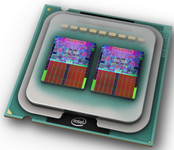

# Microprocesador

También llamado **procesador**, **micro** o **CPU**. Este circuito integrado está compuesto por millones de transistores.

Ejecuta el sistema operativo y las aplicaciones, procesando todas las instrucciones que contienen los programas realizando las operaciones que sean necesarias.

En general, cuanto más rápido sea el procesador y más núcleos tenga, podrá ejecutar más instrucciones por segundo y por tanto el software funcionará con mayor rapidez.

## Socket

El procesador se conecta a la placa base en un lugar de la placa llamado **socket**. Los sockets son de diferentes formas, algunos tienen más o menos pines para conectar, entre otras diferencias.

Según el modelo de socket que tenga nuestra placa base podré conectar un procesador u otro, por lo que  es importante tener
en cuenta cual es el procesador que queremos instalar y asegurarnos que la placa tiene un socket compatible con él.

## Sistema de refrigeración

El procesador es uno de los componentes que más se caliente. Si no extraemos el calor que genera, se terminaría
quemando y dejaría de funcionar. Por ello, es importante contar con un **sistema de refrigeración** que evitará que
se sobrecaliente.

Lleva incorporado un sistema de refrigeración que consta de:

- Un disipador metálico
- Un ventilador

El sistema de refrigeración se coloca encima de una pasta térmica que a su vez se pone encima del procesador.

## Pasos para instalar el procesador

Para realizar correctamente la instalación deberemos seguir los siguientes pasos:

- Abrimos el socket, colocamos el procesador en su interior y cerramos la horquilla
- Colocamos pasta térmica encima del procesador
- Tapamos el procesador con el disipador correspondiente y que quede bien fijado.
- Conectamos el cable del disipador a la placa base para que le llegue corriente y pueda funcionar el ventilador.

## Características de un procesador

### Marcas

Existen diferentes marcas de procesadores, siendo las más habituales

- AMD, Intel en sobremesa y portátiles
- Qualcomm en tablets y móviles

### Núcleos

Un procesador con varios núcleos puede ejecutar varias instrucciones al mismo tiempo, por lo que el rendimiento será mayor cuanto más núcleos.

Según número de núcleos:

- **Dual core**: 2 núcleos
- **Quad core**: 4 núcleos
- **Octa core**:  8 núcleos

Un procesador dual core puede ejecutar 2 aplicaciones al mismo tiempo Cada una en su propio procesador dedicado

### Velocidad

Frecuencia a la que pueden realizar operaciones. Se mide en GHz

### Caché

Memoria de acceso rápido que mejora el rendimiento

### Arquitectura

Los procesadores pueden ser de 32 o 64 bits. Un procesador de 64 puede gestionar más datos y acceder a una cantidad más grande de memoria.

En general:

- Con un procesador de 64 bits podemos instalar SO y aplicaciones de 32 o de 64 bits.
- Con un procesador de 32 bits podemos instalar SO y aplicaciones de 32 solamente.

### Identificación de procesadores

En el caso de Intel, los sufijos indican el tipo de procesador, en función de muchas características diferentes. Para conocer el modelo de procesador, debemos mirar la inscripción del procesador en la parte superior.

Una vez conocido el modelo, podemos distinguir las partes principales:

Los sufijos nos indican también que tipo de procesador es.

Puede resultar complicado comparar generaciones y productos al mismo tiempo. Las características principales en las que nos podemos fijar:

1. Número de núcleos 
2. Si disponen de hyperthreading
3. Velocidad del núcleo
4. Caché de cada núcleo
5. Generación del procesador

También podemos orientarnos en función del modelo, de la siguiente forma:

- i3 < i5 < i7
- Y < U < M < QM < HM < S < D < K < X
- Atom < Celeron < Pentium < i3,5,7 < Xeon
