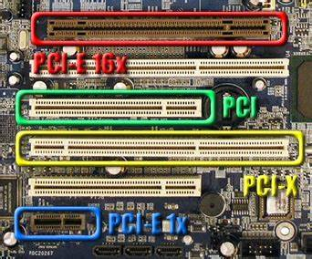

 # Tarjetas de expansión

 Las **tarjetas de expansión** permiten añadir funciones al ordenador, ampliarlo o mejorar funciones que este ya tenía. Pueden ser de diferentes tipos:

 - Tarjetas de red
 - Tarjetas gráficas
 - Tarjetas de puertos USB
 - Tarjetas de sonido
 - Tarjetas módem

## Ranuras de expansión

Cada tarjeta y placa tiene tipos diferentes de **ranuras de expansión**, que es donde insertamos las tarjetas. En general, las placas suelen tener entre 2 y 5 ranuras de expansión.

Los tipos de ranura más habituales son:

- PCI
- AGP
- PCI Express

La tarjeta y la placa base deben tener el mismo tipo para poderse conectar. Para ello, las placas disponen de varias ranuras de cada tipo.

 

## Tarjetas integradas

 Actualmente, cada vez más las placas base están integrando funciones que antes necesitaban de una tarjeta de expansión.

 Cuando una función ya viene en la placa base y no es necesaria una tarjeta de expansión, se dice que viene **integrada** en la placa.

Por ejemplo, las placas modernas ya traen incorporada:

 - Tarjeta gráfica integrada
 - Tarjeta de red integrada
 - Tarjeta de sonido integrada

Es por ello que cada vez son menos necesarias.

## GPU

La GPU o tarjeta gráfica es la encargada de procesar los gráficos y de enviar la señal de video al monitor. Incluye su propio procesador, memoria, etc. y puede ser tan potente como un ordenador.

## Conexión de tarjetas de expansión

Para que los dispositivos conectados a las tarjetas de expansión funcionen correctamente, deben realizarse dos acciones básicas:

- 1) Conectar la tarjeta en un zócalo o ranura libre de la placa base. Es decir, debe ser compatible con la tarjeta
- 2) Configurar la propia tarjeta, instalando un controlador o **driver** necesario para controlarla y funcione como es debido.