- [9. Dispositivos de almacenamiento](#9-dispositivos-de-almacenamiento)
  - [9.1. Dispositivos de almacenamiento magnéticos](#91-dispositivos-de-almacenamiento-magn%c3%a9ticos)
    - [Discos duros](#discos-duros)
    - [Funcionamiento](#funcionamiento)
    - [Estructura física](#estructura-f%c3%adsica)
    - [Tamaño](#tama%c3%b1o)
  - [Discos duros externos](#discos-duros-externos)
    - [Carcasas para convertir en externo](#carcasas-para-convertir-en-externo)
  - [9.2. Memoria flash](#92-memoria-flash)
    - [Memorias USB](#memorias-usb)
    - [Tarjetas de memoria](#tarjetas-de-memoria)
  - [9.3. Unidades SSD](#93-unidades-ssd)
    - [Ventajas frente a discos duros convencionales](#ventajas-frente-a-discos-duros-convencionales)
    - [Discos SSD M.2 y NVMe](#discos-ssd-m2-y-nvme)
  - [9.4. Dispositivos de almacenamiento ópticos](#94-dispositivos-de-almacenamiento-%c3%b3pticos)
    - [Formatos de discos](#formatos-de-discos)
    - [Tecnología de grabación](#tecnolog%c3%ada-de-grabaci%c3%b3n)
    - [CD](#cd)
    - [DVD](#dvd)
    - [Blu-ray](#blu-ray)
    - [Lector de discos](#lector-de-discos)
    - [Comparativa](#comparativa)

# 9. Dispositivos de almacenamiento

Las **unidades de almacenamiento** permiten guardar de forma permanente los datos y/o programas para ser utilizados en el momento adecuado y poder ser modificados, vueltos a guardar y recuperados cuando se desee.

Muchos de ellos capaces de ser transportables, es decir, de poder llevarse la información a otro equipo o guardarla como copia de seguridad.

Los dispositivos de almacenamiento contienen los datos (fotos, archivos PDF, películas, documentos de texto, hojas de cálculo, etc.)

La principal diferencia entre ellos, es la tecnología de acceso a la información, aquí podemos encontrar varios tipos.

## 9.1. Dispositivos de almacenamiento magnéticos

El medio o soporte está construido con un material magnético, sobre el que se guarda un punto de memoria o bit, mediante una magnetización diferente para el 1 o para el 0 de información.

### Discos duros

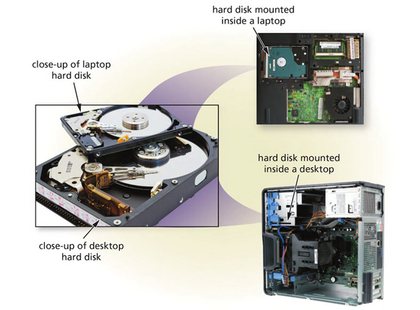

Puede ser montado dentro de la caja del ordenador
Se pueden conectar externamente
Almacena más datos y mueve los datos más rápido que las unidades de cinta
Las capacidades de disco duro actuales se extienden a los terabytes

### Funcionamiento

Los datos están escritos usando electromagnetismo. 
Se aplica una carga al cabezal de lectura / escritura 
Crea un campo magnético que escribe y lee información del disco.

- Vídeo de disco duro en funcionamiento: https://www.youtube.com/watch?v=p-JJp-oLx58

### Estructura física

Los discos duros mecánicos tradicionales son discos duros magnéticos
Tienen múltiples superficies duras de metal llamadas platos

- Cada plato contiene datos en ambos lados
- Tiene dos cabezales de lectura / escritura

Uno para la parte superior y otro para la parte inferior
Las cabezas de lectura / escritura flotan en un colchón de aire sin tocar la superficie del plato

La etiqueta del disco nos indica entre otros:

- Marca y modelo
- Capacidad
- Velocidad de rotación

Ejemplos:

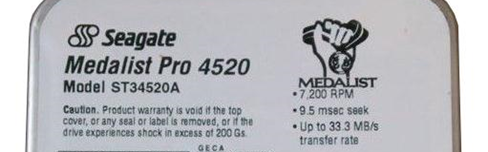

### Tamaño

- Equipos de sobremesa tienen un tamaño estándar de 3,5”
- En ordenadores portátiles el tamaño más común es 2,5” 
- Otras variantes de menor tamaño como pueden ser discos de 1,8” 

## Discos duros externos

Permiten ampliar la capacidad de almacenamiento del PC, así como realizar copias de seguridad o poderlos transportar.

Existen modelos con más funciones como reproducir vídeo y sonido y la posibilidad de conectarlos a la televisión. Se conocen como **discos multimedia**.

Características habituales:

- Suelen conectarse mediante un cable USB. Aunque otros se conectan a través de FireWire y eSATA.
- Suelen obtener la electricidad para funcionar mediante el mismo cable USB. En otras ocasiones pueden utilizar un cargador externo.
- El tamaño más utilizado de 2,5", aunque los hay de 1,8" y de 3,5 pulgadas

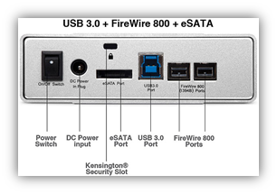

### Carcasas para convertir en externo

Podemos convertir un disco duro interno en externo añadiéndole una carcasa que nos permite tener botones de encendido y apagado, conexión para la corriente y convierte los puertos externos a puertos USB.

De esta forma podemos aprovechar un disco que no utilicemos como externo por poco dinero.

## 9.2. Memoria flash

Usan memorias flash para almacenar la información. Al carecer de partes móviles:

- Su consumo es más bajo
- Su tiempo de acceso es más rápido
- Son más pequeños en general
- Su vida útil suele ser más reducida

Por estos motivos resultan perfectos para dispositivos portátiles. Como desventaja, aunque esto está cambiando, resultan demasiado caros para grandes volúmenes de información.

### Memorias USB

- Pequeños dispositivos con un chip de memoria flash
- Se conectan al ordenador a través de un puerto USB en caliente
- No suele necesitar la instalación de drivers para utilizarlas, puesto que el sistema operativo las reconoce directamente.

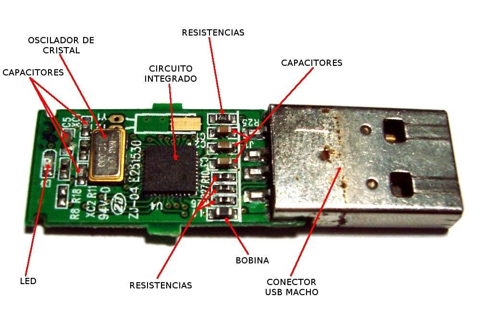

### Tarjetas de memoria

- Utilizados habitualmente en cámaras digitales y móviles
- Suelen necesitar de un lector de tarjetas para conectarlo al ordenador
- Muchos formatos diferentes:
  - SD, microSD,  miniSD
  - Compact flash
  - Memory stick
  - xD

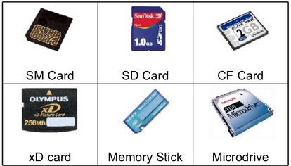

Características:

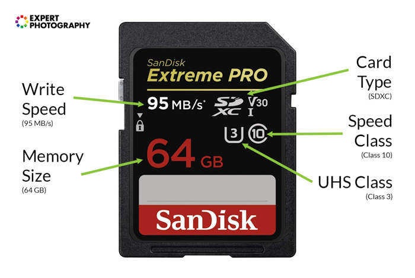

## 9.3. Unidades SSD

En este video podemos ver las diferencias entre el arranque de un sistema operativo en un disco duro y en un disco SSD. Podemos comprobar que el arranque es mucho más rápido puesto que la velocidad de lectura es más rápida en los discos SSD.

https://www.youtube.com/watch?v=4f4saFpRlvU

Soporte de almacenamiento de datos que se está utilizando cada vez más porque ofrece grandes ventajas respecto a los discos duros.

Conexión al equipo:

- SATA
- PCI Express (utiliza tarjeta adaptadora)
- USB (en dispositivos de estado sólido portátiles

Características físicas de un dispositivo de estado sólido:

- Memoria no volátil de tipo flash
- Proporciona gran velocidad en arranque, lectura y escritura
- No utiliza discos giratorios: no genera ruido, resiste a fallos físicos, movimientos bruscos...
- Tiene un bajo consumo eléctrico y de producción de calor.
- Tiene un elevado costo por bit.

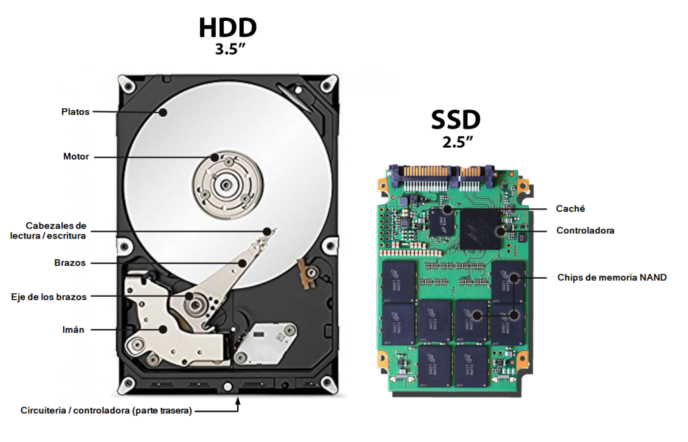

### Ventajas frente a discos duros convencionales

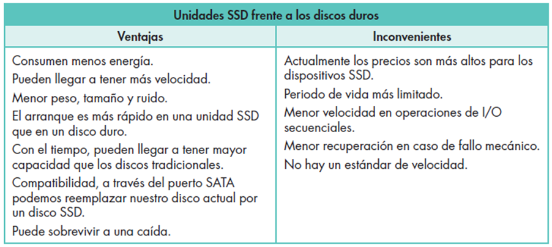

### Discos SSD M.2 y NVMe

Estas nuevas unidades de almacenamiento ya no tienen la forma tradicional de un disco duro. Se trata de un nuevo formato de almacenamiento, más compacto y que se puede conectar directamente a la placa sin necesidad de cables, a través de una ranura especial llamada M2.

Estas unidades llegan a dar velocidades de lectura hasta 2,5 Gbps, comparado con los 500 Mb/s de un disco SSD, o los 100 Mb/s de un disco duro magnético.

Las placas base tienen que estar preparadas y equipadas con una ranura especial para poder utilizar este tipo de memorias. Otra deseventaja es el precio, pues son mucho más caras en relación a un disco duro del mismo tamaño.

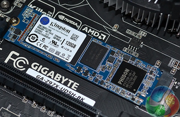

Son mucho más pequeñas que un disco duro tradicional:

Es el tipo de disco que tienen equipados tablets y portátiles ultraligeros, como el Macbook air, por ejemplo.

En este vídeo podéis ver como se monta uno de estos discos en un portátil lenovo:

https://www.youtube.com/watch?v=j_XmxniqyKI

## 9.4. Dispositivos de almacenamiento ópticos

Se utilizan medios ópticos (láseres) para manejar la información
La luz de un láser es reflejada por una superficie y dependiendo de si esta tiene o no perforación el haz relejado distingue si el punto de memoria es 1 o 0.

### Formatos de discos

Los discos pueden ser:

- Solo lectura
- Grabable (solo se pueden grabar una vez)
- Regrabable (se pueden grabar más de una vez)
- Doble capa (se pueden grabar 2 capas de información por el mimo lado)

### Tecnología de grabación

### CD

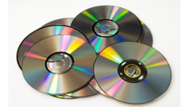

El disco CD-ROM o compact disc, es un plato de plástico, con una fina capa de aluminio y otra capa de plástico para su protección. 

- La información se guarda en una sola cara, siguiendo una pista única en forma de espiral.
- Su capacidad estándar es de 650 a 700 MB de datos, y 74 a 80 minutos de audio

### DVD

- Tiene una capacidad de 4,7 GB por capa.
- Utiliza una tecnología y por tanto un láser distinto del CD
- Las unidades lectoras de DVD incorporan un láser para leer y grabar también CD

Capas y caras:

- Un DVD puede tener 2 capas
- Un DVD puede tener 2 caras

Los DVD se pueden grabar por las dos caras (solo los DVD que lo permiten), y se pueden grabar más de una capa por el mismo lado. En función de las caras y las capas que tenga, el DVD tendrá más o menos capacidad.

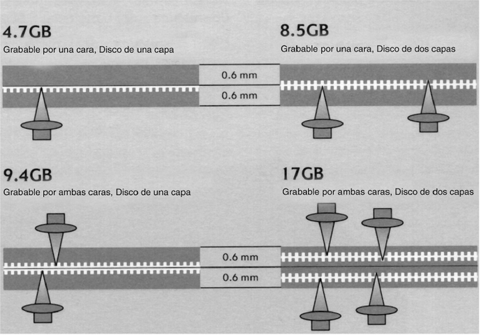

### Blu-ray

Tienen la misma forma que un CD o DVD por compatibilidad, y en este caso el rayo láser que utiliza para ser leído es de color azul, lo que da su nombre

Este formato permite guardarar video de alta definición (Full HD), video 3D y sonido envolvente, a diferencia del DVD.

Estos discos tienen una capacidad de 25 a 33,4 GB por capa. En función de las capas que tengan, tendremos blu-rays de diferentes capacidades.

Tipos:

- BD-ROM (Lectura)
- BD-R (Grabable)
- BD-RE (Regrabable)

Según capacidad, los más habituales son:

- Modelo 1 capa: 25 GB
- Modelo 2 capas: 50 GB

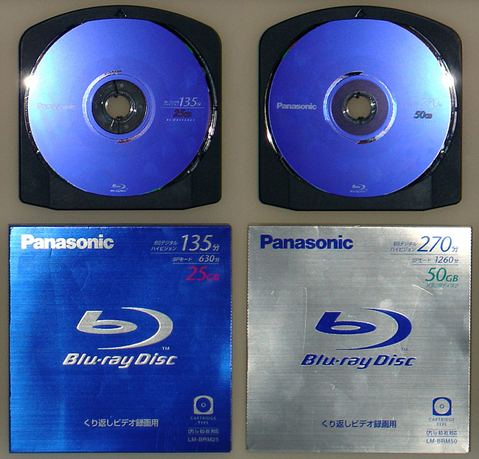

Los reproductores / grabadores de Blu-ray suelen ser compatibles con CD y DVD. En la imagen podemos ver un reproductor de Blu-ray, y un Blu-ray regrabable (RE). Hoy en día no se utiliza a nivel doméstico la grabación de Blu-ray debido al uso de pendrives, memorias externas y servicios de streaming de video.

### Lector de discos

Un lector permite leer información en un CD, DVD o BluRay

Un lector/grabador permite leer y grabar discos. Se diferencian por tener el símbolo RW en el lector.

Se conectan al equipo de forma similar a los discos duros, pero tienen una salida por la parte frontal para poder insertar y extraer los discos.

Componentes:

- Contiene una lente láser que se mueve para leer o escribir información
- Un motor hace girar el disco cuando comienza a funcionar.
- La bandeja de soporte nos permite colocar los discos que van a ser accedidos.

Parte frontal

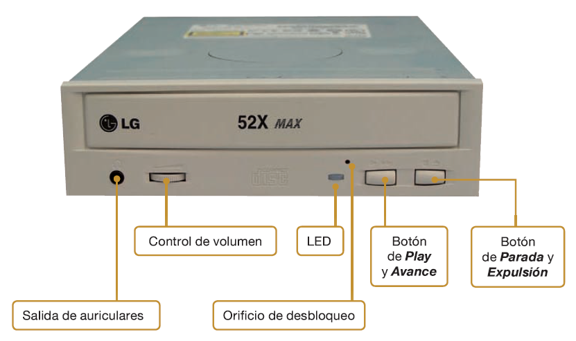

Video funcionamiento lectura y grabación:

https://www.youtube.com/watch?v=H-jxTzFrnpg

### Comparativa

Por orden, los blu-ray tienen un tamaño mayor que los DVD, y estos a su vez mayor que los CD.

En esta imagen podéis ver la superficie de un disco, con los datos grabados (los puntos representan los bits). Cuanto más pequeños son estos, más caben en el disco y, por tanto, más información pueden guardar.

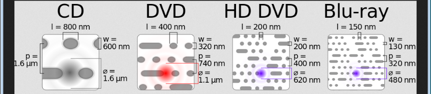

Tipos

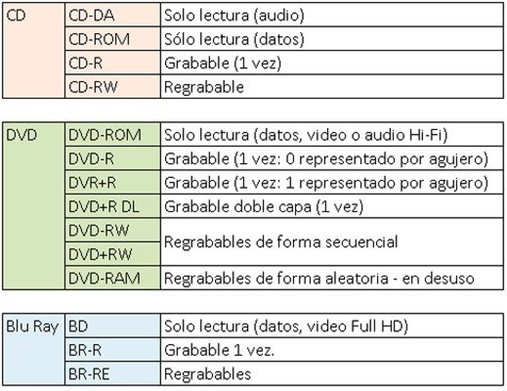