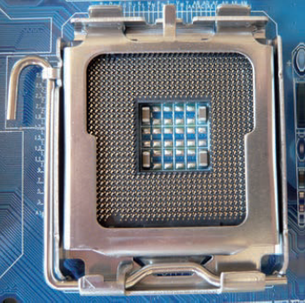
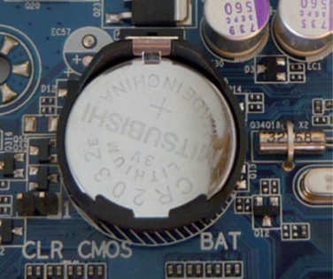

## Placa base, chipset i microprocessador

### La placa base

La placa base (motherboard) es el elemento principal del ordenador (esqueleto).

A ella se conectan todos los demás dispositivos (disco duro, memoria o el microprocesador, etc). Hace que todos estos componentes funcionen en equipo.

De ella dependerán los componentes que podremos instalar y las posibilidades de ampliación del ordenador.

Las medidas de la placa base están estandarizadas, de tal forma que su factor de forma (anchura, altura), determinará sobre que chasis metálico la podemos integrar, y en que lugares se posicionarán los distintos conectores externos (ratón, teclado, usbs...)

### Componentes principales

#### Zócalo del microprocesador

Es el conector en el que se inserta el microprocesador o CPU.
También llamado socket

#### Ranuras de memoria: 

Son los conectares donde se instala la memoria principal del ordenador, la memoria RAM. 
También se los llama bancos de memoria o slots de memoria

#### Ranuras de expansión o slots: 

Son las ranuras donde se introducen las tarjetas de expansión

##### Conjunto de chips o chipset

Se encargan de controlar muchas de las funciones que se llevan a cabo en el ordenador, como, por ejemplo, la transferencia de datos entre la memoria, la CPU y los dispositivos periféricos

#### Conectores internos: 
Son los conectores para los dispositivos internos, como el disco duro, la unidad de DVD, etc.

#### Conectores de energía: 

A los que se conectan los cables de la fuente de alimentación para que la placa base y otros componentes reciban la electricidad.

#### Conectores externos: 

Permiten que los dispositivos externos se comuniquen con la CPU, como, por ejemplo, el teclado o el ratón.

### La batería

Gracias a ella, se puede almacenar la configuración del sistema usada durante la secuencia de arranque del ordenador, como la fecha, la hora, la password y los parámetros de la BIOS, etc.

### La BIOS

Pequeño conjunto de programas almacenados en una memoria EPROM 
Permiten que el sistema se comunique con los dispositivos durante el proceso de arranque

