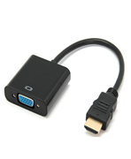
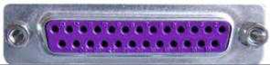
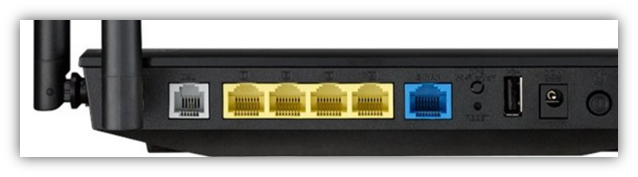
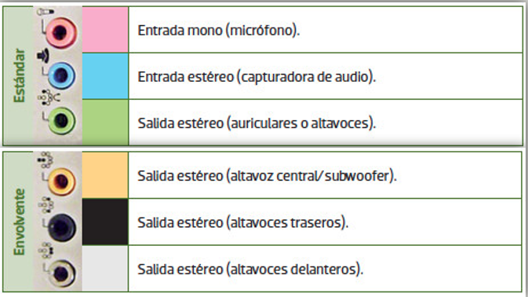
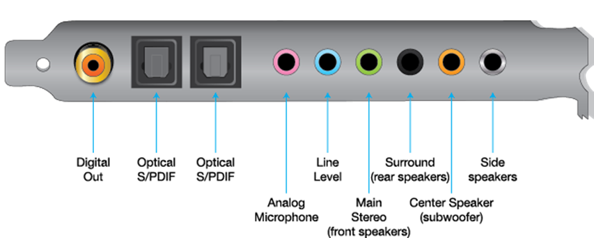

- [Puertos de comunicación](#puertos-de-comunicaci%c3%b3n)
  - [Nomenclatura](#nomenclatura)
  - [Cables, adaptadores y hubs](#cables-adaptadores-y-hubs)
    - [Adaptadores](#adaptadores)
    - [Hubs o concentradores](#hubs-o-concentradores)
  - [Cables y conectores](#cables-y-conectores)
  - [Conectores de fuente de alimentación](#conectores-de-fuente-de-alimentaci%c3%b3n)
  - [Puertos de datos](#puertos-de-datos)
    - [Tipo DIN](#tipo-din)
    - [Puerto serie y paralelo](#puerto-serie-y-paralelo)
    - [Puerto USB](#puerto-usb)
      - [Plug and play](#plug-and-play)
      - [Versiones USB](#versiones-usb)
      - [Velocidades](#velocidades)
    - [Tipos de conectores](#tipos-de-conectores)
    - [Colores](#colores)
    - [USB tipo C](#usb-tipo-c)
    - [Puerto de red](#puerto-de-red)
      - [RJ-45 y RJ-11](#rj-45-y-rj-11)
      - [Fibra óptica](#fibra-%c3%b3ptica)
  - [Puertos de audio](#puertos-de-audio)
    - [Puertos jack](#puertos-jack)
      - [Tipos de conectores Jack según diámetro](#tipos-de-conectores-jack-seg%c3%ban-di%c3%a1metro)
      - [Tipos de conectores Jack según su construcción](#tipos-de-conectores-jack-seg%c3%ban-su-construcci%c3%b3n)
    - [Conecores RCA](#conecores-rca)
    - [Conectores ópticos](#conectores-%c3%b3pticos)
    - [Conectores tarjetas de sonido](#conectores-tarjetas-de-sonido)
  - [Puertos de vídeo](#puertos-de-v%c3%addeo)
    - [Puerto HDMI](#puerto-hdmi)
    - [Puerto VGA](#puerto-vga)
    - [Puerto DVI](#puerto-dvi)

# Puertos de comunicación

Hoy en día podemos encontrar puertos en la mayoría de componentes y periféricos informáticos, así como equipos domésticos de imagen y sonido.

- Placa base
- Periféricos
- Dispositivos externos
- Tarjetas de expansión
- Equipos domésticos 
- Reproductores de vídeo
- Televisiones
- Consolas

Puertos traseros de una plac base de ordenador.

Puertos traseros de un televisor smart tv.

## Nomenclatura

Los **conectores** son los extremos de los cables o, en el caso de un pendrive, el extremo que se conecta a otro dispositivo.

En general los cables tienen uno o más conectores en cada extremo.

Llamamos generalmente **puertos** a las conexiones del equipo en los que vamos a enchufar los cables o dispositivos.

## Cables, adaptadores y hubs

Generalmente todos los cables disponen de 2 conectores del mismo tipo. Según el tipo, pueden ser:

- M = Macho
- F = Hembra

A la hora de elegir y comprar un cable, nos tenemos que fijar en la configuración de los 2 conectores:

- M-M: dos conectores macho
- M-F: uno hembra y uno macho
- F-F: dos hembra

### Adaptadores

Están formados por un cable con 2 conectores **de diferente tipo**
Transforman un tipo de Puerto/conector en otro.

Este sería un adaptador de VGA a HDMI.

### Hubs o concentradores

Mismo cable con varios conectores en un extremo se llama un adaptadores múltipl o **hub**. 

Nos pueden resultar útiles:

- En caso de disponer de un solo puerto y querer conectar más de un dispositivo
- Si queremos múltiples salidas para conectar a diferentes dispositivos, según la conexión que tienen.

Este es un hub USB:

## Cables y conectores

Existen diferentes tipos de cables y conectores, en función del tipo de la señal que transportan:

- Cables de corriente
- Cables de vídeo
- Cables de audio
- Cables de datos
- Clasifica los cables de la derecha en los diferentes tipos

## Conectores de fuente de alimentación

La fuente de alimentación es la que se encarga de recibir la corriete eléctrica de la toma de enchufe de la pared, transformarla y repartirla a los diferentes componentes del ordenador.

En la parte externa, tenemos:

- El conetor de entrada de energía
- La rejilla del ventilador
- El interruptor de seguridad.

Por la parte interna, tiene los diferentes cables que van, tanto a la placa base como a los diferentes componentes que no están enganchados a la placa base, como por ejemplo:

  - Disco duro
  - Lector de CD DVD
  - Disquetera

## Puertos de datos

### Tipo DIN

Conector redondo de 6 pines, destinado a conexión de teclado y ratón.

Se suele encontrar 1 conexión al ratón y 1 al teclado, o 1 conexión ambivalente ratón/teclado

Hoy en día, uso de conexiones USB y las conexiones PS/2 en desuso Los modelos actuales de placa ya no incorporan PS/2

### Puerto serie y paralelo

Antiguamente destinados a conectar teclado o ratón (puerto serie) o bien impresoras o escáner (puerto paralelo).

Hoy en día han caído en desuso frente a los conectores USB.

### Puerto USB

Características:

- Proporciona al ordenador capacidades plug-and-play
- Amplia variedad de dispositivos disponibles: teclados, ratones, discos duros externos, escáneres, impresoras, módems, cámaras digitales, webcams, etcétera.
- Permite conectar varios dispositivos mediante un hub o concentrador. Se pueden conectar hasta 127 dispositivos
- Suministra alimentación eléctrica al dispositivo mediante mismo cable 
- Permite utilizar dispositivos de diferentes fabricantes sin necesidad de instalar drivers adicionales

#### Plug and play

Se pueden conectar dispositivos USB al ordenador sin necesidad de reiniciarlo (conectar «en caliente»). 

Al conectar el dispositivo USB:

- El SO los reconoce automáticamente e instala los controladores 
- En caso contrario solicita al usuario los controladores correspondientes
- En este caso hemos de bajar de Internet los controladores de la página web del fabricante o utilizar un CD de instalación

#### Versiones USB

Existen diferentes versiones de USB, de la 1.0 a la 3.1, en función de la velocidad, los tipos de conectores y otras características.

.png)

#### Velocidades

Es importante tener en cuenta que:

- Las versiones de USB son compatibles entre sí.
- La versión más baja de la cadena limitará la velocidad máxima que se pueda alcanzar.

### Tipos de conectores

### Colores

### USB tipo C

Se trata de un nuevo cable y conector aparecido recientemente. Incorpora las sigueintes características:

- Se puede conectar en ambas posiciones
- Una transferencia de datos más rápida y modos alternativos. 
- Ofrece hasta 100 W de suministro de energía
- Un solo cable para entregar datos, audio, video y energía.

### Puerto de red

#### RJ-45 y RJ-11

.png)

La conexión RJ-11:

- Se utiliza para la transmisión de señal telefónica analógica.
- La vemos tanto en tendido telefónico como para las conexiones del módem, periférico que está en desuso.
- Esta conexión utiliza dos hilos para transmitir la señal.

La conexión RJ-45 se utiliza para la transmisión de voz y datos, fundamentalmente en redes Ethernet y RDSI.

Este puerto está presente en:

- Tarjetas de red (Ethernet) de los equipos
- Rosetas de red
- Periféricos de comunicaciones (router, switch, etc.)

Tiene dos luces testigo: 

- Una fija, que indica que se ha establecido un enlace con otro puerto
- Otra que parpadea para señalar que existe tráfico de datos.

#### Fibra óptica

La fibra óptica es uno de los medios de transmisión más utilizados en la actualidad.

Consiste en la agrupación de varios hilos de material transparente (vidrio o plástico)

A través de los cuales se transmiten pulsos de luz que representan la información a enviar.

Mediante la fibra óptica se pueden transmitir grandes cantidades de datos a través de largas distancias. 

## Puertos de audio

Existen diferentes puertos de audio, en función de, entre otros:

- El material utilizado (fibra, cobre, etc.)
- El tipo de señal digital o analógico

### Puertos jack

Se utiliza principalmente para la transmisión de señal de audio **analógica**

Se suele utilizar para conectar **micrófonos, auriculares** y otros sistemas similares

Existen diferentes tipos de jack según su diámetro y sus anillos

#### Tipos de conectores Jack según diámetro

**Conector Jack original (6,5 mm)**

- Instrumentos musicales
- Dispositivos de audio profesional

**Conector Jack (3,5 mm)**

- Modelo más utilizado en informática
- También se utiliza en otras áreas tecnológicas
- Tiene dos versiones (mono y estéreo)

**Mini Jack (2,5 mm)**

- Se utiliza en pequeños dispositivos
- Solo capaz de transmitir señal de audio mono

#### Tipos de conectores Jack según su construcción

- **TS**: Tip-sleeve o punta-funda. Se utiliza en audio mono.
- **TRS**: Tip-ring-sleeve o punta-anillo-funda. Se utiliza en estéreo.
- **TRRS**: Tip-ring-ring-sleeve o punta-anillo-anillo-cuerpo. Utilizado en dispositivos en los que los auriculares incluyen micrófono

Códigos de colores

### Conecores RCA

El formato RCA también se utiliza para señal de audio, tanto analógica como digital.
Se diferencian mediante un código de colores en función del tipo de señal.
Se utiliza en sistemas estéreo, así como sistemas de sonido envolvente.

Salidas estándar

Sonido envolvente

### Conectores ópticos

- Se trata de un tipo de conexión de audio digital para distancias cortas.
- La señal completa se transmite a través de un único cable en lugar de varios.
- Se utiliza principalmente para interconectar equipos home theatre y otros sistemas digitales de alta fidelidad (Hi-Fi)
- Generalmente se utiliza un cable de fibra óptica.

### Conectores tarjetas de sonido

Las tarjetas de sonido suelen venir equipadas con conectores de diversos tipos para poder conectarla a diferentes equipos.

## Puertos de vídeo

Las conexiones de vídeo más habituales en el mundo de la informática y comunicaciones son:

- VGA
- DVI
- HDMI
- DisplayPort

### Puerto HDMI

Es el conector de vídeo de alta definición más extendido en la actualidad.

Es una conexión puramente digital no admite señales analógicas.

A diferencia de su predecesor, el DVI, transmite audio en alta definición

### Puerto VGA 

Solo permite vídeo analógico a 2048x1536 (máximo)

- Al ser la señal analógica, la calidad de vídeo depende de calidad, longitud de cable e interferencias.
- Portátiles tienen salida VGA, para compartir la señal de vídeo con un proyector o un monitor adicional

### Puerto DVI

- Aparece como una variante del VGA.
- Permite transmtir señal de vídeo analógica y digital, pero no audio

Si queremos conectare dispositivos con conectores diferetnes, una conexión DVI puede ser recableada a VGA con un adaptador de VGA a DVI.

