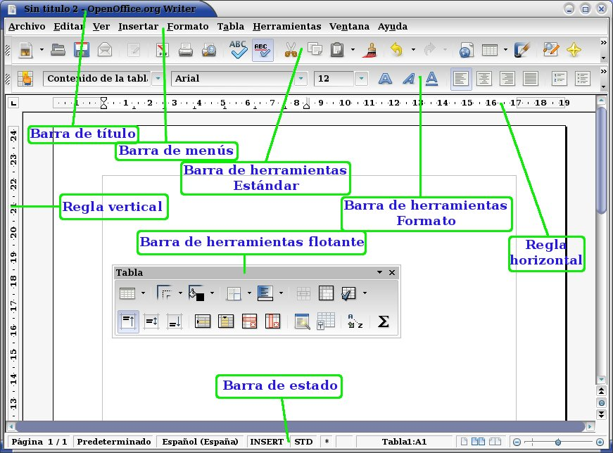

Procesador de textos
 
- [1. Suites ofimáticas](#1-suites-ofim%c3%a1ticas)
- [2. Primeros pasos](#2-primeros-pasos)
  - [2.1. Interfaz de usuario](#21-interfaz-de-usuario)
    - [Zoom](#zoom)
  - [2.2. Obtener ayuda](#22-obtener-ayuda)
  - [2.3. Abrir y guardar documentos](#23-abrir-y-guardar-documentos)
  - [2.4. Desplazamientos en documentos](#24-desplazamientos-en-documentos)
  - [2.5. Selección de textos](#25-selecci%c3%b3n-de-textos)
  - [2.6. Cortar, copiar y pegar](#26-cortar-copiar-y-pegar)
  - [2.7. Borrar o eliminar](#27-borrar-o-eliminar)
- [3. Aplicación de formatos](#3-aplicaci%c3%b3n-de-formatos)
  - [3.1. Formatos de carácter](#31-formatos-de-car%c3%a1cter)
  - [3.2. Formatos de párrafo](#32-formatos-de-p%c3%a1rrafo)
    - [Sangrías](#sangr%c3%adas)
    - [Interlineado](#interlineado)
    - [Espaciado](#espaciado)
    - [Otras características](#otras-caracter%c3%adsticas)
  - [3.3. Bordes y sombreados de color](#33-bordes-y-sombreados-de-color)
  - [3.4. Numeraciones y listas](#34-numeraciones-y-listas)
  - [3.5. Autotexto y autoformato](#35-autotexto-y-autoformato)
  - [3.6. Capitalización y conversión mayúsculas/minúsculas](#36-capitalizaci%c3%b3n-y-conversi%c3%b3n-may%c3%basculasmin%c3%basculas)
- [4. Trabajo con estilos, temas y plantillas](#4-trabajo-con-estilos-temas-y-plantillas)
  - [4.1. Modificación de estilos preexistentes](#41-modificaci%c3%b3n-de-estilos-preexistentes)
  - [4.2. Creación de nuevos estilos](#42-creaci%c3%b3n-de-nuevos-estilos)
  - [4.3. Vinculación de estilos](#43-vinculaci%c3%b3n-de-estilos)
  - [4.4. Aplicar temas a los documentos](#44-aplicar-temas-a-los-documentos)
  - [4.5. Guardar estilos como plantillas](#45-guardar-estilos-como-plantillas)
  - [4.6. Plantillas](#46-plantillas)
- [5. Trabajo con columnas, secciones y configuración de página](#5-trabajo-con-columnas-secciones-y-configuraci%c3%b3n-de-p%c3%a1gina)
  - [5.1. Texto en columnas](#51-texto-en-columnas)
  - [5.2. Saltos de sección](#52-saltos-de-secci%c3%b3n)
  - [5.4. Encabezados y pie de página](#54-encabezados-y-pie-de-p%c3%a1gina)
  - [5.5. Vista preliminar e impresión del documento](#55-vista-preliminar-e-impresi%c3%b3n-del-documento)
- [6. Ortografía, gramática e idioma](#6-ortograf%c3%ada-gram%c3%a1tica-e-idioma)
  - [6.1. Corrección ortográfica y gramatical](#61-correcci%c3%b3n-ortogr%c3%a1fica-y-gramatical)
  - [6.2. Autocorrección](#62-autocorrecci%c3%b3n)
  - [6.3. Selección de idiomas](#63-selecci%c3%b3n-de-idiomas)
  - [6.4. Separación silábica](#64-separaci%c3%b3n-sil%c3%a1bica)
- [7. Gráficos, imágenes, autoformas y cuadros de texto](#7-gr%c3%a1ficos-im%c3%a1genes-autoformas-y-cuadros-de-texto)
  - [7.1. Insertar imágenes](#71-insertar-im%c3%a1genes)
  - [7.2. Propiedades comunes (bordes, rellenos, tamaño y ajuste de texto)](#72-propiedades-comunes-bordes-rellenos-tama%c3%b1o-y-ajuste-de-texto)
  - [7.3. Barra de herramientas de dibujo](#73-barra-de-herramientas-de-dibujo)
  - [7.4. Imágenes](#74-im%c3%a1genes)
  - [7.5. Cuadros de texto](#75-cuadros-de-texto)
- [8. Trabajo con tablas](#8-trabajo-con-tablas)
  - [8.1. Insertar tablas](#81-insertar-tablas)
  - [8.2. Desplazamientos y selección de celdas, filas y columnas](#82-desplazamientos-y-selecci%c3%b3n-de-celdas-filas-y-columnas)
  - [8.3. Añadir y eliminar filas y columnas](#83-a%c3%b1adir-y-eliminar-filas-y-columnas)
  - [8.4. Cambio de altura de filas y ancho de columnas](#84-cambio-de-altura-de-filas-y-ancho-de-columnas)
  - [8.5. Convertir texto en tabla y viceversa](#85-convertir-texto-en-tabla-y-viceversa)
  - [8.6. Ordenación de datos en tablas y párrafos](#86-ordenaci%c3%b3n-de-datos-en-tablas-y-p%c3%a1rrafos)
  - [8.7. Barra de herramientas de tablas y bordes](#87-barra-de-herramientas-de-tablas-y-bordes)
  - [8.8. Dibujar tablas irregulares](#88-dibujar-tablas-irregulares)
- [9. Trabajar con tablas de contenido e índices](#9-trabajar-con-tablas-de-contenido-e-%c3%adndices)
  - [9.1. Crear y modificar una tabla de contenido](#91-crear-y-modificar-una-tabla-de-contenido)
  - [9.2. Marcar entradas para un índice](#92-marcar-entradas-para-un-%c3%adndice)
  - [9.3. Crear y modificar un índice](#93-crear-y-modificar-un-%c3%adndice)

# 1. Suites ofimáticas

Una **suite ofimática** es un conjunto de programas destinados a facilitar el desarrollo de las tareas habituales en una empresa. Dichos programas comparten una interfaz de usuario similar y permiten intercambiar información entre ellos con facilidad.

La ventaja para el usuario es doble:

- Se pueden integrar distintos tipos de información con un formato compatible 
- Se facilita el aprendizaje de nuevas aplicaciones al tener un funcionamiento y una estructura de menús similares a las que ya se conocen.

Las suites más utilizadas actualmente son:

- Microsoft Office
- OpenOffice.org
- LibreOffice
- Google suite

# 2. Primeros pasos

## 2.1. Interfaz de usuario

- Barras
- Reglas

### Zoom

Podemos hacer zoom:

- Con **Ctrl** y la rueda del ratón
- Utilizando el control de zoom del procesador de textos
  
## 2.2. Obtener ayuda

Podemos obtener ayuda sobre cualquier tema de Word utilizando la tecla **F1**.

## 2.3. Abrir y guardar documentos

Acciones:

| Función           | Atajo    |
| ----------------- | -------- |
| Abrir documento   | Ctrl + A |
| Guardar documento | Ctrl + G |

Al guardar el documento podremos elegir entre varios tipos de archivo:

- Doc: Documento de texto de Microsoft Word antiguo
- Docx: Documento de texto de Microsoft Word nuevo
- Odt: Documento de texto de Openoffice / Libreoffice
- Pdf: Formato portable de acrobat

Comparativa de formatos

| Tipo de documento | Programa Libreoffice | Extensión | Equivalente Office |
| ----------------- | -------------------- | --------- | ------------------ |
| Texto             | Writer               | .odt      | .doc               |
| Hoja de cálculo   | Calc                 | .ods      | .xsl               |
| Presentación      | Impress              | .odp      | .ppt               |
| Base de datos     | Base                 | .odb      | .mdb               |

Podemos guardar los archivos:

- En el propio disco duro
- En alguna nube privada (onedrive, drive, etc.)

## 2.4. Desplazamientos en documentos

Podemos movernos por las diferentes partes del documento:

| Función                                       | Atajo                   |
| --------------------------------------------- | ----------------------- |
| Principio de línea                            | Inicio                  |
| Final de línea                                | Fin                     |
| Moverse por páginas                           | AvPag y Repag           |
| Moverse al principio del documento y al final | Ctrl + Inicio           |
| Moverse al final                              | Ctrl + Fin              |
| Una palabra a la izquierda                    | Ctrl + flecha izquierda |
| Una palabra a la derecha                      | Ctrl + flecha derecha   |
| Un párrafo arriba                             | Ctrl + flecha arriba    |
| Un párrafo abajo                              | Ctrl + flecha abajo     |

## 2.5. Selección de textos

Podemos seleccionar un fragmento de texto de varias formas:

| Función                                 | Atajo                                   |
| --------------------------------------- | --------------------------------------- |
| Seleccionar carácter, palabra y línea   | 1, 2 o 3 clics                          |
| Seleccionar texto                       | mayús + teclas izq. o derecha           |
| Seleccionar todo el texto               | Ctrl + E                                |
| Seleccionar palabras o frases separadas | Ctrl + botón izquierdo en cada elemento |

## 2.6. Cortar, copiar y pegar

Atajos de teclado:

| Función | Atajo    |
| ------- | -------- |
| Cortar  | Ctrl + X |
| Copiar  | Ctrl + C |
| Pegar   | Ctrl + P |

Existen diferentes tipos de pegado.

## 2.7. Borrar o eliminar

Para **borrar o eliminar** parte del texto, tenemos diferentes combinaciones, con las que podemos borrar por carácter, o por palabra.

| Función                    | Atajo            |
| -------------------------- | ---------------- |
| Un carácter a la izquierda | Retroceso        |
| Una palabra a la izquierda | Ctrl + Retroceso |
| Un carácter a la derecha   | Supr             |
| Una palabra a la derecha   | Ctrl + Supr      |

# 3. Aplicación de formatos

## 3.1. Formatos de carácter

**Borrar formato:** Para borrar el formato de un texto y dejarlo con el formato predeterminado

## 3.2. Formatos de párrafo

A nivel de párrafo podemos realizar diferentes acciones:

- Alineación (izquierda, derecha, justificado, centrado)

### Sangrías

Una sangría es un espacio de cierta medida que se antepone de forma automática en los lados de un párrafo. De esta forma se puede hacer que el párrafo esté más o menos separado del margen de la página que los demás párrafos

### Interlineado

El interlineado sirve para definir el espacio entre las líneas de un mismo párrafo. Para establecer el espacio de interlineado se puede realizar desde:

### Espaciado

Se ha de tener en cuenta que el espacio posterior de un párrafo y el anterior del siguiente se sumarán, lo que puede producir una separación mucho mayor de la que se pretendía.

### Otras características

- Control de líneas viudas y huérfanas: impide que se escriba la última línea de un párrafo en la parte superior de la siguiente pagina (a esta línea se la denomina viuda) o la primera en la parte inferior de una página y el resto del párrafo en la siguiente página (línea huérfana).
- Conservar con el siguiente: evita que se inserte un salto de página entre el párrafo actual y el siguiente, de forma que los dos párrafos van siempre en la misma página.
- Conservar líneas juntas: si se hace clic en esta casilla se evita que se pueda insertar un salto de página en medio de un párrafo.
- Salto de página anterior: provoca que el párrafo sobre el que se aplica siempre sea el primero de una página.

## 3.3. Bordes y sombreados de color

## 3.4. Numeraciones y listas

Tipos de listas:

- Numeradas y no numeradas
- Listas multinivel
- Continuar numeración y reiniciar numeración
- Numeración de formatos de título
  
## 3.5. Autotexto y autoformato

## 3.6. Capitalización y conversión mayúsculas/minúsculas

# 4. Trabajo con estilos, temas y plantillas

## 4.1. Modificación de estilos preexistentes

## 4.2. Creación de nuevos estilos

## 4.3. Vinculación de estilos

## 4.4. Aplicar temas a los documentos

## 4.5. Guardar estilos como plantillas

## 4.6. Plantillas

# 5. Trabajo con columnas, secciones y configuración de página

## 5.1. Texto en columnas

## 5.2. Saltos de sección

- En página continua: la sección comenzará a continuación del salto, en el lugar de la página donde se coloque.
- En página distinta: la nueva sección comenzará al principio de la página siguiente.

## 5.4. Encabezados y pie de página

- Primera página diferente
- Pares e impares diferentes

## 5.5. Vista preliminar e impresión del documento

# 6. Ortografía, gramática e idioma

## 6.1. Corrección ortográfica y gramatical

## 6.2. Autocorrección

## 6.3. Selección de idiomas

## 6.4. Separación silábica

# 7. Gráficos, imágenes, autoformas y cuadros de texto

## 7.1. Insertar imágenes

## 7.2. Propiedades comunes (bordes, rellenos, tamaño y ajuste de texto)

## 7.3. Barra de herramientas de dibujo

## 7.4. Imágenes

## 7.5. Cuadros de texto

# 8. Trabajo con tablas

## 8.1. Insertar tablas

Podemos organizar la información en forma de tablas para tenerla más organizada y fácil de consultar.

Las tablas se dividen en:

- Filas
- Columnas
- Celdas

## 8.2. Desplazamientos y selección de celdas, filas y columnas

Para movernos por las diferentes partes de una tabla podemos utilizare las siguientes combinaciones:

| Función                      | Atajo         |
| ---------------------------- | ------------- |
| Siguiente celda de una fila  | TAB           |
| Celda anterior de una fila   | MAYÚS+TAB     |
| Primera celda de una fila    | ALT+INICIO    |
| Última celda de una fila     | ALT+FIN       |
| Primera celda de una columna | ALT+RE PÁG    |
| Última celda de una columna  | ALT+AV PÁG    |
| Fila anterior                | FLECHA ARRIBA |
| Fila siguiente               | FLECHA ABAJO  |

## 8.3. Añadir y eliminar filas y columnas

Una vez creada la tabla, podemos agregar y eliminar filas y columnas

## 8.4. Cambio de altura de filas y ancho de columnas

## 8.5. Convertir texto en tabla y viceversa

En primer lugar deberemos introducir los valores separados por TAB y saltos de línea, para que la herramienta sepa que estamos cambiando de celda.

Podemos hacerlo en **tabla > convertir > texto a tabla**

## 8.6. Ordenación de datos en tablas y párrafos

## 8.7. Barra de herramientas de tablas y bordes

## 8.8. Dibujar tablas irregulares

# 9. Trabajar con tablas de contenido e índices

## 9.1. Crear y modificar una tabla de contenido

## 9.2. Marcar entradas para un índice

## 9.3. Crear y modificar un índice
