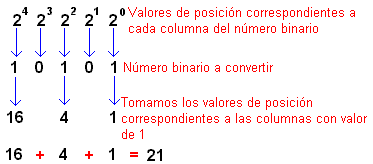
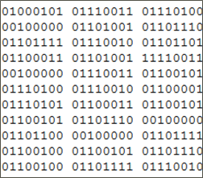

# Codificación de la información

## Sistemas de numeración

Un sistema de numeración es un conjunto de símbolos y reglas que permiten representar datos numéricos. 

Los sistemas de numeración actuales son sistemas posicionales. Cada símbolo tiene distinto valor según la posición que ocupa en la cifra.

Ejemplos:

- Decimal: 00, 01, 02, 03, 04, 05, 06, 07, 08, 09, 10, 11, 12, 13, 14, 15, 16, …
- Binario: 000, 001, 010, 011, 100, 101, 110, 111
- Octal: 00, 01, 02, 03, 04, 05, 06, 07, 10, 11, 12, 13, 14, ...
- Hexadecimal: 00, 01, 02, 03, 04, 05, 06, 07, 08, 09, 0A, 0B, 0C, 0D, 0E, 0F

## Sistema binario

Este es el sistema utilizado por la electrónica, donde una serie de interruptores y transistores pueden tener dos estados:

- Tienen corriente o no la tienen.
- El primer caso se representa con un 1 y el segundo con un 0.

El sistema binario utiliza 2 dígitos, y cada dígito tiene distinto valor dependiendo de la posición que ocupe.

Los ordenadores con un sistema binario para:

- Guardar información
- Hacer cálculos
- Enviar y recibir información

## Convertir de decimal a binario

Para pasar un número decimal a binario:

- Realizar divisiones sucesivas por 2
- Al final, escribir los restos obtenidos en cada división en orden inverso

## Convertir de binario a decimal

Ya podéis hacer los ejercicios 1 y 2

## Sistema hexadecimal

https://www.rapidtables.com/convert/number/binary-to-hex.html

Este sistema cuenta con 16 dígitos (0, 1, 2, 3, 4, 5, 6, 7, 8, 9, A, B, C, D, E, F) y se puede calcular la equivalencia entre el valor decimal de un hexadecimal de forma similar a como se hace con los binarios, pero ahora la base de numeración es 16, valor que habrá que ir elevando a las sucesivas potencias.

A partir del 10, sustituimos el número por una letra:

- 10 será A
- 11 será B
- etc.

Lo que hace interesante el sistema hexadecimal es la inmediatez de transformación entre un número hexadecimal y su equivalente binario natural. Basta con escribir las cuatro cifras binarias de cada dígito para tener la equivalencia

Aplicaciones:

- Direcciones MAC
- Códigos de colores RGB

#### Convertir entre binario y hexadecimal

Existe una equivalencia entre código hexadecimal y binario

# De binario a hexadecimal

Asimismo, la conversión de un número binario a hexadecimal es igual de sencilla: se agrupan los bits de cuatro en cuatro, comenzando por la derecha (por el bit de menor peso), y luego se sustituye cada grupo de cuatro bits por su equivalente hexadecimal.

    110110101100 --> 1101 1010 1100 -->DAC

# De hexadecimal a binario

La conversión de un número hexadecimal a uno binario es muy sencilla:  basta con sustituir cada cifra hexadecimal por su equivalente en binario.

Por ejemplo:

    3AFF = 0011 1010 1111 1111

Aquí A corresponde al número 10, y F corresponde al número 15

(Naturalmente, podemos eliminar los dos ceros de la izquierda).

    Ya podéis hacer los ejercicios 3 y 4

## Códificación de caracteres

# Código ASCII

La memoria de un ordenador no guarda caracteres, sino información la guarda en formato binario. Para poder guardar letras, necesito transformarlas a 1s y 0s.

El código ASCII se crea en 1963. Se inventa una tabla en la que a cada letra y una serie de símbolos (alfanuméricos y otros) se le asigna un código binario.

## ASCII extendido

El ASCII se desarrolló para utilizarse con inglés. Por tanto no posee:

- Caracteres acentuados
- Caracteres específicos de otros idiomas

Para codificar estos caracteres, se necesitaba un sistema de códigos distinto. Necesitamos más caracteres, con 7 bits no basta (128 máximo) y 32 son caracteres de control

El Código ASCII se extendió a 8 bits (byte). Se pueden codificar más caracteres (ASCII extendido),hasta 256

Para no romper la compatibilidad con ASCII, se hace que el primer bit signifique

- 0: Los 7 bits inferiores siguen la tabla ASCII
- 1: Los 7 bits inferiores siguen otra tabla

## Ejercicios

1.Convierte los siguientes números decimales al sistema binario:

    31
    65
    100
    144
    256

2.Convierte los siguientes números binarios a decimal:

        11011101
        1000001
        11101110
        1110001101

3.Convierte los siguientes números binarios al sistema hexadecimal:

        110010001011101
        1000111110001011101
        11011000100101

4.Convierte los siguientes números hexadecimales al sistema binario:

        AB34
        F22
        344

5.Completa la tabla:

6.Dados dos números binarios: 01001000 y 01000100 ¿Cuál de ellos es el mayor? ¿Podrías compararlos sin necesidad de convertirlos al sistema decimal?

7.Escribe los nombres de tus compañeros de la derecha e izquierda tuyos en ASCII.

8.Convierte la fecha de tu cumpleaños en binario. ¿Cuantos bits necesitarías? El formato es DD/MM/YY, cada número codificado por separado.

9.¿Cuantos bits se necesitan aproximadamente para guardar todos los nombres y fechas de nacimiento de todos los alumnos del colegio?

10.Crea un archivo de texto en el que ponga "me llamo" y tu nombre, y ábrelo con el siguiente programa. Comprueba que tamaño ocupa el archivo:

http://blog.bodurov.com/Bytes-and-Bits-Viewer/

Enlace por si no tenéis acceso al classroom:

Podéis ver el enunciado en: https://cutt.ly/cwLADpN
Enviar la tarea a danielmoreno@iesramonllull.net

## Practicar online

Podéis practicar en estas páginas:

- https://studio.code.org/projects/applab/iukLbcDnzqgoxuu810unLw
- http://flippybitandtheattackofthehexadecimalsfrombase16.com/

