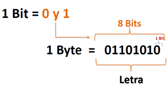

## Unidades de medida de la información

Con estas unidades medimos la capacidad para albergar información que tiene el disco duro, un USB o cualquier otro elemento de un sistema informático diseñado para tal efecto. Los medios de almacenamiento pueden ser muy diferentes.

Entre las unidades de medición de almacenamiento, es decir, la cantidad de bits que almacenan tenemos la siguiente clasificación:

### Bit

El bit es la unidad mínima del código binario. Cada bit sólo puede tener 2 valores 0 o 1. Con un número n de bits pueden representarse hasta 2 elevado a n valores diferentes.

Un bit es una unidad muy pequeña, por lo que habitualmente se utilizan múltiplos del byte, especialmente el **Gigabyte** y el **Terabyte**.

### Byte

El byte (abreviado con la mayúscula B para diferenciarlo del bit) es una unidad de información compuesta por 8 bits. Se puede utilizar para almacenar, entre otras cosas, un carácter, como por ejemplo una letra o un número.

Como curiosidad, existía una medidas de cuatro bits que se conoce como **nibble**, pero no se utiliza en la actualidad.

### Kilobyte

    En el inicio de la informática, al utilizar el sistema binario, resultó más cómodo utilizar potencias de dos para establecer las unidades. Y así se estableció el Kilobyte como 1.024 bytes, es decir, dos elevado a la diez bytes. Por eso contamos de 1024 y no de 1000 en 1000.

Un KB corresponde a 1024 bytes (B). Se utiliza para almacenamiento de:

- Archivos pequeños
- Documentos de texto (1.000 caracteres)
- Imágenes en baja resolución.

### Megabyte

Un MB corresponde a 1024 Kilobytes (KB). Equivale a más de un millón de bytes.

Por ejemplo:

- Imágenes en alta resolución
- Archivos
- Programas pequeños

### Gigabyte

Un GB contiene 1024 MB de información. Equivale a mil millones de bytes. Es la unidad que más típicamente se maneja hoy en día, la podemos encontrar en:

- Tamaño de memoria RAM
- Capacidad de datos de líneas móviles
- Memorias USB y almacenamiento en smartphones.

Los ordenadores más comunes proveen de un espacio de más de 100 GB para memoria secundaria (discos duros)

### Terabyte

Un **Terabyte** o TB equivale a 1024 Gigabytes o 240 Bytes
Su símbolo es TB

Un **Terabyte** equivale aproximadamente a:

- 300 horas de video
- 3,6 millones de fotografías digitales estándar.
- 1.000 copias de la Enciclopedia Británica digital.

Los discos duros actuales de ordenador tienen capacidades en torno a 1-4 TB de espacio.

### Unidades mayores

Aunque los términos más allá del terabyte no se usan comúnmente, existen varias medidas inventadas, que con el tiempo se volverán habituales.

Las siguientes medidas por encima del TB son:

- 1 petabyte = 1.024 terabytes
- 1 exabyte = 1.024 petabytes
- 1 zettabyte = 1.024 exabytes
- 1 yottabyte = 1.024 zettabyte

Las medidas de almacenamiento de información (en base 2) aumentan de 1024 en 1024

### Conversión de unidades

Para realizar la conversión de las medidas de almacenamiento, se multiplica o divide por 1024 cuantas veces sea necesario hasta llegar a la medida deseada.

El único salto diferente es para pasar de Bytes a bits, en el que deberemos multiplicar o dividir por 8.

# Velocidad de transmisión de datos

Utilizamos constantemente las redes informáticas para transmitir todo tipo de información. La velocidad de transmisión y recepción nos da idea del “caudal” de información que nuestros aparatos y nuestras redes son capaces de enviar o recibir.

A la hora de definir las velocidades de transmisión se suele usar como base el bit, y más concretamente el bit por segundo, o `bps`. 

Los múltiplos de estos son el **Kilobit, Megabit y Gigabit**, siempre expresado en el término por segundo (ps). Las abreviaturas se diferencian de los términos de almacenamiento en que se expresan con b minúscula. Estas abreviaturas son:

    Kbps = 1.000 bits por segundo.
    Mbps = 1.000 Kbits por segundo.
    Gbps = 1.000 Mbits por segundo. 

Suele ocurrir que se confunden bps con Bps:

- El primero indica bits por segundo
- El segundo indica Bytes por segundo.

Por ejemplo: si la conexión a internet de nuestro instituto es capaz de recibir 100 Mbps, la máxima velocidad expresada en Bytes por segundo será ocho veces menor, es decir, 12,5 MBps.

Si queremos descargar un archivo de 5 GB (5.120 MB), tardaría:

- 5120 MB / 12,5 MBps = 409,6 s = 6,8 minutos (conexión de internet de 100 Mb)
- 5120 MB / 6,25 MBps = 819,2 s = 13,6 minutos (conexión de internet de 50 Mb)

### Preguntas

1. Si una película ocupa 700 MB ¿cuántas películas caben en un DVD que tiene 8,5 GB de capacidad?
2. Ordena de menor a mayor tamaño de los siguientes archivos: dibujo.bmp (1536 KB), carta.doc (1.048.576 bytes), cancion.mp3 (1,4 MB), video.avi (0,1 GB)
3. ¿Cuántos DVD de 4,7 GB se necesitan para grabar el contenido de un disco duro de 3 TB?
4. Cuenta cuantos meses faltan para tu próximo cumpleaños (número entero). Imagina que cada mes haces 500 fotos por mes con tu móvil a máxima resolución y los quieres guardar en un pendrive USB. ¿Cual te comprarías? Búsca uno en Amazon que te vaya bien.
5. Imagina que tienes una conexión de 20 Mbps. Le quieres enviar a un amigo todas las fotos. ¿Cuanto tardarán en llegarle?
6. Te quieres descargar un programa que ocupa 8 GB y en tu casa tienes fibra óptica de 300 Mbps. ¿Cuanto tiempo tardarás en descargarlo?
