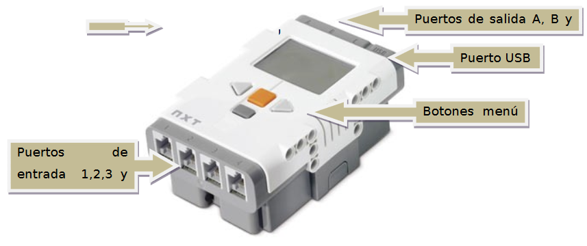
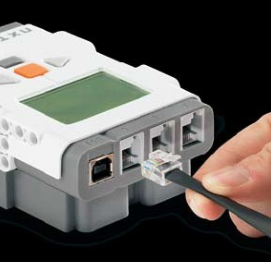

- [Principales características](#principales-caracter%c3%adsticas)
- [Brick](#brick)
- [Comunicaciones](#comunicaciones)
- [Puertos](#puertos)
- [Pantalla, altavoz y botones](#pantalla-altavoz-y-botones)
- [Sensores](#sensores)

# Principales características

El kit básico de LEGO MINDSTORMS NXT está compuesto (Ver figura 5)por:

- Un controlador
- Cuatro sensores (ultrasonidos, contacto, micrófono y luz)
- 3 servomotores 
- Un conjunto de piezas para crear estructuras mecánicas compatibles con las de otros productos LEGO.
- 

# Brick

El controlador, bloque NXT o brick, contiene una CPU con capacidad deejecutar programas de diferente complejidad. Concretamente, cuenta con unmicroprocesador Atmel ARM7 de 32 bits a 48 MHz. Se trata de un microprocesador utilizado extensivamente en electrónica de consumo (PDAs, teléfonos móviles,reproductores digitales multimedia,...) así como en otras aplicaciones empotradas como por ejemplo en la industria del automóvil.

Además, la plataforma cuenta con un coprocesador, Atmel AVR de 8 bits, y con:

- una memoria Flash de 256 KB
- una memoria RAM de 64 KB

# Comunicaciones

Con respecto a las comunicaciones, el controlador soporta tanto comunicaciones inalámbricas con Bluetooth (especificación v2.0 EDR) como comunicación por cable usando tecnología USB (estándar 2.0) que soportan tasas de trasferencia de datos de hasta 2.1 y 12 Mbits/s respectivamente. 

# Puertos

El bloque NXT cuenta también con:

- 4 puertos de entrada con conexión RJ12 (conector telefónico de 6 hilos),que permiten conectar sensores tanto digitales como analógicos.
- 3 puertos de salida RJ12 que se utilizan para conectar diferentes tipos de actuadores, normalmente servomotores.

La conexión de los motores y sensores al ladrillo NXT se realizará mediante unos cables proporcionados en el kit de Lego.

# Pantalla, altavoz y botones

Además, el controlador cuenta con una pantalla:

- LCD gráfica de 100x64 pixeles que se puede utilizar en modo gráfico para dibujar figuras
- Un altavoz con un canal de sonido con 8 bits de resolución capaz de generar tonos en el rango de 2 a 16KHz.
- 4 botones que permiten interactuar con el bloque NXT.

# Sensores

A pesar de que el kit básico de LEGO sólo cuenta con cuatro sensores que miden luminosidad, volumen sonoro, ultrasonidos y un sensor de contacto, existe una amplia gama de sensores compatibles con la plataforma LEGO que miden muchas más variables: Aceleración, inclinación, posición (GPS), dirección (brújula), giróscopo, presión atmosférica, presión neumática, temperatura, magnitudes eléctricas (tensión, corriente, conductividad), magnitudes químicas (pH, salinidad, etc.) y muchas más.

Dos de los suministradores más frecuentes de estos sensores son:

- HiTechnic(http://www.hitechnic.com/)
- MindSensors (http://www.mindsensors.com/)

No sólo ofertan sensores sino otros componentes compatibles con la plataforma LEGOMINDSTORMS. 

También existe un adaptador para conectar sensores Vernier (http://www.vernier.com/probes/) que amplía aún más el rango de sensores disponibles para medir magnitudes con la plataforma LEGO.

Vídeos de ejemplo

https://ehutb.ehu.es/video/58c66571f82b2b06308b456d
http://ehutb.ehu.es/series/58c66572f82b2b0c308b456b#874