Plataformas streaming

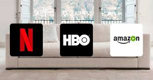

- [1. Streaming](#1-streaming)
- [2. Live Streaming](#2-live-streaming)
- [3. Evolución hacia el streaming](#3-evoluci%c3%b3n-hacia-el-streaming)
  - [Redes](#redes)
  - [Códecs y piratería](#c%c3%b3decs-y-pirater%c3%ada)
  - [Popularización de las grabadoras de CD](#popularizaci%c3%b3n-de-las-grabadoras-de-cd)
  - [Programas de intercambio de archivos P2P](#programas-de-intercambio-de-archivos-p2p)
  - [Mejoras en la conexión](#mejoras-en-la-conexi%c3%b3n)
- [4. Streaming hoy en día](#4-streaming-hoy-en-d%c3%ada)
  - [4.1. Servicios Over the top](#41-servicios-over-the-top)
  - [4.2. Modelos de servicios](#42-modelos-de-servicios)
- [5. Modelo basado en suscripción](#5-modelo-basado-en-suscripci%c3%b3n)
- [6. Servicios más populares](#6-servicios-m%c3%a1s-populares)
  - [6.1. Netflix](#61-netflix)
    - [Netflix original](#netflix-original)
  - [6.2. HBO](#62-hbo)
  - [6.3. Movistar plus](#63-movistar-plus)
    - [Movistar+ Lite](#movistar-lite)
  - [6.4. Amazon prime video](#64-amazon-prime-video)
    - [Asociación con otros servicios](#asociaci%c3%b3n-con-otros-servicios)
  - [6.5. Disney plus](#65-disney-plus)
  - [6.6. Comparativa suscripciones](#66-comparativa-suscripciones)
- [7. Visualización](#7-visualizaci%c3%b3n)
  - [7.1 Visualización online y dispositivos](#71-visualizaci%c3%b3n-online-y-dispositivos)
  - [7.2. Chromecast](#72-chromecast)
- [8. Spotify](#8-spotify)
- [9. Google stadia](#9-google-stadia)

# 1. Streaming

- Permite accedir a contenidos antes de que se hayan descargado por completo.
- Al reproduir contenidos en Streaming se ahorra espacio en memòria.
- Videos y música están en la nube
- Se van descargando progresivamente
- Se guardan de forma temporal, por lo que no se suelen almacenar.

# 2. Live Streaming

- Permite el consumo  y  publicación  de contenidos  en directo
- Una  de  las partes, o  todas ellas,  emiten  contenidos  que acaban  de  ser grabados,  para  que puedan  consumirse  de  la  misma forma.
- Todo ello con  muy  poco  tiempo  de  retardo,  dependiendo  de  factores  como  velocidad  de conexión, pero en directo.

# 3. Evolución hacia el streaming

## Redes

- Primeros  accesos  a  la  red  eran  hechos  a través  de  líneas  de  teléfono  convencionales
  - Interrumpiendo las llamadas telefónicas
  - Tarifa plana horaria
- Lo  máximo  que se  podía conseguir  de velocidad eran 56kbps
  - Tiempo descarga archivo mp3: 30 minutos.
- Prácticamente imposible hacer transmisiones en tiempo real.

## Códecs y piratería

Aparición de primeros códecs de audio y video MP3 y DivX.

MP3 fue el primer formato de compresión de audio popularizado gracias a Internet, ya que hizo posible el intercambio de ficheros musicales.

Estos codecs permitían convertir audio (CD) y video (DVD) en archivos de ordenador que generalmente ocupaban una décima parte del tamaño original.

## Popularización de las grabadoras de CD

- Se empiezan a comercializar las grabadoras de CD domésticas.
- En un CD podían caber aproximadamente 100 archivos MP3.
- Una película en DVD (4,7 GB) se podía comprimir en el tamaño de un CD (650 MB).
  

## Programas de intercambio de archivos P2P

Paralelamente, surgen los programas de intercambio de archivos a través de redes P2P, con **Napster** como su exponente más importante.

Algunos de los más populares fueron, entre otros:

- Emule
- Bittorrent
- Ares

## Mejoras en la conexión

- Crecimiento en infraestructura como ADSL o fibra óptica
- Se desarrolló la tecnología  de  banda  ancha  (mayor velocidad) lo  que posibilitó  la  transmisión  de  video.
- Comercialización del Internet con costos cada vez menores
- Avances en las capacidades de hardware de los ordenadores

Los  navegantes empezaron  a  tener la  posibilidad  de  descargar  contenido  para disfrutarlo. Era necesario esperar a que la descarga se realizase por completo y no era un proceso rápido precisamente.

Todo lo que se descargaban se hacía de manera local y utilizando la poca  capacidad  que  por  aquel  entonces  tu  disco  duro  podía  ofrecerte
Se debía eliminar unas descargas para poder almacenar contenido nuevo

# 4. Streaming hoy en día

- Las plataformas audiovisuales de Streaming son entornos informáticos que utilizan sistemas compatibles entre sí
- Ofrecen contenido audiovisual mediante conexión a internet para poder visualizar en línea
- También podemos descargar el contenido a un dispositivo portátil para visualizarlo sin conexión
- Acceso de los usuarios a contenidos a través de métodos como el Streaming está causando un importante cambio en las formas de creación, distribución y consumo de contenidos. 

## 4.1. Servicios Over the top 

Permiten ver productos populares en PC, Tablet, consolas y otros dispositivos

Estos tipos de servicios se han convertido en una prioridad
estratégica para empresas de entretenimiento o cadenas de televisión.

## 4.2. Modelos de servicios

- Modelos basados en la **publicidad**: YouTube, Google.
- Modelos basados en el **revenue-sharing**: VeVo, Blinkx, BlipTV
- Modelos **mixtos**: BBC, FreeSat, Hulu, ITV Player, etc.
- Modelos  basados  en  **suscripciones**  o  **pago  por  contenidos**: Netflix,  Apple,  Hulu  Plus,  Sky,  Amazon,  Time  Warner,  Ultraviolet, Qriocity, TiVo, HBO, etc.

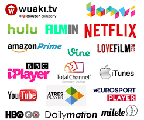

# 5. Modelo basado en suscripción

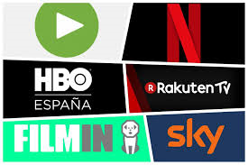

- Dan  acceso  a películas, programas  y series  de  diferentes de  canales  
- Para ello  se han adquirido previamente derechos vía pago de una cuota mensual o pagando por la opción de ver un título concreto

En España, los más populares son:

- Netflix, Filmin, Sky
- HBO, Rakuten TV, Movistar + y Amazon Prime Video

# 6. Servicios más populares

        El 37% de los hogares españoles con internet declaran tener algún tipo de estas plataformas

## 6.1. Netflix

- Originariamente era un servicio de alquiler y venta de DVD. Introducción de Streaming desde 2007.
- Llega a España en 2005
- Principal Servicio Premium de suscripción mensual del mundo

### Netflix original

Desde 2013 entra en la industria de producción de contenido: House of cards.

Netflix lanzó 126 series originales o películas en 2016, más que cualquier otra red o canal de cable.

## 6.2. HBO

Propiedad de **Time Warner**, existe desde 1972 en USA.

En 1999, HBO se convirtió en el primer canal de cable de los EE. UU. Fue el primer canal de televisión por cable y satélite que no usaba la red de difusión terrestre de televisión habitual.

- HBO España desde 2016
- Tiene acuerdo exclusivo con **Vodafone**
- Estrategia basada en series de actualidad

## 6.3. Movistar plus

- Telefónica compra **Canal+** a PRISA (primer operador audiovisual de pago)
- Lanzado en 2015 como fusión Canal+ y Movistar TV
- Características principales
  - 80 canales TV, 5000 títulos cine y series
  - Grabación en la nube, contenido HD y VoD
  - Visionado multidispositivo mediante Yomvi
  - No pretenden contenido de terceros, sinó ser dueños de su propio contenido y crearlo

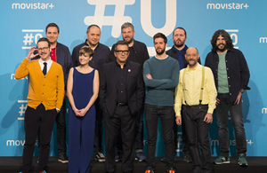

### Movistar+ Lite

Movistar+ Lite es un nuevo servicio de Movistar, que a diferencia de su Movistar+ convencional no necesita que seas cliente de la operadora

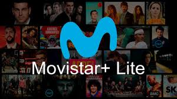

## 6.4. Amazon prime video

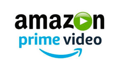

**Características**

- Lanzado en 2006 (USA)
- Desarrollado y propiedad de Amazon

### Asociación con otros servicios

Los clientes también tienen también:

- Amazon Prime (envíos)
- [Amazon Drive](https://www.amazon.es/b?ie=UTF8&node=12935598031)
- [Reproducción sin anuncios en Twitch](https://twitch.amazon.com/tp)
- Acceso prioritario a ofertas flash

## 6.5. Disney plus

Desde el 12 de noviembre funciona en Estados Unidos, Canadá y en los Países Bajos.

A diferencia de Netflix, no habrá varios planes de suscripción y precios. Sólo habrá uno: el precio de Disney Plus es actualmente de 6,99 dólares en Estados Unidos y de 6,99 euros en Holanda.

El 31 de marzo de 2020 llegará Disney Plus a España y a otros países europeos como Alemania, Francia, Italia, Irlanda y Reino Unido.

Características:

- Cuatro transmisiones simultáneas
- Hasta siete perfiles de usuario por cada cuenta creada. Cada uno de los perfiles mantendría sus propias recomendaciones y su propio historial de visionado.

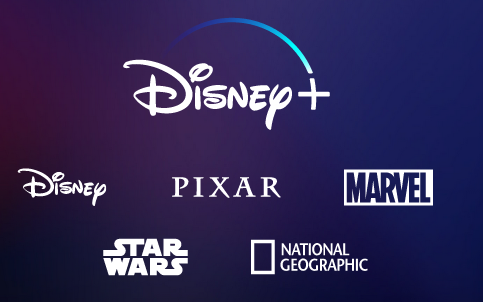

## 6.6. Comparativa suscripciones

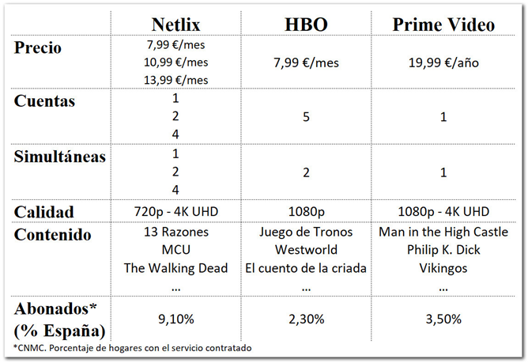

# 7. Visualización

## 7.1 Visualización online y dispositivos

Los servicios de streaming los podemos utilizar:

- Desde un navegador conectando a la página web de la plataforma
- A través de una app en caso de un móvil, tablet o SmartTV.
- En caso de no disponer de SmartTV, se pueden utilizar otros dispositivos para añadirle funcionalidades, como el chromecast.

En general existen limitaciones de dispositivos:

- Número máximo de equipos registrados
- Número máximo de dispositivos conectados simultáneamente.

## 7.2. Chromecast

**Chromecast** es un adaptador de transmisión de medios de Google que permite a los usuarios reproducir contenido en línea como videos y música en un televisor digital.

El adaptador es un **dongle** que se conecta al puerto **HDMI** del televisor; un cable se conecta a un puerto USB para alimentar el dispositivo. 

Una **aplicación móvil** hace posible usar esencialmente un teléfono inteligente, tableta, computadora portátil o computadora de escritorio como control remoto de TV.

Una vez que comienza la transmisión, no es necesario mantener abierta la aplicación, y el dispositivo se puede usar para otros fines. Chromecast puede transmitir contenido desde un número creciente de fuentes, incluidas Netflix, Hulu Plus, YouTube, música y películas de Google Play y el navegador Chrome.

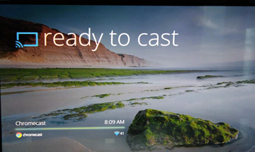

# 8. Spotify

Spotify es una aplicación de música, que permite al usuario transmitir (reproducir) música, canciones o incluso podcasts. Aunque los usuarios pueden disfrutar escuchando sin conexión descargándolo en la aplicación. 

- La versión **gratuita** tiene anunciosL
- La versión **premium** es de pago.

Spotify fue creado por Daniel Ek y Martin Lorentzon. Ambos son empresarios suecos. Se desarrolló en 2006 en Suecia. Su sede se encuentra en Londres, Reino Unido.

Otros productos parecidos han aparecido más recientemente como:

- [Youtube Music](https://music.youtube.com/)
- [Amazon Music](https://www.amazon.es/music/unlimited?_encoding=UTF8&ref=dmm_acq_marin_d_bra%7Cc_396321122850_m_Taw5HTL0-dc_s__)

# 9. Google stadia

Stadia es el nombre del servicio de streaming de videojuegos de Google. Permite jugar a videojuegos en prácticamente cualquier dispositivo por streaming.

No se necesita una consola física para jugar, sino que se puede hacer con dispositivos de los que ya disponemos.

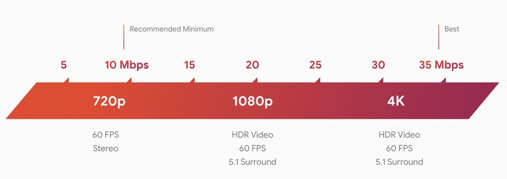

Versiones de stadia:

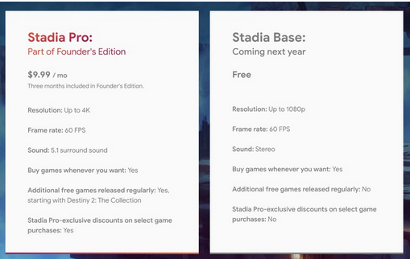