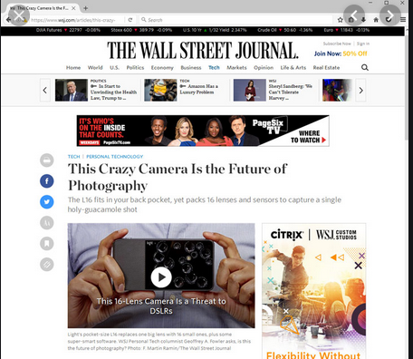
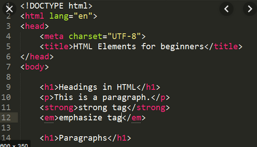

## Introducción páginas web

# Página web

Una **web o página web** es en realidad un **sitio web** (website) formado por varias páginas web enlazadas entre sí. Los documentos que componen el sitio web son archivos y carpetas que contienen texto, imágenes, botones, animaciones, tablas, gráficos, videos, etc.

# Navegadores

Para acceder a las páginas web usamos un **navegador**, que se encarga de comunicar nuestro ordenador con el servidor que alberga la página web.

Los más habituales son:

- Google Chrome
- Internet Explorer
- Mozilla Firefox
- Safari

# Páginas estáticas y dinámicas

**Paginas estáticas:** Son páginas enfocadas principalmente a mostrar una información permanente, se crean principalmente mediante el lenguaje HTML. Siempre se ven igual y no cambian según la navegación.

**Páginas Dinámicas:** Se construyen haciendo uso de otros lenguajes de programación, siendo el más utilizado de todos el PHP. Permiten la creación de aplicaciones dentro de la propia Web, ofrecen también una mayor interactividad con los usuarios que la visiten.

# Lenguaje HTML

**HTML** (HyperText Markup Language o Lenguaje de Marcado de Hipertexto) es el lenguaje que se utiliza para crear los documentos que componen el sitio web. Este lenguaje:

- Indica a los navegadores cómo deben mostrar el contenido de una página web.
- Nos permite enlazar y navegar por Internet.

El lenguaje HTML contiene dos partes:

- El **contenido**, que es el texto que se verá en la pantalla de un ordenador,
- Las **etiquetas** y atributos que estructuran el texto de la página web en encabezados, párrafos, listas, enlaces, etc. y normalmente no se muestra en pantalla.

Los archivos HTML deben tener una extensión htm o html (ej. miweb.htm o miweb.html). Una página web se puede crear:

- Directamente escribiendo en HTML (en el editor de texto y guardándolo con la extensión .htmlo .html)
- Mediante programas **editores** de páginas web (Adobe Dreamweaver, MicrosoftExpression Web, Kompozer, etc.)

# La primera página web

Ahora vamos a crear una página web sencilla siguiendo el tutorial de **w3schools**

https://www.w3schools.com/
