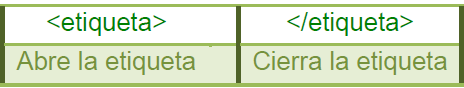
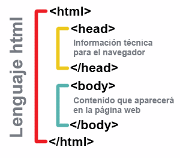

# Estructura de un documento web: HTML.

## Etiquetas

Las páginas Web se escriben como etiquetas que hay que abrir y cerrar. Las etiquetas son cajas contenedoras de la información.

Las etiquetas se abren o cierran mediante los símbolos<> y </>

La estructura de la página web debe llevar las siguientes etiquetas:

Atributos

Estructura básica de un documento HTML.

Extensión HTML

Caracteres especiales

Tipos de elementos

Etiquetas básicas

Listas

Encabezados

Tablas

Imágenes

Enlaces
