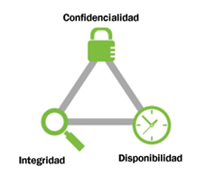

# 1. La seguridad de la información

La **seguridad informática** es el conjunto de acciones, herramientas y dispositivos cuyo objetivo es dotar a un sistema informático (conjunto de hardware, software, personas y procedimientos) de integridad, confidencialidad y disponibilidad.

## 1.1. Principios de la seguridad informática

**Integridad:** Un sistema informático es íntegro cuando impide la modificación de la información a cualquier usuario que no haya sido autorizado con anterioridad.

Ejemplos:

- Alteración malintencionada de archivos
- Modificación de informes de ventas (empleados)

**Confidencialidad:** Un sistema informático es confidencial cuando impide la visualización de datos a los usuarios que no tengan privilegios en el sistema.

Ejemplos:

- Robo de información confidencial por parte de un atacante a través de internet
- Divulgación no autorizada a través de las redes sociales de información confidencial
- Acceso por parte de un empleado a información crítica de la compañía ubicada en carpetas sin permisos asignados, a la que no debería tener acceso

**Disponibilidad:** Un sistema informático es disponible cuando está en todo momento en funcionamiento y accesible para que los usuarios autorizados puedan hacer un uso adecuado de ellos.

Ejemplos:

- Imposibilidad de acceder al correo electrónico corporativo
- Ataque de denegación de servicio, en el que el sistema «cae»impidiendo accesos legítimos.

## 1.2. ¿Qué queremos proteger?

La seguridad informática pretende **proteger recursos** valiosos de una organización. En un sistema informático lo que queremos proteger son sus activos, es decir, los recursos que forman parte del sistema y que podemos agrupar en:

- **Hardware**: elementos físicos del sistema informático, tales como procesadores, electrónica y cableado de red, medios de almacenamiento (cabinas, discos, cintas, DVDs,...).
- **Software**: elementos ló́gicos o programas que se ejecutan sobre el hardware, tanto si es el propio sistema operativo como las aplicaciones.
- **Datos**: comprenden la información lógica que procesa el software haciendo uso del hardware. En general serán informaciones estructuradas en bases de datos o paquetes de información que viajan por la red.
- **Otros**: fungibles, personas, infraestructuras,.. aquellos que se 'usan y gastan' como puede ser la tinta y papel en las impresoras, los soportes tipo DVD o incluso cintas si las copias se hacen en ese medio, etc.

De ellos los mas críticos son los datos, el hardware y el software. Es decir, los datos que están almacenados en el hardware y que son procesados por las aplicaciones software.

El activo mas crítico son los **datos**. El resto se puede reponer con facilidad pero los datos no.

La empresa debe tener una buena política de copias de seguridad y ser capaz de reponerlos en el estado mas próximo al momento en que se produjo la pérdida.

Si la empresa no es capaz de reponer dichos datos, le conllevaría de pérdida de tiempo y dinero.

Para ello se establecen **planes de seguridad** que garantizan los tres principios establecidos con anterioridad. Estos nos ayudan a identificar **vulnerabilidades** e implementar planes de contingencia adecuados.

## 1.3. Contra qué nos tenemos que proteger

- **nosotros mismos**: Borramos archivos sin darnos cuenta, eliminamos programas necesarios para la seguridad o aceptamos correos electrónicos perjudiciales para el sistema.
- **accidentes y averías**: Pueden hacer que se estropee nuestro ordenador y perdamos datos necesarios.
- **usuarios intrusos**: Bien desde el mismo ordenador, bien desde otro equipo de la red, puedan acceder a datos de nuestro equipo.
- **software malicioso o malware**: Programas que aprovechan un acceso a nuestro ordenador para instalarse y obtener información, dañar el sistema o incluso llegar a inutilizarlo por completo

## 1.4. La importancia de los datos

La importancia de la información que manejamos será, en gran medida,relativa a nuestro sector de negocio.

**Ámbito sanitario**

Gran volumen de información personal de pacientes, a la que se deben aplicar todas las medidas de seguridad para evitar que se pierda, modifique o se acceda a ella sin autorización.

Suele ser necesario llevar un registro de los accesos y modificaciones.

**Sector financiero**

Se maneja información confidencial tanto de clientes como de operaciones financieras de compras y ventas de activos cuya difusión puede suponer una importante pérdida económica o un perjuicio para nuestros clientes.

**Sectores industriales o de desarrollo de productos**

Confidencialidad de los procesos y procedimientos que nos pueden aportar una mejora de productividad sobre la competencia.

**Hostelería y restauración**

Se maneja, además de un volumen de datos de carácter personal muy significativo, información sobre reservas, cuya pérdida nos podría poner en una situación muy complicada con nuestros clientes.

**Legislación de datos**

La legislación sobre protección de datos de carácter personal, define datos personales como toda información sobre una persona física identificada o identificable.

Una **persona es identificable** si puede determinarse su identidad, directa o indirectamente.

Esta legislación exige la protección de la seguridad de los datos de carácter personal ante posibles riesgos que afecten a la privacidad de las personas por ejemplo: acceso no autorizado, uso ilegítimo, modificación no autorizada, discriminación por perfilado o pérdida de datos.

**Datos sensibles**

Existen categorías especiales de datos, los denominados **datos sensibles** que exigen una protección reforzada y que están sujetos a un régimen jurídico especial.

Estos datos son datos personales que revelan:

- Ideología, afiliación sindical, opiniones políticas
- Creencias religiosas y otras creencias.
- Origen racial o étnico
- Relativos a la salud o la vida sexual y orientación sexual, datos genéticos y biométricos.
- Datos de condenas penales o administrativas
