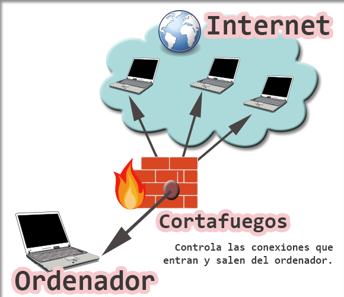

# 10. Protección de las conexiones de red

## 10.1. Cortafuegos

Es un **hardware o software** que controla la información entrante y saliente del equipo, actuando como defensa en caso de amenaza.

Este se encarga de examinarla y comprueban que superen los criterios de seguridad. estos criterios pueden establecerse en función de las preferencias de cada uno.

Se utiliza en los dispositivos con internet y suelen incluirse con los antivirus, aunque algunos sistemas operativos como Windows ya llevan instalado el suyo propio.

## 10.2. Redes privadas virtuales

Consiste en conectarse a Internet a través de una red privada, estableciendo una conexión cifrada y así evita que el buscador guarde tus datos.

- **VPN de acceso remoto:** acceso a una red privada con una red pública. Ejemplos son conexiones desde lugares públicos como hoteles o cafeterías.
- **VPN de sitio a sitio:** conectar redes a través de internet, pudiendo comunicarse entre ellas.

## 10.3. Certificados de servidor web y HTTPS

SSL es un protocolo criptográfico en el que se otorgan certificados a las páginas para garantizar la integridad y confidencialidad de las comunicaciones de esta.

Cuando TSL y SSL se combinan, forman el protocolo de navegación HTTPS. Este es indicador de que se trata de un lugar seguro, en el que se asegura como un sito de comercio electrónico seguro.

En los navegadores aparece como un candado verde, y si además el nombre de la web están en verde es que se trata de una versión extendida de este protocolo.