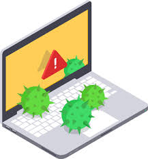
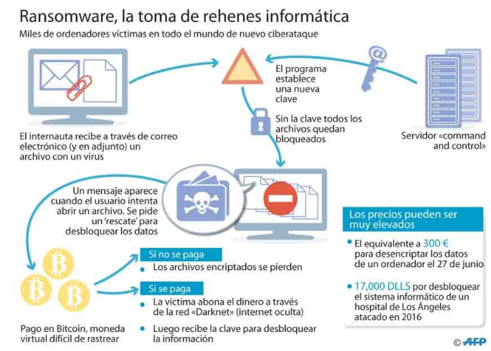
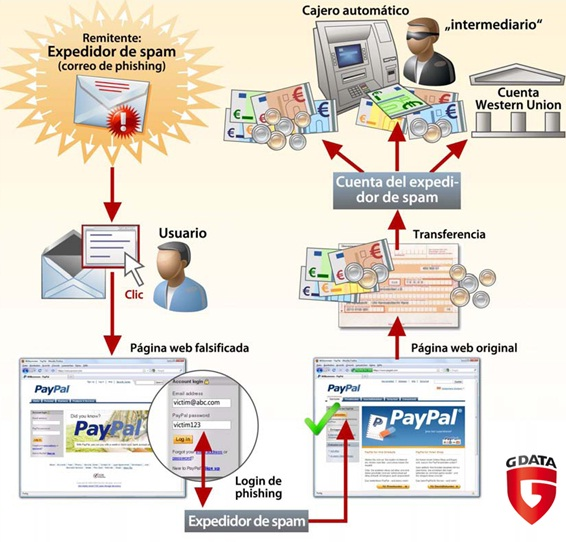
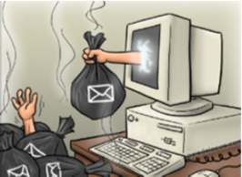

# 3. Malware

Nuestro ordenador está expuesto a una serie de pequeños programas o software , potencialmente **peligroso**. Tiene la capacidad de hacer daño a un equipo y posibilidad de **propagarse** a otros sistemas.

Agrupa a los virus, gusanos, troyanos y en general a todos los programas que se han desarrollado para acceder a los ordenadores sin autorización y producir efectos no deseados.

- En los comienzos la motivación principal de los creadores de virus era el reconocimiento publico.
- Con la evolución de las tecnologías de comunicación y su implantación en todos los aspectos de la la vida diaria, los ciberdelincuentes han visto en ello un negocio muy lucrativo, han pasado a tener una motivación económica.

**¿Cömo entra en nuestros equipos?**

que puede introducirse en el sistema por medio de:

- Los correos electrónicos
- La navegación por páginas web falsas

Los **ciberataques** combinan habitualmente varios tipos.

## 3.1. Formas de obtener un beneficio económico por parte del creador

- Robar información sensible del ordenador infectado como contraseñas, mail, datos personales,
credenciales de acceso a diferentes entidades, banca online, etc.
- Crear una red de ordenadores infectados llamados Botnet o red Zombi, de tal manera que el
atacante manipula todos simultáneamente por ejemplo para realizar ataques de denegación de
servicio, envió de spam, etc.
- Venta de falsas soluciones de seguridad (rogueware) que no realizan lo que afirman, como por
ejemplo falsos antivirus.
- Cifrar el contenido de los ficheros del ordenador y solicitar un rescate económico al usuario del
equipo para recuperar la información.

## 3.2. Cómo se infecta un ordenador

### Explotando una vulnerabilidad

Los sistemas operativos o programas no siempre se comportan como se espera en determinadas situaciones y esto es aprovechado para ejecutar comandos no
deseados o introducir programas maliciosos.

### Ingeniería social

Mediante técnicas de abuso de confianza para apremiar a un usuario a que realice
determinada acción.

### Por un archivo malicioso

Es la forma en que gran cantidad de malware llega al ordenador, en archivos adjuntos, por medio del correo no deseado o spam, por la ejecución de aplicaciones web, archivos descargados de redes p2p, cracks, etc.

### Dispositivos extraibles

Muchos gusanos dejan copias de si mismos en dispositivos extraibles y por
medio de la ejecución automática al conectarlo o reproducirse.

### Cookies maliciosas

Pequeños ficheros que monitorizan y registran las actividades del usuario en
internet con fines maliciosos, por ejemplo tener hábitos de navegación para empresas de publicidad.

## 3.3. Tipos de malware más conocidos

Algunos de los tipos de malware más habituales son:

- Virus
- Gusanos
- Troyanos
- Espía
- Dialers
- SPAM
- Pharming
- Phishing

Enlace: los 8 virus más famosos de todos los tiempos.

https://uk.norton.com/norton-blog/2016/02/the_8_most_famousco.html

### Virus

Se trata de un programa que se instala en el ordenador sin el conocimiento del usuario.

Su finalidad de **propagarse** a otros equipos de la red o de otras redes a las que esté conectado.
Puede provocar desde pequeñas **bromas** hasta la **destrucción** total de discos duros.

### Gusano

Tipo de virus cuya finalidad es la de multiplicarse e infectar una red de ordenadores. Las consecuencias no suelen implicar la destrucción de archivos pero sí **ralentizan** el funcionamiento.

### Troyano

Código malicioso que **se oculta dentro de un archivo** inofensivo y útil o llamativo para el usuario. Requieren la intervención de sus víctimas para propagarse.

Lo que intentan es disponer de una puerta de entrada a nuestro ordenador para que otro usuario o aplicación recopile información de nuestro ordenador o tome el control absoluto de él.

Existen una gran variedad de troyanos, en función de sus acciones y utilidades:

- **Downloader** (descarga otros programas maliciosos)
- **Clicker** (busca beneficio económico a través de clicks en publicidad)
- **Keylogger** (registra las actividades que se realizan en el sistema)
- **Backdoor** (abre puertos en el sistema)
- **Bot** (controla el equipo de forma remota), etc.

### Spyware

Programa que se instala en el ordenador sin conocimiento del usuario con la finalidad de recopilar información sobre el usuario para enviarla a servidores de Internet gestionados por compañías de publicidad.

### Adware

Software que se esconde en los anuncios de Internet. Tras acceder los equipos y dispositivos, este malware roba la información de las empresas y usuarios.

### Ransomware

El **ransomware** es un tipo de malware que toma a sus archivos como rehenes.

Lanzado en septiembre de 2013, **CryptoLocker** se extendió a través de archivos adjuntos de correo electrónico y cifró los archivos del usuario para que no pudieran acceder a ellos.

Luego, los piratas informáticos envian supuestamente una clave de descifrado a cambio de una suma de dinero.

# 3.4. Otras amenazas malware

## Phishing

Es un tipo de fraude ejecutado a través de un **correo electrónico** en el que se solicita la actualización de los datos personales (usualmente vinculados a cuentas u otros instrumentos financieros). 

Aparece un **enlace** para que se haga clic de acceso a una página falsa que tendrá prácticamente la **misma apariencia** de la página de la institución simulada.

## Pharming

Se instala un código malicioso introducido premeditadamente que permite **redireccionar** un nombre de dominio a otra máquina diferente.

Si el usuario ha sido redireccionado, cuando introduzca el nombre de dominio ingresará a una página ‘web’ falsa (en apariencia similar a la que deseaba ingresar) permitiéndole al estafador obtener todos los datos personales del cliente.

Finalidad:

- Obtener datos bancarios
- Cometer delitos económicos

## Spam

Envío de correo electrónico publicitario de forma masiva a cualquier dirección de correo electrónico existente. Su finalidad en general suele ser la de 
vender productos.

## Hoax

Mensajes de correo distribuidos en cadena, cuyo objetivo es realizar engaños masivos. Por ejemplo:

- Historias solidarias inventadas
- Mensajes que traen mala suerte
- Alertas falsas sobre virus

