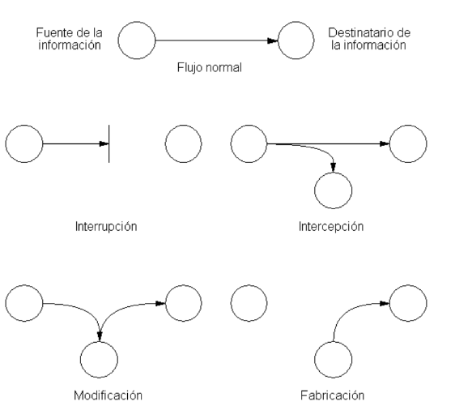
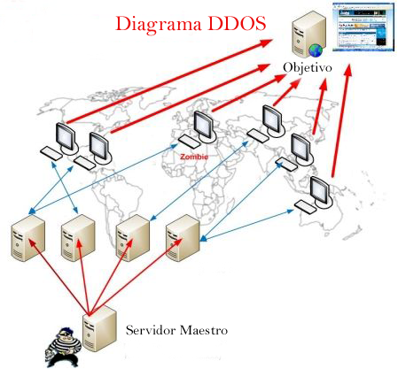

# 4. Ataques a los sistemas informáticos

- https://www.20minutos.es/noticia/4071984/0/los-ciberataques-mas-sonados-de-la-historia-brechas-de-ciberseguridad-en-las-grandes-empresas/
- https://www.20minutos.es/noticia/2227019/0/apple-investigacion-pirateria/icloud-fotos-famosas-fbi-celebgate/desnudas-jennifer-lawrence/
- https://www.20minutos.com/noticia/26344/0/infieles-al-descubierto/robo-datos/ashley-madison/
- https://www.20minutos.es/noticia/1185738/0/sony/ataque/informatico/
- https://www.20minutos.es/noticia/3037174/0/telefonica-garantiza-trabajadores-normalidad-ciberataque/
- https://www.20minutos.es/noticia/4070463/0/prosegur-cierra-servicios-ciberataque/

## 4.1. Tipos de ataques

- **Interrupción**: Destruir o dejar inutilizable los dispositivos. 
- **Interceptación**: Acceder a recursos para los que no tiene autorización.
- **Modificación**: Acceder a los recursos y manipularlos. 
- **Suplantación o fabricación**: Inserta objetos falsificados. Pueden ser:
 - Suplantación de identidad
 - Suplantación de una dirección web
 - Suplantación de una dirección IP

## 4.1. Ataques remotos

Se trata de un conjunto de técnicas utilizadas para intentar acceder a un sistema informático a distancia. Se suele utilizar software malicioso que aprovecha vulnerabilidades de seguridad de programas o del sistema operativo.

- **Inyección de Código:** Añade o borra información en sitios remotos
- **Escaneo de Puertos**: Averigua los puertos abiertos para atacar.
- **Denegación de Servicios (DoS):** Satura los recursos de un equipo o de una red para que deje de responder.
- **Escuchas de Red**: Captura e interpreta el tráfico de una red.
- **Spoofing**: Suplanta la identidad del usuario.
- **Fuerza Bruta:** Probar todas las combinaciones posibles de claves de un sistema.
- **Elevación de Privilegios:** El atacante se hace root o administrador para controlar más.

Ejemplos: 

- [SQL Injection](https://www.w3schools.com/sql/sql_injection.asp)

## 4.2. Botnets

Una botnet, o mejor dicho, una red de bots (también conocida como ejército zombi) es una red constituida por un gran número de equipos informáticos que han sido "secuestrados" por malware, de forma que quedan a disposición de un hacker. Al tomar el control de cientos o miles de equipos, las botnets se suelen utilizar para enviar spam o virus, para robar información personal o para realizar ataques de denegación de servicio distribuido (DDoS). A día de hoy, se consideran una de las mayores amenazas en Internet.
Botnet

Para que un equipo forme parte de una botnet, primero es necesario que se **infecte** con algún tipo de **malware** que se comunica con un servidor remoto o con otros equipos infectados de la red. De esta forma, recibe instrucciones de quien controla la botnet, normalmente hackers y ciberdelincuentes.

## 4.3 DDoS: denegación de servicio distribuido

Los ataques DDoS **bloquean** sitios web o redes completas **saturándolos con tráfico** de miles de equipos infectados, lo que se conoce como una botnet.

**¿A quién afectan principalmente?**

Los ataques DDoS no suelen estar dirigidos a usuarios individuales, sino a servidores web relevantes como los de bancos, pasarelas de pago con tarjeta de crédito o sitios web de organismos públicos. 

Los bancos, los sitios web de noticias e incluso de instituciones públicas son el principal objetivo de este tipo de ataques, que impiden que los usuarios puedan acceder a ellos.

**¿cómo se ven afectados los usuarios?**

Dado que tanto el objetivo como los equipos utilizados en la botnet son víctimas, los usuarios individuales reciben daños colaterales en el ataque, ya sus equipos se ralentizan y fallan mientras se encuentran bajo el control del hacker.

Los motivos que llevan a un hacker a organizar un ataque DDoS suelen ser:

- El beneficio económico
- La venganza
- El deseo de ser un "troll"

El ataque hace que se cierre el sitio web y que sus servicios en línea dejen de estar disponibles para los usuarios, que suelen perder la paciencia y la confianza en la empresa, terminando por buscar otras opciones empresariales alternativas. Además de la consecuente **pérdida de ingresos**, esto produce un daño importante en la **reputación** de la organización.

Diagrama de un ataque DDos:

## 4.4. Ingeniería social

Los **eslabones** más **débiles** de cualquier cadena de seguridad son los seres humanos. La ingeniería social busca explotar este punto débil, apelando a la vanidad, la avaricia, la curiosidad, el altruismo o el respeto o temor a la autoridad de las personas, para conseguir que revele cierta información o que permita el acceso a un sistema informático.

Hay una serie de técnicas de ingeniería social que los ladrones utilizan. Incluyen:

- Cebos (ofrecerle algo que desea para conseguir que descargue un archivo malicioso), 
- Phishing (un correo electrónico fraudulento para que comparta información personal)
- Pretextos (hacerse pasar por otra persona con el fin de obtener acceso a información privilegiada)
- Scareware (engañarle para que crea que su equipo está infectado con malware y luego ofrecer una solución que infecta el ordenador).

### 4.5. Ciberacoso

El ciberacoso puede ser el tipo de ataque en línea más pernicioso, ya que los acosadores, que suelen **ocultarse** tras personalidades falsas, tienden a aprovecharse de las **inseguridades** o **debilidades** personales de la víctima para humillarla y causarle daños **psicológicos**.

El ciberacoso suele consistir en:

- El envío de mensajes amenazantes.
- La publicación de fotografías o vídeos humillantes de la víctima en redes sociales.

En ocasiones, incluso se crean páginas web sobre la víctima. Como a menudo vemos en los periódicos, el efecto del ciberacoso puede ser devastador y, en ocasiones, incluso mortal.

**¿De dónde proviene el ciberacoso?**

El ciberacoso lo practica la misma gente indeseable que acosa en la vida real. Personas que quieren **abusar de su poder** y elevar su **status** en las redes sociales **denigrando** y **humillando** a otros, especialmente si consideran que la otra persona es más débil o creen que puede representar una amenaza.

Los ciberacosadores pueden:

- Realizar publicaciones anónimas
- Esconderse tras identidades falsas
- Utilizar su identidad real sabiendo que no se van a enfrentar cara a cara con sus víctimas.

Muchos de ellos dicen o publican cosas en línea que jamás se atreverían a decir en la vida real.
