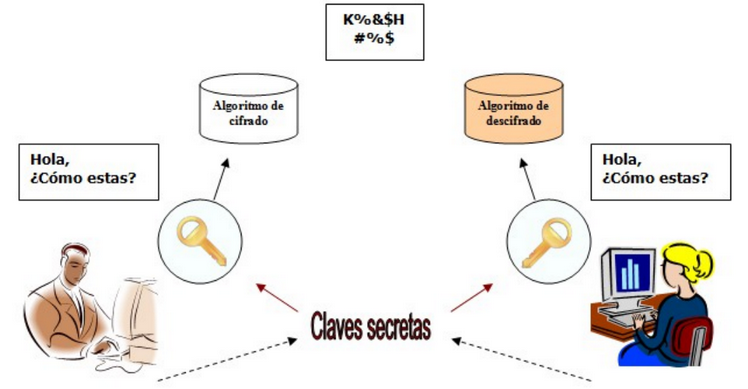
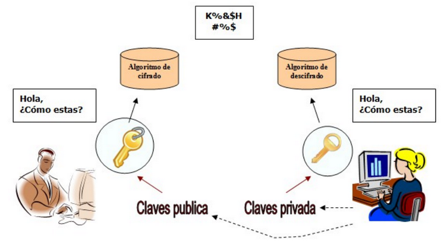

# 6. Cifrado de la información

## 6.1. Orígenes

## 6.2. Criptografía

La **criptografía** (del griego 'escritura oculta') es la ciencia de cifrar y descifrar información con técnicas especiales, usado frecuentemente en mensajes que solo puedan ser leídos por las personas a las que van dirigidos.

Al hablar de este área se debería hablar de criptologia que a su vez engloba:

- Las técnicas de cifrado (**criptografía**)
- Sus técnicas complementarias donde se incluye el **criptoanalisis** (técnica que estudia los métodos para romper textos cifrados con objeto de recuperar la información original en ausencia de claves).

- [Práctica tipos de cifrado](https://cryptii.com/pipes/caesar-cipher)

Todos estos métodos criptográficos se fueran perfeccionando y mejorando según avanzaba el tiempo. Es en la Segunda Guerra Mundial cuando se hace imprescindible el uso de máquinas que cifren los mensajes para así evitar que el enemigo interceptase información sensible para el desarrollo de las operaciones.

- [Máquinas enigma](https://www.google.com/search?client=firefox-b-d&biw=1920&bih=966&tbm=isch&sxsrf=ACYBGNT0fxRWa0DxAk1SNttpEINHJAJBmw%3A1574852405799&sa=1&ei=NVfeXcC3MIKAjLsP5cOH-AI&q=maquina+enigma+m3&oq=maquina+enigma+m3&gs_l=img.3..0i24.4590.5417..5548...0.0..0.82.386.5......0....1..gws-wiz-img.......35i39j0j0i67.S_eCof4Qw-g&ved=0ahUKEwiApuKxnormAhUCAGMBHeXhAS8Q4dUDCAY&uact=5#imgrc=7MSWvJylpjBB7M:) 

### Criptografía simétrica

La criptografía simétrica usa la misma clave para cifrar y descifrar mensajes. 

Dado que toda la seguridad recae en la clave, esta debe ser muy difícil de adivinar, para ello se usa la longitud y el conjunto de caracteres que use.

Ejercicio: [encriptacion AES](https://aesencryption.net/)

### Criptografía asimétrica o de clave pública

Cada usuario del sistema criptográfico ha de poseer una pareja de claves, formada por:

- Una **Clave privada**, que será custodiada por su propietario y no se dará a conocer a ningún otro.
- Una **Clave publica**, que será conocida por todos los usuarios.

Esta pareja de claves es **complementaria**: lo que cifra una solo lo puede descifrar la otra y viceversa.

Como es lógico pensar, estas claves se generan a la vez y se encuentran relacionadas matemáticamente entre sí mediante funciones de un solo sentido.

Resulta prácticamente imposible descubrir la clave privada a partir de la pública

Práctica: https://www.devglan.com/online-tools/rsa-encryption-decryption

## 6.3 Algoritmos

Los **algoritmos** son los métodos que se utilizan para transformar el texto claro en el texto cifrado.

Vamos a analizar el cifrado por sustitución del César.

        El algoritmo consiste en:

        - Sustituir cada letra del texto sin cifrar por otra letra del mismo alfabeto que se encuentra situada en el orden del diccionario N puestos por delante.
        - N es el valor de la clave, que como podemos ver, junto con el algoritmo, determinará exactamente la letra que sustituirá a la original.

Como podemos imaginar, hoy en día se utilizan diferentes algoritmos, algunos válidos para criptografía de clave privada y otras para criptografía de clave pública.

- **Algoritmos de clave privada**: DES, 3DES, RC4, IDEA Y AES son nombres de algoritmos de clave privada.
- **Algoritmos de clave pública**: DH, EIGamal, RSA.
