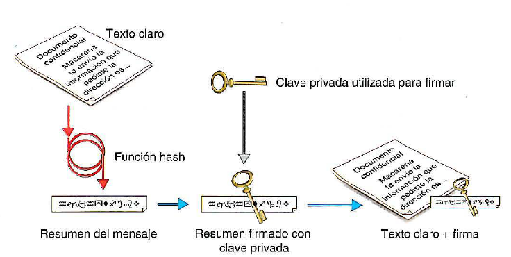
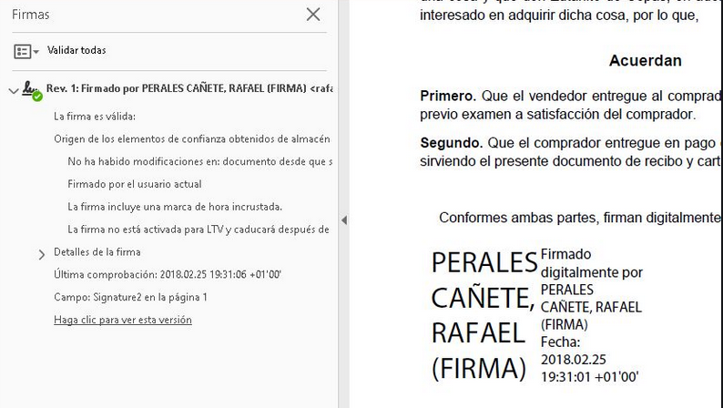

# 7. Firma electrónica y certificado digital

## 7.1 Firma electrónica

Una **firma electrónica** es un conjunto de datos electrónicos que:

- Acompañan o que están asociados a un documento electrónico
- Identifican al firmante de manera inequívoca
- Certifican la integridad del documento
- Aseguran que el firmante no puede repudiar lo firmado.

La firma digital viene a sustituir a la manuscrita en e[ mundo de [a informática. Es decir, si firmamos de forma digital un documenta, [e estaremos dando veracidad y como sucede con la firma manuscrita, no podremos decir que no [o hemos firmado nosotras; por lo tanto, seremos responsables de lo que en él se diga.

La descripción del mecanismo de firma electrónica es e[ siguiente:

1. Se **calcula un valor resumen del documento**, utilizando algún algoritmo como e[ SHA.
2. Este valor resumen **se cifra utilizando la clave privada** de nuestra pareja de claves pública-privada. Esto permite asegurar que la única persona que ha podido firmar el documento soy yo, el único que conoce la clave privada).
3. El resultado de este valor es e que se conoce como firma digital del documento.

**Sellado en el tiempo**

Una de las características más útiles que puede ir asociada a la firma electrónica es lo que se conoce como **"sellado en el tiempo"**. Se trata de un método para probar que un conjunto de datos (en este caso, la firma que se ha realizado) existió en un momento determinado (fecha y hora).

### Firma de documentos electrónicos

Si contamos con un **certificado digital**, podemos comenzar a firmar documentos. La firma electrónica en documentos se puede realizar de dos formas:

- Online, a través de un servicio de verificación y generación de firmas electrónicas como es VALIDe
- A través de aplicaciones de firma electrónica o de ofimática que, tras ser descargadas y ejecutadas en un ordenador, permitirán realizar firmas de documentación sin la necesidad de estar conectado a Internet.

## 7.2. certificado digital

Para poder realizar firma electrónica, previamente, será necesario contar con un **certificado digital** como los de la FNMT (Fábrica Nacional de Moneda y Timbre o el del DNI electrónico, que autentica, —mediante una pareja de claves en un fichero software o en tarjeta— la identidad (como persona física o jurídica) del firmante. 

### Autoridades de certificación

Estos certificados, son emitidos por una entidad emisora de certificados que dan fe de que el portador del certificado es quien dice ser. Existen varias autoridades de certificación: 

- FNMT
- Agencia de Tecnología y Certificación Electrónica de la Generalitat Valenciana
- Agència Catalana de Certificació
- Dirección General de la Policía (para el DNI), etc

Si disponemos de un certificado y quieres comprobar su validez, firmar, visualizar o validar una firma puedes utilizar los servicios del portal de firma electrónica.

### Tipos de certificados

Las entidades certificadoras expiden distintos tipos de certificados, dependiendo de si el solicitante es:

- Un ciudadano
- Un representante de una empresa (persona jurídica, de entidad sin personalidad jurídica y, para administradores únicos y solidarios)
- Un empleado público.

### ¿Cómo conseguir un certificado digital?

En caso de no contar con un certificado electrónico, el primer paso será **solicitarlo**. Los pasos que hay que seguir para realizar dicha solicitud son los siguientes:

1. Realizar una solicitud online. Al final de este proceso se obtiene un código que será necesario para poder acreditar tu identidad.
2. Presentarse en una Oficina de Registro para acreditar tu identidad.
   - Para el DNI tendrás que personarte en las oficinas de la D. G. de la Policía
   - Si solicitas un certificado de representante de una empresa, además debes acreditar la existencia de la entidad, que tienes el poder de representación y su vigencia. 
   - La Agencia Tributaria actúa como Oficina de Registro de los certificados emitidos por la FNMT. También hay Oficinas de Registro en la Comisión Nacional del Mercado de Valores o en la Comunidad Foral de Navarra. Puedes buscar la Oficina de Registro para acreditar tu identidad en el mapa de la FNMT-RCM.
3. Descargar el Certificado. Para ello, habrá sido necesario realizar el registro presencial y estar en posesión del código obtenido en el primer paso que permitirá descargar el certificado vía Internet.
