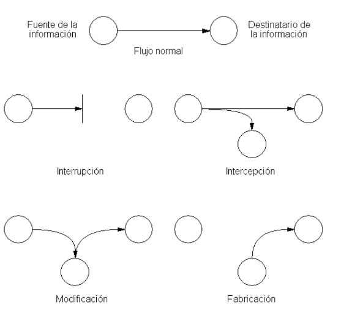

- [1. La seguridad de la información](#1-la-seguridad-de-la-informaci%c3%b3n)
  - [1.1. Principios de la seguridad informática](#11-principios-de-la-seguridad-inform%c3%a1tica)
  - [1.2. ¿Qué queremos proteger?](#12-%c2%bfqu%c3%a9-queremos-proteger)
  - [1.3. Contra qué nos tenemos que proteger](#13-contra-qu%c3%a9-nos-tenemos-que-proteger)
  - [1.4. La importancia de los datos](#14-la-importancia-de-los-datos)
- [2. Amenazas](#2-amenazas)
  - [2.1. Tipos de amenazas](#21-tipos-de-amenazas)
    - [Amenazas Humanas](#amenazas-humanas)
    - [Amenazas Lógicas](#amenazas-l%c3%b3gicas)
    - [Amenazas Físicas](#amenazas-f%c3%adsicas)
  - [2.2. Conductas de seguridad](#22-conductas-de-seguridad)
    - [Técnicas de seguridad activa](#t%c3%a9cnicas-de-seguridad-activa)
    - [Técnicas o prácticas de seguridad pasiva](#t%c3%a9cnicas-o-pr%c3%a1cticas-de-seguridad-pasiva)
- [3. Malware](#3-malware)
  - [3.1. Tipos de malware más conocidos](#31-tipos-de-malware-m%c3%a1s-conocidos)
    - [Virus](#virus)
    - [Gusano](#gusano)
    - [Troyano](#troyano)
    - [Spyware](#spyware)
  - [Adware](#adware)
  - [Ransomware](#ransomware)
- [3.2. Otras amenazas malware](#32-otras-amenazas-malware)
  - [Phishing](#phishing)
  - [Pharming](#pharming)
  - [Spam](#spam)
  - [Hoax](#hoax)
- [4. Ataques a los sistemas informáticos](#4-ataques-a-los-sistemas-inform%c3%a1ticos)
  - [4.1. Tipos de ataques](#41-tipos-de-ataques)
  - [4.2. Ingeniería social](#42-ingenier%c3%ada-social)
  - [4.3. Ataques remotos](#43-ataques-remotos)
- [5. Protección contra malware](#5-protecci%c3%b3n-contra-malware)
  - [5.1. Políticas de seguridad](#51-pol%c3%adticas-de-seguridad)
  - [5.2. Soluciones antivirus](#52-soluciones-antivirus)
  - [5.3. Síntomas de una infección](#53-s%c3%adntomas-de-una-infecci%c3%b3n)
  - [5.4. Pasos que debe darse en caso de infección](#54-pasos-que-debe-darse-en-caso-de-infecci%c3%b3n)
- [6. Cifrado de la información](#6-cifrado-de-la-informaci%c3%b3n)
  - [6.1. Orígenes](#61-or%c3%adgenes)
  - [6.2. Criptografía](#62-criptograf%c3%ada)
    - [Criptografía simétrica](#criptograf%c3%ada-sim%c3%a9trica)
    - [Criptografía asimétrica](#criptograf%c3%ada-asim%c3%a9trica)
    - [Criptografía de clave pública](#criptograf%c3%ada-de-clave-p%c3%bablica)
- [7. Firma electrónica y certificado digital](#7-firma-electr%c3%b3nica-y-certificado-digital)
  - [7.1 Firma electrónica](#71-firma-electr%c3%b3nica)
    - [Firma de documentos electrónicos.](#firma-de-documentos-electr%c3%b3nicos)
  - [7.2. certificado digital](#72-certificado-digital)
    - [Autoridades de certificación](#autoridades-de-certificaci%c3%b3n)
- [8. Navegación segura](#8-navegaci%c3%b3n-segura)
  - [8.1. Buenas prácticas](#81-buenas-pr%c3%a1cticas)
  - [8.2. Navegación privada](#82-navegaci%c3%b3n-privada)
  - [8.3. Proteger la privacidad en la red con un proxy](#83-proteger-la-privacidad-en-la-red-con-un-proxy)
  - [8.4. Navegación anónima](#84-navegaci%c3%b3n-an%c3%b3nima)
- [9. Privacidad de la información](#9-privacidad-de-la-informaci%c3%b3n)
  - [9.1. Amenazas a la privacidad](#91-amenazas-a-la-privacidad)
  - [9.2. Antiespías](#92-antiesp%c3%adas)
  - [9.3. Borrar archivos de forma segura](#93-borrar-archivos-de-forma-segura)
- [10. Protección de las conexiones de red](#10-protecci%c3%b3n-de-las-conexiones-de-red)
  - [10.1. Cortafuegos](#101-cortafuegos)
  - [10.2. Redes privadas virtuales](#102-redes-privadas-virtuales)
  - [10.3. Certificados de servidor web y HTTPS](#103-certificados-de-servidor-web-y-https)
- [11. Seguridad en comunicaciones inalámbricas](#11-seguridad-en-comunicaciones-inal%c3%a1mbricas)

# 1. La seguridad de la información

La **seguridad informática** es el conjunto de acciones, herramientas y dispositivos cuyo objetivo es dotar a un sistema informático (conjunto de hardware, software, personas y procedimientos) de integridad, confidencialidad y disponibilidad.

## 1.1. Principios de la seguridad informática

**Integridad:** Un sistema informático es íntegro cuando impide la modificación de la información a cualquier usuario que no haya sido autorizado con anterioridad.

Ejemplos:

- Alteración malintencionada de archivos
- Modificación de informes de ventas (empleados)

**Confidencialidad:** Un sistema informático es confidencial cuando impide la visualización de datos a los usuarios que no tengan privilegios en el sistema.

Ejemplos:

- Robo de información confidencial por parte de un atacante a través de internet
- Divulgación no autorizada a través de las redes sociales de información confidencial
- Acceso por parte de un empleado a información crítica de la compañía ubicada en carpetas sin permisos asignados, a la que no debería tener acceso

**Disponibilidad:** Un sistema informático es disponible cuando está en todo momento en funcionamiento y accesible para que los usuarios autorizados puedan hacer un uso adecuado de ellos.

Ejemplos:

- Imposibilidad de acceder al correo electrónico corporativo
- Ataque de denegación de servicio, en el que el sistema «cae»impidiendo accesos legítimos.

## 1.2. ¿Qué queremos proteger?

La seguridad informática pretende **proteger recursos** valiosos de una organización. En un sistema informático lo que queremos proteger son sus activos, es decir, los recursos que forman parte del sistema y que podemos agrupar en:

- **Hardware**: elementos físicos del sistema informático, tales como procesadores, electrónica y cableado de red, medios de almacenamiento (cabinas, discos, cintas, DVDs,...).
- **Software**: elementos ló́gicos o programas que se ejecutan sobre el hardware, tanto si es el propio sistema operativo como las aplicaciones.
- **Datos**: comprenden la información lógica que procesa el software haciendo uso del hardware. En general serán informaciones estructuradas en bases de datos o paquetes de información que viajan por la red.
- **Otros**: fungibles, personas, infraestructuras,.. aquellos que se 'usan y gastan' como puede ser la tinta y papel en las impresoras, los soportes tipo DVD o incluso cintas si las copias se hacen en ese medio, etc.

De ellos los mas críticos son los datos, el hardware y el software. Es decir, los datos que están almacenados en el hardware y que son procesados por las aplicaciones software.

Incluso de todos ellos, el activo mas crítico son los **datos**. El resto se puede reponer con facilidad y los datos ... sabemos que dependen de que la empresa tenga una buena política de copias de seguridad y sea capaz de reponerlos en el estado mas próximo al momento en que se produjo la pérdida. Esto puede suponer para la empresa, por ejemplo, la dificultad o imposibilidad de reponer dichos datos con lo que conllevaría de pérdida de tiempo y dinero.
 
Para ello se establecen **planes de seguridad** que garantizan los tres principios establecidos con anterioridad. Estos nos ayudan a identificar **vulnerabilidades** e implementar planes de contingencia adecuados.

## 1.3. Contra qué nos tenemos que proteger

- **nosotros mismos**: Borramos archivos sin darnos cuenta, eliminamos programas necesarios para la seguridad o aceptamos correos electrónicos perjudiciales para el sistema.
- **accidentes y averías**: Pueden hacer que se estropee nuestro ordenador y perdamos datos necesarios.
- **usuarios intrusos**: Bien desde el mismo ordenador, bien desde otro equipo de la red, puedan acceder a datos de nuestro equipo.
- **software malicioso o malware**: Programas que aprovechan un acceso a nuestro ordenador para instalarse y obtener información, dañar el sistema o incluso llegar a inutilizarlo por completo

## 1.4. La importancia de los datos

La importancia de la información que manejamos será, en gran medida,relativa a nuestro sector de negocio.

**Ámbito sanitario**

Gran volumen de información personal de pacientes, a la que se deben aplicar todas las medidas de seguridad para evitar que se pierda, modifique o se accedaa ella sin autorización.

Suele ser necesario llevar un registro de los accesos y modificaciones.

**Sector financiero**

Se maneja información confidencial tanto de clientes como de operaciones financieras de compras y ventas de activos cuya difusión puede suponer una importante pérdida económica o un perjuicio para nuestros clientes.

**Sectores industriales o de desarrollo de productos**

Confidencialidad de los procesos y procedimientos que nos pueden aportar una mejora de productividad sobre la competencia.

**Hostelería y restauración**

Se maneja, además de un volumen de datos de carácter personal muy significativo, información sobre reservas, cuya pérdida nos podría poner en una situación muy complicada con nuestros clientes.

**Legislación de datos**

La legislación sobre protección de datos de carácter personal, define datos personales como toda información sobre una persona física identificada o identificable.

Una **persona es identificable** si puede determinarse su identidad, directa o indirectamente.

Esta legislación exige la protección de la seguridad de los datos de carácter personal ante posibles riesgos que afecten a la privacidad de las personas por ejemplo: acceso no autorizado, uso ilegítimo, modificación no autorizada, discriminación por perfilado o pérdida de datos. 

**Datos sensibles**

Existen categorías especiales de datos, los denominados **datos sensibles** que exigen una protección reforzada y que están sujetos a un régimen jurídico especial.

Estos datos son:

- Datos personales que revelan ideología, afiliación sindical, opiniones políticas, creencias religiosas y otras creencias.
- Datos personales que revelan el origen racial o étnico y los relativos a la salud o la vida sexual y orientación sexual, datos genéticos y biométricos.
- Datos de condenas penales o administrativas

# 2. Amenazas

## 2.1. Tipos de amenazas

### Amenazas Humanas

- Ataques Pasivos
 - Usuarios con conocimientos básicos
 - Hackers
- Ataques Activos
 - Antiguos empleados de una Organización
 - Crackers y otros Atacantes

### Amenazas Lógicas

- Software Malicioso
- Vulnerabilidades del software

### Amenazas Físicas

- Fallos en los dispositivos
- Accidentes
- Catástrofes Naturales

## 2.2. Conductas de seguridad

### Técnicas de seguridad activa

El fin de las medidas de seguridad activa es evitar daños a los sistemas informáticos.

Para ello podemos utilizar diferentes estrategias:

- Empleo de **contraseñas** adecuadas y seguras (elegir una contraseña segura, comprobar la seguridad de una contraseña)
- **Encriptación** de los datos (codificar la información con una contraseña, cualquier persona que la intercepte no pueda ver el mensaje original)
- El uso de **software de seguridad** informática
- Control de Acceso
- Firmas y Certificados Digitales
- Protocolos Seguros

Enlaces:

- [Comprobar si nuestros datos han sido comprometidos](https://haveibeenpwned.com/
)
- https://howsecureismypassword.net/

### Técnicas o prácticas de seguridad pasiva

Su fin es minimizar los efectos causados por un accidente, un usuario o un malware.

Estrategias:

- Hardware adecuado frente a accidentes y averías (refrigeración del sistema, conexiones eléctricas adecuadas, etc.)
- Realización de copias de seguridad (backup) de los datos (en más de un soporte y en distintas ubicaciones físicas)
- Herramientas de Limpieza
- Sistemas de Alimentación Ininterrumpida (SAI)
- Sistemas Redundantes

# 3. Malware

Se trata de un programa malicioso, potencialmente peligroso. Tiene la capacidad de hacer daño a un equipo y posibilidad de propagación.

Los **ciberataques** combinan habitualmente varios tipos.

## 3.1. Tipos de malware más conocidos

Enlace: los 8 virus más famosos de todos los tiempos.

https://uk.norton.com/norton-blog/2016/02/the_8_most_famousco.html

### Virus

Programa que se instala en el ordenador sin el conocimiento del usuario 
Finalidad de propagarse a otros equipos.
Puede provocar desde pequeñas bromas hasta la destrucción total de discos duros.

### Gusano

Tipo de virus
Finalidad 
Multiplicarse e infectar una red de ordenadores. 
Consecuencias
No suelen implicar la destrucción de archivos 
pero sí ralentizan el funcionamiento.

### Troyano

Código malicioso que se oculta dentro de un archivo inofensivo y útil o llamativo para el usuario. Requieren la intervención de sus víctimas para propagarse.

Existen una gran variedad de troyanos, en función de sus acciones y utilidades:

- **Downloader** (descarga otros programas maliciosos)
- **Clicker** (busca beneficio económico a través de clicks en publicidad)
- **Keylogger** (registra las actividades que se realizan en el sistema)
- **Backdoor** (abre puertos en el sistema)
- **Bot** (controla el equipo de forma remota), etc.

### Spyware

Programa que se instala en el ordenador sin conocimiento del usuario con la finalidad de recopilar información sobre el usuario para enviarla a servidores de Internet gestionados por compañías de publicidad.

## Adware

Software que se esconde en los anuncios de Internet. Tras acceder los equipos y dispositivos, este malware roba la información de las empresas y usuarios.

## Ransomware

El **ransomware** es un tipo de malware que toma a sus archivos como rehenes.

Lanzado en septiembre de 2013, **CryptoLocker** se extendió a través de archivos adjuntos de correo electrónico y cifró los archivos del usuario para que no pudieran acceder a ellos.

Luego, los piratas informáticos envian supuestamente una clave de descifrado a cambio de una suma de dinero.

# 3.2. Otras amenazas malware

## Phishing

Es un tipo de fraude ejecutado a través de un **correo electrónico** en el que se solicita la actualización de los datos personales (usualmente vinculados a cuentas u otros instrumentos financieros). 

Aparece un **enlace** para que se haga clic de acceso a una página falsa que tendrá prácticamente la **misma apariencia** de la página de la institución simulada.

## Pharming

Se instala un código malicioso introducido premeditadamente que permite **redireccionar** un nombre de dominio a otra máquina diferente.

Si el usuario ha sido redireccionado, cuando introduzca el nombre de dominio ingresará a una página ‘web’ falsa (en apariencia similar a la que deseaba ingresar) permitiéndole al estafador obtener todos los datos personales del cliente.

Finalidad:

- Obtener datos bancarios
- Cometer delitos económicos

## Spam

Envío de correo electrónico publicitario de forma masiva a cualquier dirección de correo electrónico existente. Su finalidad en general suele ser la de 
vender productos.

## Hoax

Mensajes de correo distribuidos en cadena, cuyo objetivo es realizar engaños masivos. Por ejemplo:

- Historias solidarias inventadas
- Mensajes que traen mala suerte
- Alertas falsas sobre virus

# 4. Ataques a los sistemas informáticos

## 4.1. Tipos de ataques

- **Interrupción**: Destruir o dejar inutilizable los dispositivos. 
- **Interceptación**: Acceder a recursos para los que no tiene autorización.
- **Modificación**: Acceder a los recursos y manipularlos. 
- **Suplantación o fabricación**: Inserta objetos falsificados. Pueden ser:
 - Suplantación de identidad
 - Suplantación de una dirección web
 - Suplantación de una dirección IP

## 4.2. Ingeniería social

Técnica que explota ciertos comportamientos y conductas de los seres humanos. 
Se utiliza para conseguir información, privilegios o acceso a sistemas engañando al usuario mediante simulaciones: 

- Empleado de banco
- Comercial de una empresa
- Compañero de trabajo
- Un técnico Etc..

## 4.3. Ataques remotos

Se trata de un conjunto de técnicas utilizadas para intentar acceder a un sistema informático a distancia. Se suele utilizar software malicioso que aprovecha vulnerabilidades de seguridad de programas o del sistema operativo.

- **Inyección de Código:** Añade o borra información en sitios remotos
- **Escaneo de Puertos**: Averigua los puertos abiertos para atacar.
- **Denegación de Servicios (DoS):** Satura los recursos de un equipo o de una red para que deje de responder.
Escuchas de Red: Captura e interpreta el tráfico de una red.
- **Spoofing**: Suplanta la identidad del usuario.
- **Fuerza Bruta:** Probar todas las combinaciones posibles de claves de un sistema.
- **Elevación de Privilegios:** El atacante se hace root o administrador para controlar más.

# 5. Protección contra malware

## 5.1. Políticas de seguridad

## 5.2. Soluciones antivirus

Un antivirus es un software que tiene como finalidad prevenir,detectar y eliminar el malware del sistema. Cuando hay una amenaza, el antivirus manda un mensaje al usuario dándole la oportunidad de acabar con ella.

Los antivirus se encuentran en constante actualización, debido a la aparición de nuevos virus. Los antivirus, además, suelen incorporar otras funciones como: 

- Antispam
- Cortafuegos
- Cifrado de datos
- Monitor de red

Existe una gran variedad de antivirus, entre los más destacados están:

- Avast
- Avira
- Gdata
- KAspersky,etc.

## 5.3. Síntomas de una infección

Algunos síntomas de infección habituales de que un equipo puede estar infectado por algún tipo de malware:

- El sistema va mas lento.
- Desaparece información privada.
- Te sale publicidad indeseada.
- El ratón o las ventanas se mueve sin que tu hagas nada.
- Mal funcionamiento de algunas aplicaciones.
- Conexiones a Internet no intencionadas.
- Cambio del buscador predeterminado.
- Barras nuevas en el navegador sin tu consentimiento.
- Envío de mensajes sin tu mandarlos.
- Aumento de la actividad de tu equipo.

## 5.4. Pasos que debe darse en caso de infección

- Restaurar e sistema a un estado anterior: De esta manera no se pierde información, pero si se elimina el virus.
- Actualizar la base de datos del antivirus y realizar un análisis del sistema.
- Arrancar el sistema con un LiveCD o Live USB: permite analizar el equipo con un sistema que no está contaminado y recuperar información.
- Ejecutar utilidades de desinfección específicas, que eliminas amenazas concretas: esto sirve cuando ya ha sido detectada la amenaza.

# 6. Cifrado de la información

## 6.1. Orígenes

## 6.2. Criptografía

La criptografía (del griego 'escritura oculta') es la ciencia de cifrar y descifrar información con técnicas especiales, usado frecuentemente en mensajes que solo puedan ser leídos por las personas a las que van dirigidos.

Al hablar de este área se debería hablar de criptologia que a su vez engloba:

- Las técnicas de cifrado (**criptografía**)
- Sus técnicas complementarias donde se incluye el **criptoanalisis** (técnica que estudia los métodos para romper textos cifrados con objeto de recuperar la información original en ausencia de claves).

### Criptografía simétrica

La criptografía simétrica usa la misma clave para cifrar y descifrar mensajes. 

Dado que toda la seguridad recae en la clave, esta debe ser muy difícil de adivinar, para ello se usa la longitud y el conjunto de caracteres que use.

### Criptografía asimétrica

Cada usuario del sistema criptográfico ha de poseer una pareja de claves:

- Clave privada: sera custodiada por su propietario y no se dará a conocer a ningún otro.
- Clave publica: sera conocida por todos los usuarios.

Esta pareja de claves es complementaria: lo que cifra una solo lo puede descifrar la otra y viceversa.

### Criptografía de clave pública

# 7. Firma electrónica y certificado digital

## 7.1 Firma electrónica

### Firma de documentos electrónicos.

## 7.2. certificado digital

### Autoridades de certificación

# 8. Navegación segura

## 8.1. Buenas prácticas

## 8.2. Navegación privada

## 8.3. Proteger la privacidad en la red con un proxy

## 8.4. Navegación anónima

# 9. Privacidad de la información

## 9.1. Amenazas a la privacidad

## 9.2. Antiespías

## 9.3. Borrar archivos de forma segura

Los archivos borrados, incluso después de ser borrados, pueden ser recuperados mediante software adecuado.

Existen programas para ello, así como para asegurar que los archivos se eliminan de forma segura e irrecuperable.

# 10. Protección de las conexiones de red

## 10.1. Cortafuegos

Es un hardware o software que controla la información entrante y saliente del equipo, actuando como defensa en caso de amenaza.fr

Este se encarga de examinarla y comprueban que superen los criterios de seguridad. estos criterios pueden establecerse en función de las preferencias de cada uno.

Se utiliza en los dispositivos con internet y suelen incluirse con los antivirus, aunque algunos sistemas operativos como Windows ya llevan instalado el suyo propio.

## 10.2. Redes privadas virtuales

Consiste en conectarse a Internet a través de una red privada, estableciendo una conexión cifrada y así evita que el buscador guarde tus datos.

- VPN de acceso remoto: acceso a una red privada con una red pública. Ejemplos son conexiones desde lugares públicos como hoteles o cafeterías.
- VPN de sitio a sitio: conectar redes a través de internet, pudiendo comunicarse entre ellas.

## 10.3. Certificados de servidor web y HTTPS

SSL es un protocolo criptográfico en el que se otorgan certificados a las páginas para garantizar la integridad y confidencialidad de las comunicaciones de esta.

Cuando TSL y SSL se combinan, forman el protocolo de navegación HTTPS. Este es indicador de que se trata de un lugar seguro, en el que se asegura como un sito de comercio electrónico seguro.

En los navegadores aparece como un candado verde, y si además el nombre de la web están en verde es que se trata de una versión extendida de este protocolo.

# 11. Seguridad en comunicaciones inalámbricas

Seguridad en Bluetooth, seguridad en redes wifi.