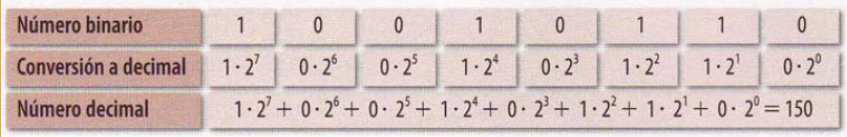

# Representación digital de la información (1)

## Electrónica analógica y digital. 

Los sistemas electrónicos pueden ser:

- **Analógicos**: las variables (tensión, corriente, peso, temperatura, velocidad, etc.) varían
de una forma continua en el tiempo y pueden tomar valores infinitos.

- **Digitales** : las variables solo pueden tomar valores discretos (finitos) y tienen siempre un
estado perfectamente definido.

Las señales digitales son más fáciles de manipular, guardar o recuperar que las señales analógicas , por esta razón se utilizan en telefonía, radio y televisión en la actualidad.

## Representación de información y sistemas de numeración. 

Para comunicarnos, los humanos, utilizamos un extenso conjunto de símbolos (los caracteres del alfabeto, los números del 0 al 9...), además de imágenes, sonidos, etc.

Sin embargo, el ordenador, representa toda la información utilizando sólo dos dígitos: el 0 y el 1. A esta forma de representar la información en un ordenador se denomina **código Binario**.

Como un bit contiene una cantidad de información demasiado pequeña, se utilizan sus
**múltiplos** para representar la información

## Actividades

## Sistemas de numeración.

## Sistema binario

Según el código binario, lo que para nosotros es el número 18 (sistema decimal),
para el ordenador es el número 10010 (sistema binario)

    18 = 10010 (binario)

## Paso de decimal a binario. 

Para ello hay que dividirlo sucesivamente entre
dos y ordenar los restos de los cocientes de esta forma:

## Paso de binario a decimal. 

Multiplicamos cada dígito por la potencia en
base de 2 correspondiente a su posición. La suma total nos da el número.

## Actividades

1. ¿Qué número es el 100010 en decimal?
2. ¿Cuál es el mayor número que puedes representar usando tres dígitos
binarios? ¿Y con cuatro dígitos binarios?
3. Suma el día, mes y año de tu cumpleaños y pása el número resultante a binario.
4. ¿Cuántos bits caben en un pendrive de 2Gb? Si cada letra ocupa un byte, ¿cuántas letras cabrán?
5. Si un fichero ocupa 10MB, ¿cuántos ficheros podremos guardar en un pendrive de 4Gb?
6. ¿Cuántas fotos de 1MB se pueden guardar en un disco duro de 2TB?
7. ¿A cuántos CD equivale un DVD? ¿y un Blu-Ray?
8. Convierte:
- 16.384‬ KB a MB
- 2,5 TB a KB
- 3 MB a bits
- 131.072 bits a KB
