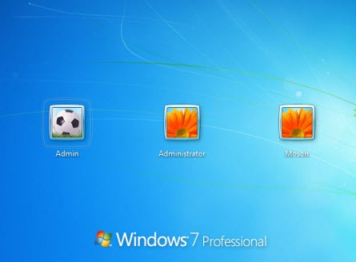

- [1. Software de un ordenador](#1-software-de-un-ordenador)
  - [1.1 Sistemas operativos](#11-sistemas-operativos)
  - [1.1 Funciones del SO](#11-funciones-del-so)
  - [1.2. SO multiusuario y multitarea](#12-so-multiusuario-y-multitarea)
  - [1.3. Programas o aplicaciones](#13-programas-o-aplicaciones)

# 1. Software de un ordenador

## 1.1 Sistemas operativos

Un **sistema operativo** (SO) es el programa (software) encargado de poner en funcionamiento el ordenador, tablet o smartphone, puesto que gestiona los procesos básicos del sistema. 

## 1.1 Funciones del SO

- Se encarga de gestionar para el usuario el hardware
- Es el programa básico sin el cual un ordenador, una tablet o un smartphone no podría funcionar.
- Comienza a trabajar en cuanto se enciende el dispositivo y es completamente fundamental para que el usuario trabaje con él.

Los sistemas operativos realizan tareas básicas y, sin ellos, el dispositivo no funcionaría.

Así, por ejemplo, el sistema operativo reconoce la conexión del teclado de un ordenador, organiza y ordena los archivos, controla la impresora, la pantalla, etc. Se encarga de que los programas no interfieran entre ellos.

## 1.2. SO multiusuario y multitarea 

Hoy día los sistemas operativos son siempre multiusuario y multitarea. ¿qué significa
esto?

- **Multiusuario**: Un sistema operativo es multiusuario cuando puedes tener configurados en él varios usuarios distintos. Por ejemplo en casa, un usuario para ti, otro para tu hermano y otro para tus padres.

- **Multitarea**: Un Sistema operativo es multitarea cuando puede ejecutar varios programas a la vez. Está claro que Windows lo es ya que, por ejemplo, mientras escribes un texto en el Word, puedes estar escuchando música y navegando por Internet.

## 1.3. Programas o aplicaciones

Sobre el sistema operativo se instalan los programas que vaya a usar el usuario. Los programas, también llamados **aplicaciones**, son muy diversos.

Ejemplo:

- El procesador de textos Word en un ordenador con Windows
- La aplicación de mensajería Whatsapp en un móvil con Android o IOS.
