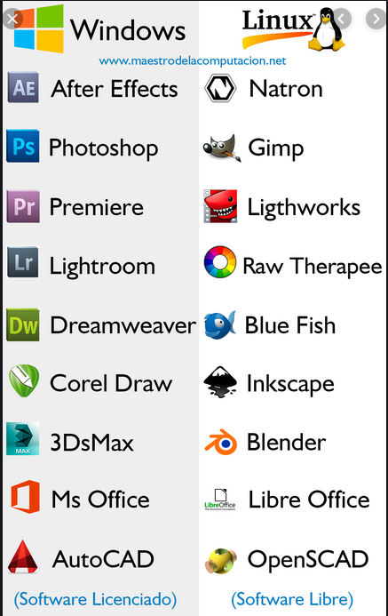

- [2. Software libre y privativo](#2-software-libre-y-privativo)
  - [2.1. Sistema operativos propietario o privativos](#21-sistema-operativos-propietario-o-privativos)
  - [2.2. Sistemas operativo libres](#22-sistemas-operativo-libres)
  - [2.3. Software libre o privativo](#23-software-libre-o-privativo)

# 2. Software libre y privativo

## 2.1. Sistema operativos propietario o privativos

Fueron creados por empresas para su uso comercial. Tales empresas son sus propietarias y cobrar por utilizarlo y distribuirlo y aquellos que lo diseñaron y crearon ocultan su código original para evitar que se altere.

Sólo la empresa propietaria tiene derecho a modificar el software. Además, queda prohibida su distribución sin un previo pago.

Ejemplos de SO propietario:

- Windows es un sistema operativo propietario de la empresa MicroSoft.
- Otro ejemplo de sistema operativo propietario es el Mac OS X, propiedad de  Apple.

## 2.2. Sistemas operativo libres

Fueron creados por una **comunidad de programadores** sin fines comerciales. Esta comunidad dispone del código del sistema y lo comparte con quien quiera modificarlo para su mejora, por eso, su uso y distribución es libre y gratuito.

El hecho de que su código esté disponible para cualquiera es lo que hace que estos sistemas sean abiertos. Linux es un ejemplo.

## 2.3. Software libre o privativo

El software **libre**

- Es gratuito (generalmente) y se puede usar y distribuir sin restricciones
- Su código es abierto, pues está disponible y cualquiera con conocimientos de programación lo puede modificar para adaptarlo a sus necesidades
- Ejemplo: Gimp.

El software **privativo**

- Suele ser de pago, aunque no siempre y su distribución suele estar restringida
- Su código está cerrado, es decir, el propietario del software es el único que conoce el código de la aplicación y sólo el puede admitir modificaciones y actualizaciones. 
- Normalmente es de pago, aunque no siempre
- Ejemplos: PhotoShop.

