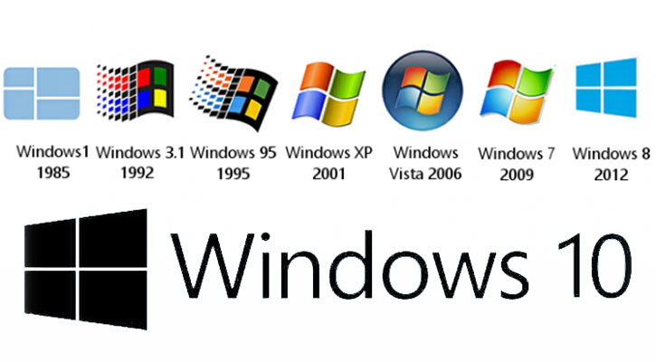
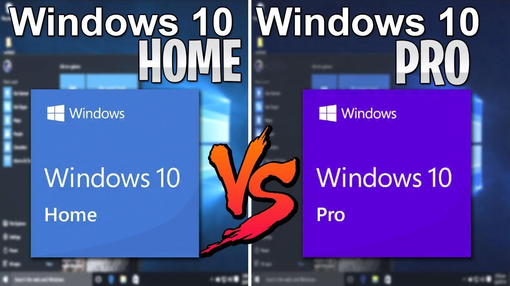
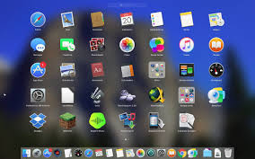

- [3. Sistemas operativos actuales](#3-sistemas-operativos-actuales)
  - [3.1. SO de portátiles y sobremesa](#31-so-de-port%c3%a1tiles-y-sobremesa)
    - [Windows](#windows)
    - [Mac OS X](#mac-os-x)
    - [GNU/Linux](#gnulinux)
  - [3.2 SO de dispositivos móviles](#32-so-de-dispositivos-m%c3%b3viles)
      - [IOS, de la compañía Apple](#ios-de-la-compa%c3%b1%c3%ada-apple)
      - [Android, de Google](#android-de-google)
- [Tarea 1: Comparativa de sistemas operativos](#tarea-1-comparativa-de-sistemas-operativos)
  - [Preguntas](#preguntas)

# 3. Sistemas operativos actuales

## 3.1. SO de portátiles y sobremesa

Los sistemas operativos de ordenador más extendidos son:

### Windows

Es un sistema operativo propiedad de la empresa MicroSoft que es privativo (de pago).

Diferentes versiones: 

- Windows XP, Windows Vista,Windows 7, Windows 8, Windows 10...  

Dentro de cada versión, tenemos diferentes subversiones, según las necesidades. Entre otras versiones, las más habituales son:

- La versión **Home** se utiliza en entornos domésticos, contiene las funciones básicas y es más económica.
- La versión **Pro** se utiliza en entornos de empresas, en los que se requiere acceso a un servidor y otras funciones avanzadas.

Versiones de Windows: https://ca.wikipedia.org/wiki/Llistat_de_les_versions_de_Microsoft_Windows

### Mac OS X

Es un sistema operativo propiedad de la empresa Apple, (el creador del Ipod) que es privativo. 

- Los sistemas operativos Mac OS solo funcionan en hardware de Apple.
- Suelen estar más optimizados para el hardware que están creados
- Son menos vulnerables a virus informáticos.

Versiones de Mac: https://ca.wikipedia.org/wiki/MacOS

### GNU/Linux

Sistema operativo que está en alza, completamente gratuito. Cualquiera, con conocimiento de programación, lo puede modificar según sus necesidades, al contrario que los anteriores. Además, es bastante seguro. A las diferentes versiones de Linux se les llama **distribuciones**

Versiones de Linux: https://maslinux.es/las-5-distros-gnu-linux-mas-populares/

## 3.2 SO de dispositivos móviles

Estadísticas de SO:

- https://gs.statcounter.com/os-market-share/mobile/worldwide

Los Smartphones y tablets tienen también su programa básico de gestión, esto es, su sistema operativo.

Hasta ahora hemos hablado de tres sistemas operativos: Windows,
GNU/Linux y Mac OS X. Estos tres sistemas (los más utilizados) se utilizan en
ordenadores, por lo que son llamados también sistemas operativos de escritorio.

Los sistemas operativos móviles:

- Son mucho más simples
- Están más orientados a la conexión inalámbrica y la interacción táctil a través de sus pantallas.

Los dos sistemas operativos móviles más extendidos en España son:

#### IOS, de la compañía Apple

Es el empleado en los Iphone y Ipads. Su funcionamiento es sencillo, intuitivo y en general ofrece un rendimiento bastante bueno.

https://en.wikipedia.org/wiki/IOS_version_history

#### Android, de Google

Es el más extendido actualmente y está integrado en la mayoría de los teléfonos (Samsung, LG, Sony, Huawei,...). Su
núcleo es Linux.

Es un sistema operativo cuya filosofía parte de ser un entorno abierto para que cualquier programador y fabricante pueda modificarlo a su gusto para posteriormente distribuirlo.

Versiones de Android: 

- https://www.android.com/intl/es_es/history
- https://es.wikipedia.org/wiki/Anexo:Historial_de_versiones_de_Android

# Tarea 1: Comparativa de sistemas operativos

Cada versión de un sistema operativo necesita una capacidad de memoria RAM suficiente y un espacio de disco suficiente para que se pueda instalar. 

- Si necesita 2 GB de RAM y mi ordenador tiene 1 GB, no arrancará,funcionará muy lento o no dejará ejecutar programas.
- Si necesita 50 GB de disco duro y mi disco duro tiene 20 GB, no cabrá el SO y no se podrá copiar para instalarlo.

## Preguntas

1) Explica cuales son las diferentes versiones de Windows 7 y 10 existentes
2) Requisitos de: memoria RAM y espacio en disco que necesita cada versión para poder instalarse en un ordenador
3) ¿Qué versiones podríais instalar en vuestro ordenador y cuáles no?
4) ¿Qué cambios haríais en vuestro ordenador para poder instalar todas las versiones?
5) Busca cómo descargar o comprar Windows 10 para tu ordenador y qué pasos seguirías para instalarlo