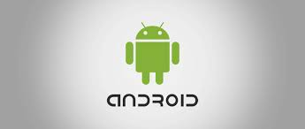

## Sistemas operativos (1)

Un **sistema operativo** (SO) es el programa (software) encargado de poner en funcionamiento
el ordenador, tablet o smartphone, puesto que gestiona los procesos básicos del sistema. Así mismo:

- Se encarga de gestionar para el usuario el hardware
- El Sistema Operativo es el programa básico sin el cual un ordenador, una tablet o un smartphone no
podría funcionar.
- El sistema operativo comienza a trabajar en cuanto se enciende el dispositivo y es completamente fundamental para que el usuario trabaje con él. 

Los sistemas operativos realizan tareas básicas y, sin ellos, el dispositivo no funcionaría.

Así, por ejemplo, el sistema operativo reconoce la conexión del teclado de un ordenador, organiza y ordena los archivos, controla la impresora, la pantalla, etc. Se encarga de que los programas no interfieran entre ellos.

## Programas o aplicaciones

Sobre el sistema operativo se instalan los programas que vaya a usar el usuario. Los programas, también llamados aplicaciones, son muy diversos. 

Ejemplo:

- El procesador de textos Word en un ordenador con Windows
- La aplicación de mensajería Whatsapp en un móvil con Android o IOS.

## Tipos de sistemas operativos

### Sistema operativos propietario o privativos

Fueron creados por empresas para su uso comercial. Tales empresas son sus propietarias y cobrar por utilizarlo y distribuirlo y aquellos que lo diseñaron y crearon ocultan su código original para evitar que se altere.

Sólo la empresa propietaria tiene derecho a modificar el software. Además, queda prohibida su distribución sin un previo pago.

Ejemplos de SO propietario:

- Windows es un sistema operativo propietario de la empresa MicroSoft.
- Otro ejemplo de sistema operativo propietario es el Mac OS X, propiedad de  Apple.

### Sistemas operativo libres

Fueron creados por una comunidad de programadores sin fines comerciales. Esta comunidad dispone del código del sistema y lo comparte con quien quiera modificarlo para su mejora, por eso, su uso y distribución es libre y gratuito.

El hecho de que su código esté disponible para cualquiera es lo que hace que estos sistemas sean abiertos. Linux es un ejemplo.

### Software libre o privativo

El software **libre**

- Es gratuito (generalmente) y se puede usar y distribuir sin restricciones
- Su código es abierto, pues está disponible y cualquiera con conocimientos de programación lo puede modificar para adaptarlo a sus necesidades
- Ejemplo: Gimp.

El software **privativo**

- Suele ser de pago, aunque no siempre y su distribución suele estar restringida
- Su código está cerrado, es decir, el propietario del software es el único que conoce el código de la aplicación y sólo el puede admitir modificaciones y actualizaciones. 
- Normalmente es de pago, aunque no siempre
- Ejemplos: PhotoShop.

### Ejemplos de SO

Los sistemas operativos de ordenador más extendidos son:

- **Windows** (en sus diferentes versiones): Windows XP, Windows Vista,Windows 7, Windows 8, Windows 10... Es un sistema operativo propiedad de la empresa MicroSoft que es privativo (de pago). 

Versiones de Windows: https://ca.wikipedia.org/wiki/Llistat_de_les_versions_de_Microsoft_Windows

- **Mac OS X:** Es un sistema operativo propiedad de la empresa Apple, (el creador del Ipod) que es privativo.

Versiones de Mac: https://ca.wikipedia.org/wiki/MacOS

- **GNU/Linux:** Sistema operativo que está en alza, completamente gratuito. Cualquiera, con conocimiento de programación, lo puede modificar según sus necesidades, al contrario que los anteriores. Además, es bastante seguro. A las diferentes versiones de Linux se les llama **distribuciones**

Versiones de Linux: https://maslinux.es/las-5-distros-gnu-linux-mas-populares/

### SO de dispositivos móviles

Estadísticas de SO:

- https://gs.statcounter.com/os-market-share/mobile/worldwide

Los Smartphones y tablets tienen también su programa básico de gestión, esto es, su sistema operativo.

Hasta ahora hemos hablado de tres sistemas operativos: Windows,
GNU/Linux y Mac OS X. Estos tres sistemas (los más utilizados) se utilizan en
ordenadores, por lo que son llamados también sistemas operativos de escritorio.

Los sistemas operativos móviles:

- Son mucho más simples
- Están más orientados a la conexión inalámbrica y la interacción táctil a través de sus pantallas.

Los dos sistemas operativos móviles más extendidos en España son:

#### IOS, de la compañía Apple

Es el empleado en los Iphone y Ipads. Su funcionamiento es sencillo, intuitivo y en general ofrece un rendimiento bastante bueno.

https://en.wikipedia.org/wiki/IOS_version_history

#### Android, de Google

Es el más extendido actualmente y está integrado en la mayoría de los teléfonos (Samsung, LG, Sony, Huawei,...). Su
núcleo es Linux.

Es un sistema operativo cuya filosofía parte de ser un entorno abierto para que cualquier programador y fabricante pueda modificarlo a su gusto para posteriormente distribuirlo.

Versiones de Android: 

- https://www.android.com/intl/es_es/history
- https://es.wikipedia.org/wiki/Anexo:Historial_de_versiones_de_Android

## Funciones principales

Sin un sistema operativo, el ordenador no podría funcionar, ya que este no tendría acceso a los periféricos, el microprocesador no tendría instrucciones de funcionamiento, no se podrían cargar programas, etc.

Podemos resumir las funciones del sistema operativo en cuatro:

**Gestiona los recursos**

Dirige el funcionamiento de todos los recursos de nuestro ordenador: controla el funcionamiento de los discos duros y unidades de CD-ROM, administra la cantidad de memoria que asigna a cada trabajo, envía órdenes de funcionamiento a los periféricos, etc.

**Presenta la interfaz de usuario**

Nos proporciona una herramienta de comunicación entre el usuario y la máquina. La interfaz o entorno de trabajo
puede ser de tres tipos:

Tipo gráfico, en la que se nos presentan iconos que al ser accionados realizan
una determinada tarea.

**Administra los archivos**

El sistema operativo se encarga de almacenar los datos de la memoria en unidades de almacenamiento y además, contiene un registro para conocer dónde se encuentra ubicado cada archivo. 

Las tareas realizadas con los archivos (copiarlos, trasladarlos o cambiarles el nombre) también son realizadas por el sistema operativo.

**Administra las tareas**

Actualmente, los sistemas operativos son multitarea, es decir, que pueden realizar simultáneamente distintos trabajos (por ejemplo, navegar por Internet, editar texto o copiar un CD). 

El sistema operativo se encarga de regular el orden de ejecución de las instrucciones en el microprocesador, para que todos estos programas puedan funcionar de forma aparentemente simultánea. 

## SO multiusuario y multitarea 

Hoy día los sistemas operativos son siempre multiusuario y multitarea. ¿qué significa
esto?

- Multiusuario: Un sistema operativo es multiusuario cuando puedes tener configurados en él varios usuarios distintos. Por ejemplo en casa, un usuario para ti, otro para tu hermano y otro para tus padres.

- Multitarea: Un Sistema operativo es multitarea cuando puede ejecutar varios programas a la vez. Está claro que Windows lo es ya que, por ejemplo, mientras escribes un texto en el Word, puedes estar escuchando música y navegando por Internet.

## Interfaz gráfica

Conocida también como **GUI** es un programa informático que actúa de interfaz de usuario. Su principal uso, consiste en proporcionar un entorno visual sencillo para permitir la comunicación con el sistema operativo de una máquina o computador.

