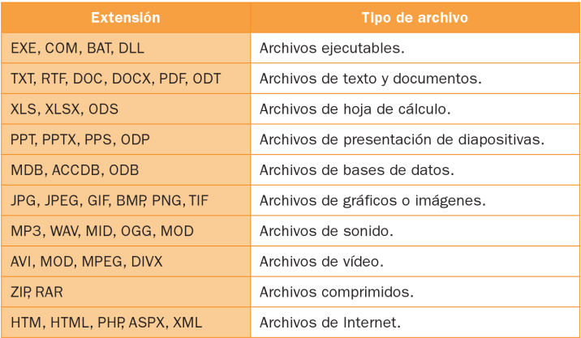
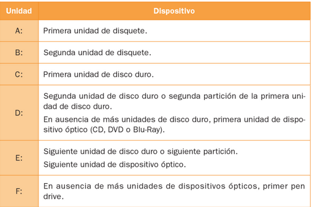
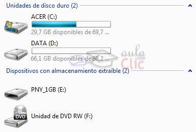
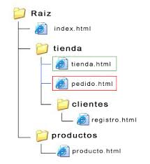
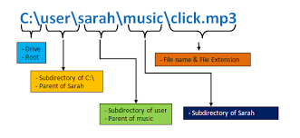
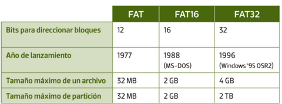
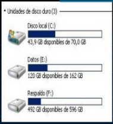

- [Almacenamiento de la información.](#almacenamiento-de-la-informaci%c3%b3n)
  - [Carpetas](#carpetas)
  - [Unidades lógicas](#unidades-l%c3%b3gicas)
  - [Unidades de red](#unidades-de-red)
  - [Ruta](#ruta)
  - [Operaciones sobre archivos](#operaciones-sobre-archivos)
  - [Sistema de archivo](#sistema-de-archivo)
    - [Sistemas FAT](#sistemas-fat)
  - [Particiones](#particiones)

# Almacenamiento de la información. 

El conjunto de información relacionada entre sí, como una canción o un documento de texto, que se guarda en un ordenador se llama **archivo**.

Cada archivo se identifica por:

- Su **nombre** (máximo 255 caracteres)
- Su **extensión** (3 o 4 caracteres)

La extensión de un archivo:

- Nos informa de que tipo de archivo se trata
- Le dice al sistema operativo con qué programa lo debe de abrir

Ejemplos de extensiones:

## Carpetas

El sistema operativo permite organizar la información en:

- Unidades lógicas
- Carpetas y archivos.

## Unidades lógicas

Las unidades lógicas son generalmente discos duros, ópticos, discos extraíbles o discos de red, y tienen letras para diferenciarlos.

Ejemplo de unidades (Mi PC):

Los archivos se organizan en diferentes **carpetas** para poder ser accedidos más fácilmente.

## Unidades de red

Son unidades de almacenamiento a las que Windows asigna una letra de unidad, pero que no están en nuestro equipo, sino en otro equipo de la red. Se trata de una carpeta compartida en un ordenador remoto a la que tenemos acceso con derechos de lectura, al menos.

## Ruta

Para conocer el lugar en que está almacenado un archivo, necesitamos conocer la ruta hasta él. En la ruta tenemos:

- La unidad en la que está
- El camino hacia la carpeta
- El nombre del archivo y la extensión

## Operaciones sobre archivos

Algunas operaciones que podemos realizar sobre los archivos:

- Crear, mover, cortar, copiar y pegar
- Crear accesos directos
- Renombrar archivos
- Ordenar carpetas
- Ver propiedades de un archivo
- Borrar y sacar de la papelera
- Borrar definitivamente

## Sistema de archivo

El **sistema de archivos** nos permite crear y eliminar archivos y carpetas, hacer copias de seguridad, manipularlos, etc. Existen muchos tipos diferentes.

Cada dispositivo de almacenamiento utiliza un sistema de archivos para guardar la información.

Cuando **formateamos** un dispositivo de almacenamiento, preparamos el dispositivo para guardar información y elegimos el sistema de archivos que queremos que utilice.

Conviene saber:

- Ver el sistema de archivos de un disco
- Qué sistemas podemos escoger para formatear un disco

### Sistemas FAT

Otros sistemas:

## Particiones

Consiste en dividir un disco duro en una o más partes lógicas, donde cada una se comporta como si fuese un disco duro independiente, asignándole una unidad con una letra.

De este modo puedo:

- Utilizar dos sistemas operativos con un solo disco físico
- Guardar en una partición datos y en la otra el SO.

****