- [3. Ejercicios práctica sistema operativo](#3-ejercicios-pr%c3%a1ctica-sistema-operativo)
  - [3.1. Gestor de arranque](#31-gestor-de-arranque)
  - [3.2. Iniciar sesión](#32-iniciar-sesi%c3%b3n)
  - [3.3. Escritorio](#33-escritorio)
  - [3.4. Personalizar el escritorio](#34-personalizar-el-escritorio)
  - [3.5. Administrador de tareas](#35-administrador-de-tareas)
  - [3.6. Trabajo con documentos](#36-trabajo-con-documentos)
  - [3.7. Características de un archivo](#37-caracter%c3%adsticas-de-un-archivo)
  - [3.8. Deshacer acciones y rehacer](#38-deshacer-acciones-y-rehacer)
  - [3.9. Accesos directos](#39-accesos-directos)
  - [3.10. Archivos comprimidos](#310-archivos-comprimidos)
  - [3.11. Características del SO](#311-caracter%c3%adsticas-del-so)
    - [Panel de control](#panel-de-control)
<<<<<<< HEAD
    - [Información de sistema](#informaci%c3%b3n-de-sistema)
=======
>>>>>>> 3cd40f156ff5f92f79249879423733d2b5ca47bb
    - [Dispositivos y unidades. Características](#dispositivos-y-unidades-caracter%c3%adsticas)
    - [SO de 64 y 32 bit.](#so-de-64-y-32-bit)
    - [Manejo de aplicaciones](#manejo-de-aplicaciones)
    - [Otros](#otros)
  - [3.12. Navegador](#312-navegador)
  - [3.13. Propiedades de pantalla](#313-propiedades-de-pantalla)
    - [Pantallas divididas y extendidas](#pantallas-divididas-y-extendidas)
    - [Duplicar pantallas](#duplicar-pantallas)
    - [Extender pantallas](#extender-pantallas)

# 3. Ejercicios práctica sistema operativo

## 3.1. Gestor de arranque

Cuando disponemos de más de un sistema operativo, dispondremos de un menú llamado gestor de arranque que nos permitirá elegir con qué sistema operativo queremos arrancar.

Suele aparecer uno marcado por defecto, que arranca al cabo de unos segundos si no se realiza ninguna acción.

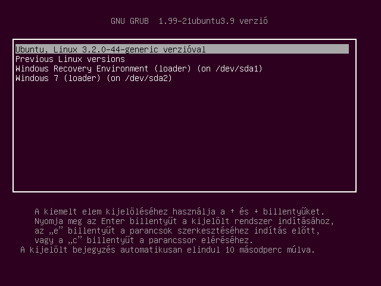

En el caso de que el ordenador no se cerrase correctamente, nos puede aparecer un menú informando al respecto que nos dejará iniciar también a prueba de fallos.

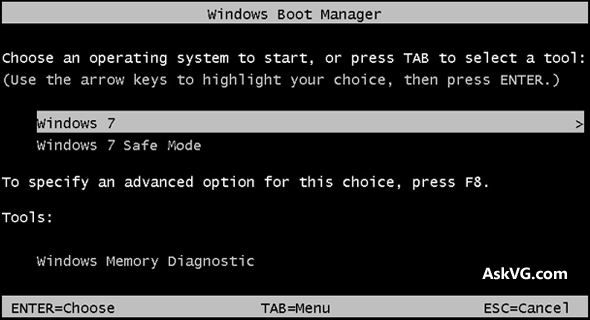

## 3.2. Iniciar sesión

Al arrancar un ordenador, automáticamente se ejecuta el sistema operativo instalado en el mismo. Pero para que un usuario pueda comenzar a operar con el sistema, debe iniciar una sesión de trabajo introduciendo un nombre de usuario y una contraseña válidos.

Pueden haber varios usuarios al mismo tiempo con sesión iniciada, pero solo uno lo podrá utilizar al mismo tiempo.

        Podemos bloquear la sesión con la tecla windows + L

El inicio de sesión de un usuario también puede ser automático si se configura el sistema para que siempre inicie sesión con un usuario predeterminado.

    Iniciar sesión también se conoce como loguearse, logging in o log in

## 3.3. Escritorio

Es el área de trabajo en la pantalla del ordenador que simula un escritorio real. En inglés se denomina **Desktop**.

Elementos principales:

- Iconos
- Ventanas
- Gadgets
- Barra de tareas

## 3.4. Personalizar el escritorio

Cada usuario puede modificar el aspecto de su escritorio para adaptarlo a sus necesidades.

Por ejemplo, podemos modificar:

- Resolución de pantalla
- Tamaño de texto y elementos
- Personalizar temas
  - Fondo de escritorio
  - Color de ventanas
  - Sonidos
  - Protector de pantalla

## 3.5. Administrador de tareas

Permite al usuario gestionar los programas que se están ejecutando (tareas). El uso más extendido es el de poder cerrar programas que se quedan bloqueados.

Podemos acceder con:

        CTRL + ALT + SUPR
        CTRL + MAYUS + ESC

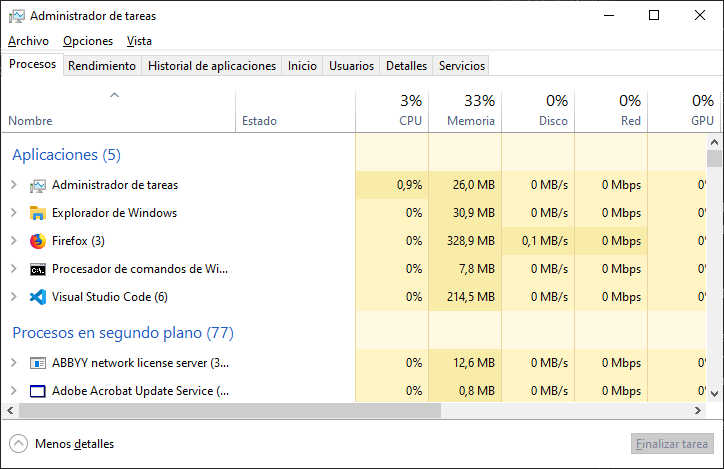

## 3.6. Trabajo con documentos

- Crear, copiar, cortar, pegar documentos
- Renombrar
- Borrar y recuperar archivos
  - Papelera de reciclaje
- Crear, copiar, cortar, pegar carpetas
  - Copiar con CTRL
  - Copiar arrastrando
- Seleccionar
  - Todas las carpetas
  - Algunas carpetas

## 3.7. Características de un archivo

Visualizar las propiedades de un archivo

- Tamaño
- Oculto
- Solo lectura
- Permisos

## 3.8. Deshacer acciones y rehacer

Deshacer una acción: 

        CTRL + Z

Rehacer una acción: 

        CTRL + Y

Estas teclas se pueden pulsar varias veces para deshacer o rehacer varias acciones consecutivas.

## 3.9. Accesos directos

Los accesos directos nos permiten acceder a una carpeta o archivo que está en algún lugar del disco de una forma más rápida, como si de un atajo se tratara.

- Crear accesos directos
- Borrar accesos directos. Borrar el acceso directo no borra el destino.
- Comprobar ruta del acceso directo

## 3.10. Archivos comprimidos

Los archivos comprimidos nos permiten guardar varios archivos en uno solo y además conseguir que ocupen menos espacio. Esto hace que sean más rápidos de guardar, copiar y enviar por internet.

Los archivos de texto en concreto disminuyen mucho su tamaño cuando los comprimimos.

También podemos poner una contraseña a nuestro archivo para protegerlo y que otras personas no puedan acceder a él.

- Crear archivos comprimidos
- Extraer archivos comprimidos
- Extraer parte del archivo

## 3.11. Características del SO

### Panel de control

Accediendo al **panel de control** podemos configurar y cambiar muchas opciones de nuestro sistema operativo.

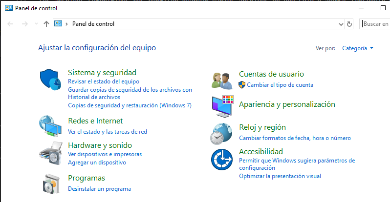

### Información de sistema

Buscando dentro del **panel de control**, en el apartado **sistema**  podemos buscar diferentes características del ordenador (RAM, CPU, etc.)

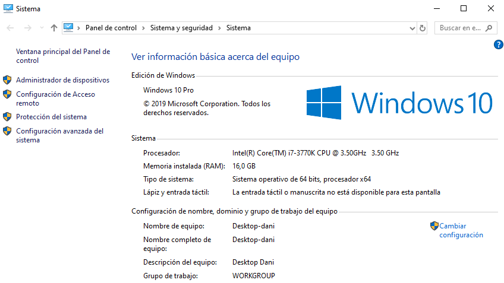

### Dispositivos y unidades. Características

- En **este equipo** podemos ver información de los dispositivos y unidades de almacenamiento de nuestro equipo.
- También podemos ver información ed los discos en **configuración de almacenamiento**
- Formatear discos

### SO de 64 y 32 bit. 

- Averiguar qué sistema operativo tenemos (64 o 32 bits)
- Diferencias

### Manejo de aplicaciones

- Maximizar, minimizar ventanas
- Cambiar entre aplicaciones abiertas
- Cerrar aplicaciones

### Otros

- Conexión de internet
- Idioma de teclado

## 3.12. Navegador

Utilizar diversas ventanas suele ser muy incómodo, sobretodo a la hora de movernos por ellas. Para solucionarlo se utilizan las **pestañas** o tabs.

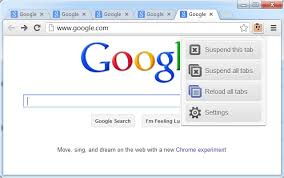

Cosas que podemos hacer:

- Crear tabs, cerrar tabs
- Moverse entre pestañas: CTRL + TAB
- Pantalla completa
- Crear o editar marcadores
- Limpiar historial
- Ver código fuente
- Modo incógnito
- Aumentar tamaño de letra

## 3.13. Propiedades de pantalla

- **Resolución:** Algunas veces me puede interesar cambiar la resolución, bien porque la pantalla no es compatible, o el equipo rinde menos a resoluciones altas.

- **Relación de aspecto:** Las pantallas o monitores pueden tener relaciones de aspecto diferentes (formatos), en función de su forma, como 4:3, 16:9, etc. Según cual sea la salida de vídeo que vaya a utilizar, tendré que cambiarlo.

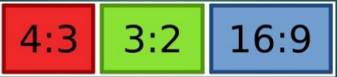

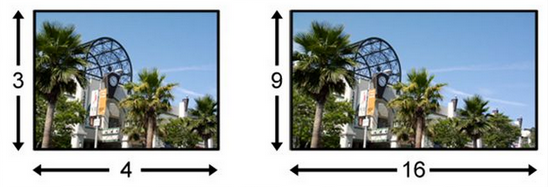

### Pantallas divididas y extendidas

Cuando tengo varias pantallas, o bien una pantalla y un proyector, me puede interesar:

- Que se vea lo mismo en los dos dispositivos
- Que se vea la mitad en uno y la otra mitad en otro.

Para ello deberé ir a la pantalla de resolución de pantalla, donde tendré diferentes opciones:

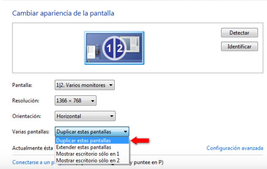

### Duplicar pantallas

Se nos abre un diálogo con diferentes opciones. Por defecto nos aparecerán las dos pantallas duplicadas, es decir, mostrará lo mismo en ambas. A esta configuración también se la conoce como “pantallas clonadas”.

Suele utilizarse, por ejemplo, para hacer presentaciones. El autor utiliza la pantalla pequeña de su equipo para realiza sus acciones, pero el público las ve en una pantalla mayor.

### Extender pantallas

Podemos utilizar la segunda pantalla para extender nuestro escritorio. Lo que conseguimos es añadir un espacio mucho mayor a nuestro escritorio, normalmente a la derecha, el cual no vemos desde la pantalla original, pero que aparece disponible en la segunda pantalla. Debemos escoger la opción ‘Extender estas pantallas’.

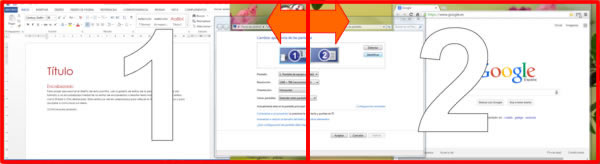

<<<<<<< HEAD
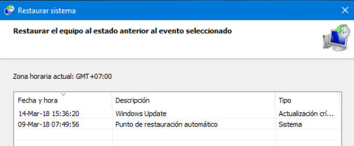

### Crear un punto de restauración
=======
>>>>>>> 3cd40f156ff5f92f79249879423733d2b5ca47bb

