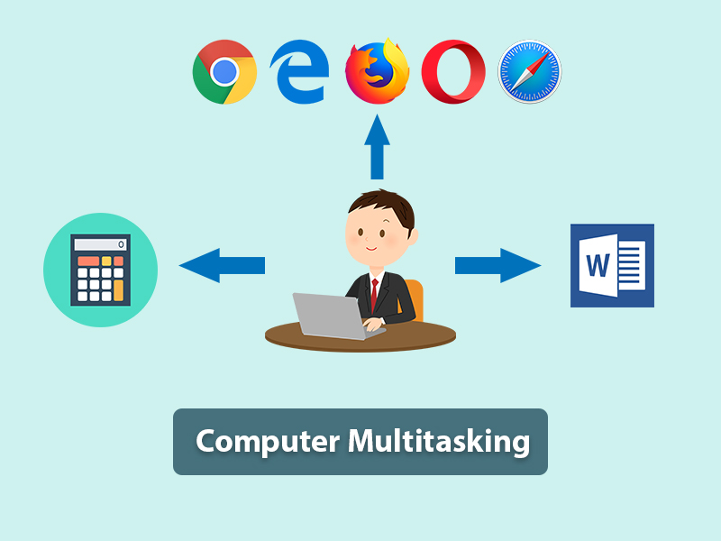

## SO multiusuario y multitarea 

Hoy día los sistemas operativos son siempre multiusuario y multitarea. ¿qué significa
esto?

- Multiusuario: Un sistema operativo es multiusuario cuando puedes tener configurados en él varios usuarios distintos. Por ejemplo en casa, un usuario para ti, otro para tu hermano y otro para tus padres.

- Multitarea: Un Sistema operativo es multitarea cuando puede ejecutar varios programas a la vez. Está claro que Windows lo es ya que, por ejemplo, mientras escribes un texto en el Word, puedes estar escuchando música y navegando por Internet.

## Interfaz gráfica

Conocida también como **GUI** es un programa informático que actúa de interfaz de usuario. Su principal uso, consiste en proporcionar un entorno visual sencillo para permitir la comunicación con el sistema operativo de una máquina o computador.

