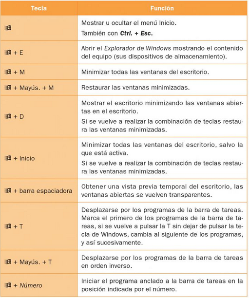

- [Tareas a realizar](#tareas-a-realizar)
  - [SO](#so)
  - [Recursos y rendimiento](#recursos-y-rendimiento)
  - [Navegador](#navegador)
  - [Propiedades de pantalla](#propiedades-de-pantalla)
  - [Comandos MS-DOS](#comandos-ms-dos)
  - [Restaurar sistema](#restaurar-sistema)
  - [Aplicaciones portables](#aplicaciones-portables)
  - [Atajos de teclado](#atajos-de-teclado)
  - [Atajos con tecla de windows](#atajos-con-tecla-de-windows)

## Ejercicios con SO

## Iniciar sesión

Al arrancar un ordenador, automáticamente se ejecuta el sistema operativo instalado en el mismo. Pero para que un usuario pueda comenzar a operar con el sistema, debe iniciar una sesión de trabajo introduciendo un nombre de usuario y una contraseña válidos.

El inicio de sesión de un usuario también puede ser automático si se configura el sistema para que siempre inicie sesión con un usuario predeterminado.

    Iniciar sesión también se conoce como loguearse, logging in o log in

## Escritorio

Es el área de trabajo en la pantalla del ordenador que simula un escritorio real. En inglés se denomina **Desktop**.

Elementos principales:

- Iconos
- Ventanas
- Gadgets
- Barra de tareas

## Personalizar el escritorio

Cada usuario puede modificar el aspecto de su escritorio para adaptarlo a sus necesidades. 

Por ejemplo, podemos modificar:

- Resolución de pantalla
- Tamaño de texto y elementos
- Personalizar temas
  - Fondo de escritorio
  - Color de ventanas
  - Sonidos
  - Protector de pantalla

## Administrador de tareas

Permite al usuario gestionar los programas que se están ejecutando (tareas). El uso más extendido es el de poder cerrar programas que se quedan bloqueados.

Podemos acceder con:

- CTRL + ALT + SUPR
- CTRL + MAYUS + ESC

# Tareas a realizar

- Crear, copiar, cortar, pegar documentos
- Renombrar
- Borrar y recuperar archivos
  - Papelera de reciclaje
- Crear, copiar, cortar, pegar carpetas
  - Copiar con CTRL
  - Copiar arrastrando
- Seleccionar
  - Todas las carpetas
  - Algunas carpetas
- Deshacer acciones y rehacer
- Crear accesos directos
- Archivos comprimidos
- Características de un archivo
  - Tamaño
  - Oculto
  - Solo lectura
  - Permisos

## SO

- Buscar características del ordenador
- Dispositivos y unidades. Características
- SO de 64 y 32 bit

## Recursos y rendimiento

- Buscar información sobre el ordenador
- Información de disco
- Administrador de tareas
- Cambiar entre aplicaciones abiertas
- Cerrar aplicaciones
- Formatear discos
- Panel de control
- Conexión de internet
- Idioma de teclado

## Navegador

- Crear tabs, cerrar tabs, modo incógnito
- Moverse entre pestañas: CTRL + TAB
- Pantalla completa
- Mostrar escritorio
- Crear o editar marcadores
- Limpiar historial

## Propiedades de pantalla

- Cambiar resolución
- Cambiar formato de pantalla
- Pantallas divididas

## Comandos MS-DOS

- Abrir consola de comandos
- Limpiar consola
- Listar contenido
- Crear carpetas y copiar
- Moverse por carpetas
- Moverse al inicio
- Comprobar configuración de red
- Moverse por comandos anteriores

## Restaurar sistema

- Crear punto de restauración
- Restaurar a un punto anterior

## Aplicaciones portables

- Permisos de instalación y ejecución
- Aplicaciones portables

## Atajos de teclado

## Atajos con tecla de windows

