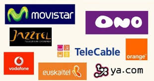

# Acceso a Internet

Para podernos conectar a internet, necesitaremos:

- Saber qué tecnología de acceso voy a utilizar y porqué.
- Contratar los servicios de un proveedor de acceso
- Configurar los dispositivos para qué se conecten a la red instalada, y por tanto puedan
  - Comunicarse entre ellos
  - Acceder a Internet

## Tecnologías de acceso

Las tecnologías de acceso más habituales hoy en día son:

- ADSL
- HFC
- FTTH

Se diferencian, entre otras cosas, por el medio de transporte utilizado, así como la velocidad de acceso, distancia de cobertura, o simetría en las conexiones de subida y bajada.

## Proveedores de servicios

Para poder conectarnos a Internet, necesitaremos contactar con un proveedor de servicios o ISP, que es el que nos dará acceso a Internet en nuestra casa o negocio. Los proveedores más habituales son:

- Vodafone
- Movistar
- Orange
- Jazztel

Con ellos podremos contratar un servicio de Internet a cambio de una cantidad mensual y con unas características de servicio determinadas. 

## Otros servicios

En ocasiones, además de la conexión de Internet en casa, nos ofrecerán:

- Líneas de telefonía móvil
- Televisión a la carta

Según la combinación que nos ofrezcan, tendremos un precio a pagar u otro.