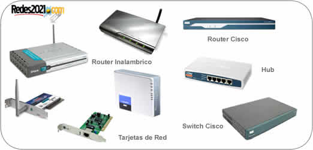

- [3. Redes locales](#3-redes-locales)
  - [3.1 Dispositivos de red](#31-dispositivos-de-red)
  - [3.2 Cables de red](#32-cables-de-red)
  - [3.3 Red cableada](#33-red-cableada)
    - [Red en árbol](#red-en-%c3%a1rbol)
    - [Red en malla](#red-en-malla)
  - [3.4 Red inalámbrica](#34-red-inal%c3%a1mbrica)
  - [3.5 Red PLC](#35-red-plc)

# 3. Redes locales

## 3.1 Dispositivos de red

## 3.2 Cables de red

- Cable de par trenzado: Está formado por ocho hilos conductores trenzados para protegerlos.
- Fibra óptica: con Es una fibra de material transparente por la que se envían los datos en la forma de haz de luz, a gran velocidad.

## 3.3 Red cableada

### Red en árbol

Topología de red en la que los nodos están colocados en forma de árbol. Desde una visión topológica, la conexión en árbol es parecida a una serie de redes en estrella interconectadas.

Es una variación de la red en bus, la falla de un nodo no implica interrupción en las comunicaciones. Se comparte el mismo canal de comunicaciones.

### Red en malla

Es una topología de red en la que cada nodo está conectado a uno o más de los otros nodos. De esta manera es posible llevar los mensajes de un nodo a otro por diferentes caminos.

## 3.4 Red inalámbrica

Las redes inalámbricas no requieren cables para establecer una conexión. 

## 3.5 Red PLC

Las redes PLC aprovechan la red eléctrica para convertirla en una red digital de alta velocidad mediante la cual se transmiten datos, hacen posible, entre otras cosas, la distribución de la señal de vídeo de alta definición y el acceso a Internet.