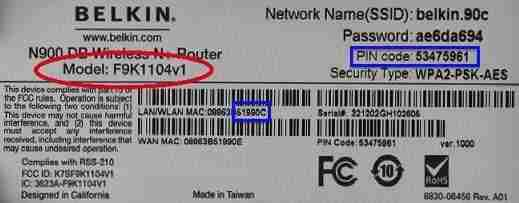

- [5. Configurar un router wifi](#5-configurar-un-router-wifi)
  - [5.1. Características](#51-caracter%c3%adsticas)
  - [5.2. Parámetros importantes](#52-par%c3%a1metros-importantes)
  - [5.3. Acceder al router](#53-acceder-al-router)
  - [5.4. Proteger una red inalámbrica](#54-proteger-una-red-inal%c3%a1mbrica)
    - [Cambiar el nombre de la red y ocultarla.](#cambiar-el-nombre-de-la-red-y-ocultarla)
    - [Encriptar la red](#encriptar-la-red)
    - [Activar el cifrado MAC](#activar-el-cifrado-mac)
  - [5.5. Abrir puertos](#55-abrir-puertos)

# 5. Configurar un router wifi

Un router es un dispositivo harware que sirve para interconectar varias redes informáticas.

## 5.1. Características

En la foto podemos ver los componentes principales de un router wifi:

## 5.2. Parámetros importantes

Los parámetros habituales son:

- El **SSID**: Código identificador de una red inalàmbrica.
- El estándar de **seguridad**: Utilizado para poder acceder a la red inalàmbriaca.
- La **contraseña**: Necesaria para poder acceder a la red inalàmbrica.

## 5.3. Acceder al router

Para acceder al router, necesitamos estar conectados a él y conectarnos mediante un navegador. Para ello:

- Abrir el explorador de Internet
- Teclear la dirección IP del router en la barra de direcciones.
- Escribir el nombre de usuario y la contraseña del router, proporcionados por el ISP. A continuación, se mostrará el menú de configuración del router. 
- Explorar las distintas opciones para encontrar en qué menú se hallan los paràmetros que se desean cambiar

## 5.4. Proteger una red inalámbrica

### Cambiar el nombre de la red y ocultarla.

- Abrir la pestaña Wireless LAN para visualizar las opciones.
- Marcar la casilla Enable Wireless LAN para activarla.
- Activar la opción Hide ESSID para ocultar el nombre de la red.

### Encriptar la red

- Elegir el tipo de encriptación: WEP, WPA o WPA2.
- Establecer la clave deseada en el campo de Key

### Activar el cifrado MAC

- Hacer clic en MAC Filter, dentro de las opciones Wireless LAN.
- Poner la opción Active en Yes
- Si se desconoce esta dirección, se debe abrir el terminal y ejecutar ipconfig-all (windows) o ifconfig-a (ubuntu)

## 5.5. Abrir puertos

Las indicaciones para abrir los puertos son:

    Localizar la opción adecuada del menú para configurar los puertos del router.
    En cada fila, hay que especificar el puerto de inicio, el puerto final, el protocolo y la dirección IP del ordenador de la red en la que se desea abrir el puerto.

Hacer clic en el botón Save para guardar la configuración