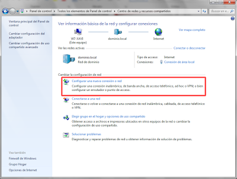

- [9.REDES VIRTUALES](#9redes-virtuales)
  - [9.1 Red VLAN](#91-red-vlan)
  - [9.2 Red VPN](#92-red-vpn)
  - [9.3 Configurar la conexión a una VPN](#93-configurar-la-conexi%c3%b3n-a-una-vpn)

# 9.REDES VIRTUALES

## 9.1 Red VLAN

Las redes de àrea local virtuales pueden ser:

- VLAN estáticas: Cada puerto se programa para indicar a qué red pertenece los equipos conectados.
- VLAN dinámicas: Se gestionan mediante software de red

## 9.2 Red VPN

Estas redes posibilitan el acceso remoto  a las aplicaciones y recursos para que los empleados, las sucursales y los clientes puedan conectarse a redes corporativas a través de una conexión a Internet, protegiendo la información que se envía y recibe.

## 9.3 Configurar la conexión a una VPN

Para establecer una conexión a una red VPN, hay que configurar los datos que facilita el servidor VPN o la empresa que presta el servicio. Estos datos suelen ser la pasarela y, en caso de ser una conexión privada, el usuario, la contraseña, y el dominio de red.

