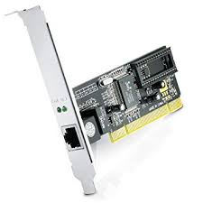

- [Redes](#redes)
- [Tipo y conceptos básicos](#tipo-y-conceptos-b%c3%a1sicos)
- [Creación de redes. Dispositivos físicos.](#creaci%c3%b3n-de-redes-dispositivos-f%c3%adsicos)
- [Redes cableadas, inalámbricas y eléctricas](#redes-cableadas-inal%c3%a1mbricas-y-el%c3%a9ctricas)
- [Configurar una red](#configurar-una-red)
  - [Adaptadores](#adaptadores)
- [routers, conexión de una red wifi](#routers-conexi%c3%b3n-de-una-red-wifi)
- [Acceso a Internet](#acceso-a-internet)
  - [Tecnologías de acceso](#tecnolog%c3%adas-de-acceso)
  - [Proveedores de servicios](#proveedores-de-servicios)
  - [navegadores](#navegadores)
- [Configurar un router wifi](#configurar-un-router-wifi)
  - [Características](#caracter%c3%adsticas)
- [Acceder al router](#acceder-al-router)
  - [Seguridad wifi. abrir puertos](#seguridad-wifi-abrir-puertos)

# Redes

# Tipo y conceptos básicos

# Creación de redes. Dispositivos físicos. 

# Redes cableadas, inalámbricas y eléctricas

Las redes cableadas necesitan un medio fisico para transmitir la señal, como por ejemplo:

- Cable coaxial
- Cable UTP (cobre)
- Fibra óptica

Las redes inalámbricas no necesitan de ningún cable, sino que utilizan el aire para transmitir la señal de un dispositivo a otro. Ejemplos de tecnologías inalámbricas son:

- WiFi
- Bluetooth
- NFC

Las redes eléctricas utilizan la red eléctrica existente en un edificio para que, al mismo tiempo que transmiten electricidad para que las luces o los equipos conectados a los enchufes reciban potencia, puedan llevar datos entre dos equipos.

Para que funcione, se necesita de adaptadores que conviertan la señal para que no se confunda con la señal eléctrica.

# Configurar una red

Para configurar una red, necesitaré:

## Adaptadores

En caso de ordenadores, por ejemplo, deberán contar con un adaptador al que conectar un cable de red, si queremos conectarlos de este modo. En ocasiones vienen en forma de tarjetas de expansión (ordenadores de sobremesa) o están ya integrados en la placa del ordenador (portátiles).

Los dispositivos móviles o portátiles tienen adaptadores inalámbricos, que están dentro del dispositivo y no se ven, aunque se pueden encender y apagar y configurar a través del sistema operativo.

Un dispositivo puede tener varios adaptadores, y de varios tipos. Por ejemplo, un portátil puede disponer de:

- Adaptador de red cableada para situaciones en las que no tenga ninguna red WiFi o no la quiera utilizar
- Adaptador de red wifi (interna) para situaciones en las que quiera o solo pueda utilizar conexiones inalámbricas.

Todos los adaptadores se pueden configurar y habilitar o deshabilitar a través del sistema operativo.

# routers, conexión de una red wifi

# Acceso a Internet

Para podernos conectar a internet, necesitaremos:

- Saber qué tecnología de acceso voy a utilizar y porqué.
- Contratar los servicios de un proveedor de acceso
- Configurar los dispositivos para qué se conecten a la red instalada, y por tanto puedan
  - Comunicarse entre ellos
  - Acceder a Internet

## Tecnologías de acceso

Las tecnologías de acceso más habituales hoy en día son:

- ADSL
- HFC
- FTTH

Se diferencian, entre otras cosas, por el medio de transporte utilizado, así como la velocidad de acceso, distancia de cobertura, o simetría en las conexiones de subida y bajada.

## Proveedores de servicios

Para poder conectarnos a Internet, necesitaremos contactar con un proveedor de servicios o ISP, que es el que nos dará acceso a Internet en nuestra casa o negocio. Los proveedores más habituales son:

- Vodafone
- Movistar
- Orange
- Jazztel

Con ellos podremos contratar un servicio de Internet a cambio de una cantidad mensual y con unas características de servicio determinadas. En ocasiones, además de la conexión de Internet en casa, nos ofrecerán:

- Líneas de telefonía móvil
- Televisión a la carta

Según la combinación que nos ofrezcan, tendremos un precio a pagar u otro.

## navegadores

# Configurar un router wifi

## Características

En la foto podemos ver los componentes principales de un router wifi:

# Acceder al router

Para acceder al router, necesitamos estar conectados a él y conectarnos mediante un navegador. A continuación, nos pedirá un usuario y contraseña para poder entrar en el menú de administración.

## Seguridad wifi. abrir puertos
Intercambio de información entre dispositivos móviles. Tipo de conexión inalámbrica. Hogar conectado
Gestión de usuarios y permisos.
Tipos de usuarios. Crear una cuenta de usuario. Permisos de archivos y carpetas. Ver y modificar permisos.
Compartir recursos.
Compartir archivos y carpetas. Redes virtuales. Redes VLAN y VPN
