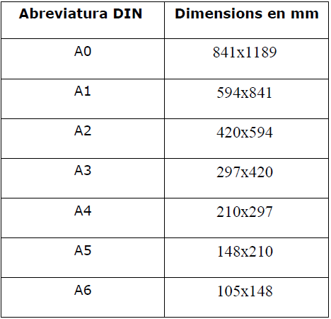

- [2. SUPORTS PER AL DIBUIX TÈCNIC](#2-suports-per-al-dibuix-t%c3%88cnic)
  - [2.1 El paper](#21-el-paper)
  - [2.2 Tipus de paper i característiques](#22-tipus-de-paper-i-caracter%c3%adstiques)
    - [Paper opac](#paper-opac)
    - [Paper vegetal](#paper-vegetal)
    - [Paper mil·limetrat](#paper-millimetrat)
    - [Paper per a croquis](#paper-per-a-croquis)
  - [2.3 Formats del paper](#23-formats-del-paper)

# 2. SUPORTS PER AL DIBUIX TÈCNIC

## 2.1 El paper

És el més utilitzat per realitzar el dibuix tècnic. Existeixen diverses menes de papers per a
aquesta finalitat. Esta format per fibres entrellaçades de cel·lulosa i altres additius, la cel·lulosa
s'extreu de la polpa de la fusta, de l'espart i dels draps.

El **gramatge** d’un paper n’indica la gruixària i expressa la quantitat de massa per unitat de superfície. (g/m2) normalment 60 o 80 g/m2.

## 2.2 Tipus de paper i característiques

### Paper opac 

- De color blanc, acabat rugós per a dibuixos a llapis i acabat llis.
- Per a dibuixos a tinta.

### Paper vegetal

- Transparent, impermeable i dur.
- Per calcar plànols i reproduir-los fàcilment.

### Paper mil·limetrat 

- Opac i està dividit en quadrats d'1 mm.
- Per a la realització de gràfics.

### Paper per a croquis 

- De baixa qualitat, rugós i de color groguenc.
- Per a esborranys.

## 2.3 Formats del paper

El paper es ven amb unes mide normalitzades que s'anomenen FORMATS. Hi ha 3 sèries de
formats: A, B i C. 

La norma utilitzada a Espanya és la **DIN** i la sèrie més emprada la **A**, d'aquí provenen els formats:

- DIN A-3
- DIN A-4.

Per dibuixos petits es fa servir el format rectangular anomenat A-4. Les dimensions seves són:

- 210 mm de base
- 297 mm d’alçada

S’ha de tenir en compte que d’un format es passarà a l’immediat inferior, doblegant-se en dues meitats.
