- [3. INSTRUMENTS PER AL DIBUIX TÈCNIC](#3-instruments-per-al-dibuix-t%c3%88cnic)
  - [3.1 El llapis](#31-el-llapis)
  - [3.2 El portamines](#32-el-portamines)
  - [3.3 La goma d’esborrar](#33-la-goma-desborrar)
  - [3.4 El compàs](#34-el-comp%c3%a0s)
  - [3.5 El regle graduat](#35-el-regle-graduat)
  - [3.6 El transportador d’angles](#36-el-transportador-dangles)
  - [3.7 L’escaire i el cartabó](#37-lescaire-i-el-cartab%c3%b3)
    - [Traçat d'angles](#tra%c3%a7at-dangles)
    - [Traçat de perpendiculars i paralel·les](#tra%c3%a7at-de-perpendiculars-i-paralelles)
  - [3.8 Les plantilles](#38-les-plantilles)
  - [3.8 Escalímetre](#38-escal%c3%admetre)

# 3. INSTRUMENTS PER AL DIBUIX TÈCNIC

## 3.1 El llapis

El **llapis** és l’estri que es fa servir més en la realització del dibuix. Els llapis es fabriquen de fusta, amb una mina de grafit a l’interior.

La qualitat bàsica d’un llapis per al dibuix és la duresa de la mina, que indica les característiques dels traços marcats sobre el suport. 

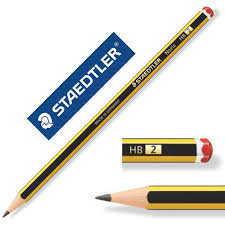

- Per a traços àgils i dibuixos que s’hagin de modificar i esborrar molt calen mines toves
- Per fer traços definitius i dibuixos acabats, són preferibles mines una mica més dures.

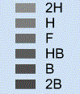

Denominació Duresa Utilitat

- 2B Molt tova Esbossos
- B Tova Esbossos i escritura
- HB Semitova Croquis
- F Semidura Escritura, esbossos i croquis
- H Dura Croquis i dibuixos a llapis
- 2H Molt dura Dibuixos a llapis
delineats

## 3.2 El portamines

Hi ha una gran varietat de models i fets de diversos materials. Tots tenen, a l’interior, un dipòsit per a les mines, amb un diàmetre que oscil·la entre 0,3 i 1mm.

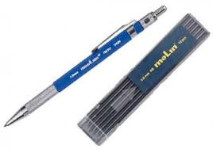

## 3.3 La goma d’esborrar

Serveix per facilitar la correcció d'errades d'un dibuix.

- Es fabrica a partir de cautxú i és elàstica i compacta, apta per a esborraments freqüents.
- Manteniment de la goma: que tingui caires vius, i que estigui neta.

Tipus de gomes i característiques

- Goma per a llapis Tova i flexible.
- Goma per a tinta És més dura i actua per desgast del paper

## 3.4 El compàs

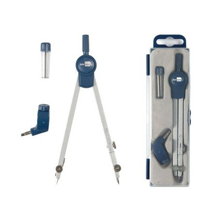

El compàs és un instrument que serveix per transportar magnituds lineals i traçar arcs i
circumferències.

Està constituït per dues cames articulades en un dels extrems per una guia que disposa d’un
agafador cilíndric estriat que facilita la rotació. 

- Una de les cames te una peça on s’acobla l’agulla de centrar, regulable per mitjà d’una roda de pressió.
- L’altra cama , més curta, també disposa, a l’extrem, d’un mecanisme articular que permet la inserció i la fixació d’altres accessoris.

## 3.5 El regle graduat

El regle graduat es fa servir per traçar línies rectes, transportar longituds i mesurar segments. 

En el dibuix tècnic s’empren regles graduats fets de plàstic transparent; graduats en mil·límetres.

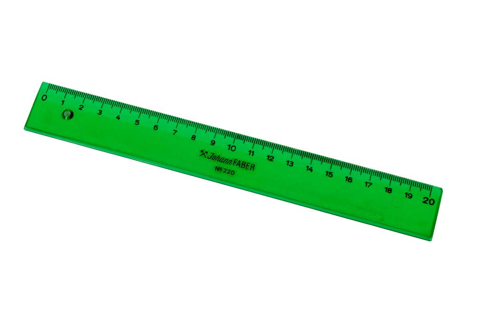

## 3.6 El transportador d’angles

És una plantilla per mesurar i construir angles. És de plàstic transparent i de forma circular o semicircular. 

Té el contorn dividit en 180 o 360 parts iguals, i cadascuna correspon a un grau sexagesimal.

## 3.7 L’escaire i el cartabó

**L’escaire** té la forma d’un triangle rectangle isòsceles i els catets formen, entre si, un angle de 90o i un angle de 45o amb la hipotenusa.

El **cartabó** és un triangle rectangle escalè els angles aguts del qual tenen 30o i 60o. La hipotenusa té el doble de llargada que el més petit dels catets.

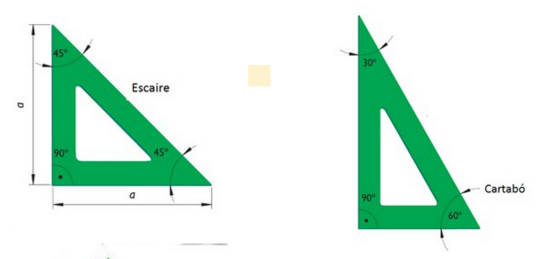

Se sol anomenar **joc de cartabó i escaire** quan es compleix la següent premisa: la longitud del
catet major del cartabó és igual a la hipotenusa de l’escaire.

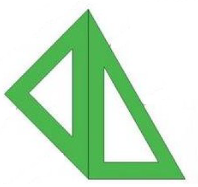

Aquestes característiques permeten formar una àmplia gamma d’angles variant l’orientació
relativa dels estris.

Se solen emprar conjuntament per traçar paral·leles i perpendiculars

Traçat de rectes paral·leles Traçat rectes perpendiculars

### Traçat d'angles

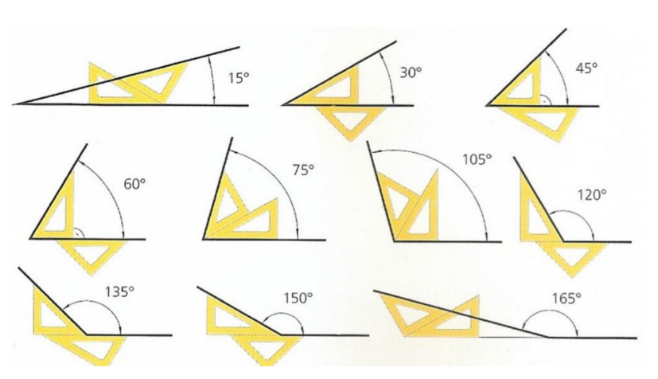

### Traçat de perpendiculars i paralel·les

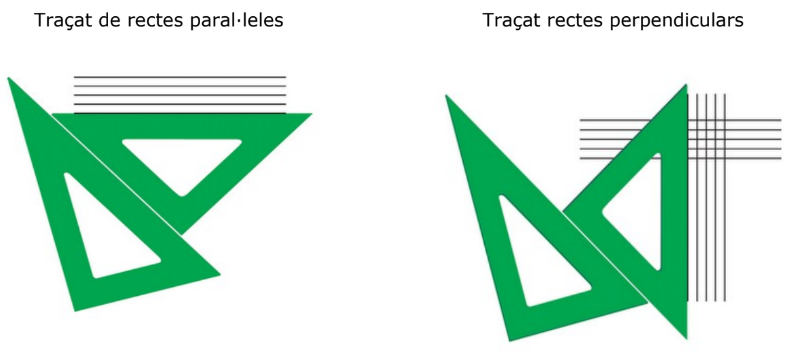

## 3.8 Les plantilles

Les plantilles de dibuix són un conjunt d’elements auxiliars que faciliten i agilitzen el traçat
geomètric, n’hi ha de corbes, de cercles, d’el·lipses, de símbols elèctrics o arquitectònics, de
retolació.

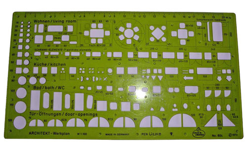

## 3.8 Escalímetre

Permet dibuixar en escala directament. Disposa de vàries escales.

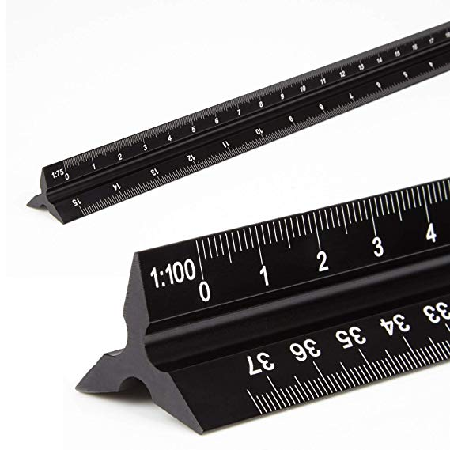