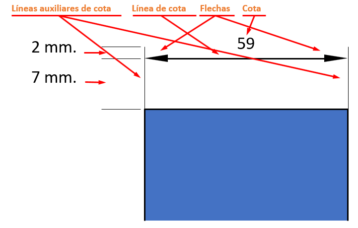
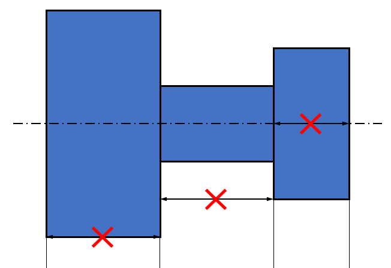
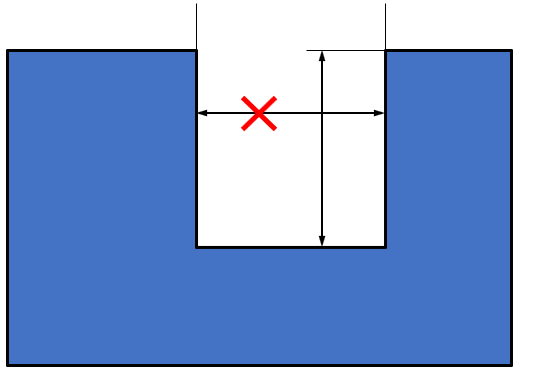
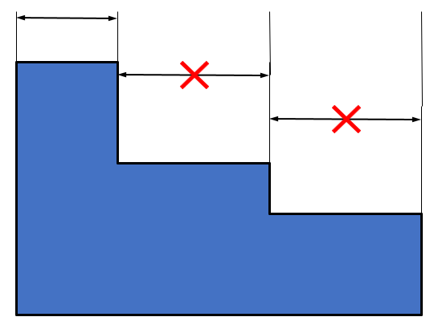
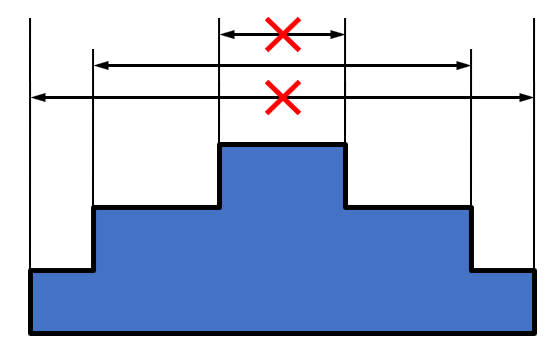
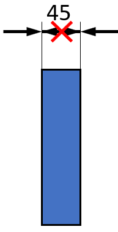

- [5. Acotació](#5-acotaci%c3%b3)
  - [Normes generals d'acotació](#normes-generals-dacotaci%c3%b3)
  - [Elements de l'acotació](#elements-de-lacotaci%c3%b3)
  - [Acotació d'aristes](#acotaci%c3%b3-daristes)

# 5. Acotació

## Normes generals d'acotació

- Apareixeran les cotes necessàries perquè la peça
quedi definida.
- Les cotes no han de repetir-se, es col·locaran les
mínimes necessàries.
- Les cotes es col·locaran a la vista que millor defineixi
la magnitud acotada.
- Totes les cotes s'han d'expressar en la mateixa unitat.
- Les cotes es llegiran des de baix (horitzontals) i
des de la dreta (verticals).
- Les xifres de cota quedaran sobre de la línia de
cota i en la seva mateixa direcció.

## Elements de l'acotació

## Acotació d'aristes

Les **línies de cota** no poden coincidir amb les arestes 

Les **línies d'acotació** no es creuen entre si ni amb cap altra línia.

Les línies d'acotació en sèrie es col·loquen alineades.

Les línies d'acotació no es creuen entre si ni amb cap
una altra línia.

Per evitar-ho en l'acotació en paral·lel col·locarem les cotes majors més allunyades i les menors més a prop de la figura.

Si les fletxes queden molt
juntes es treuen fora de les
línies auxiliars

Si la xifra de cota té poc
espai es col·locarà fora, a la
dreta

Si les fletxes no es poden treure fora es substitueixen per un punt i les xifres es trauran amb una línia de referència mantenir tenint la seva direcció.
