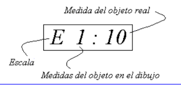
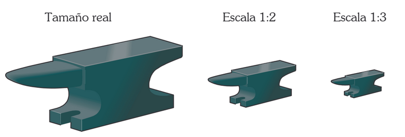
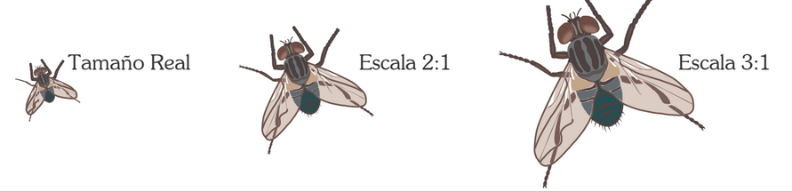
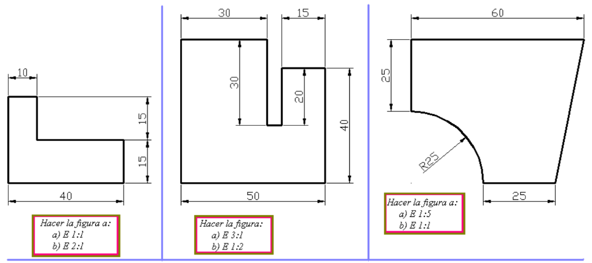

# 6. Escales

Quan les peces a dibuixar són molt grans o molt petites, la seva representació en el paper presenta certes dificultats, per a aquests casos s'utilitzen les escales. 

Aquestes no són altra cosa que una xifra per la qual es multipliquen o divideixen les mesures reals de les peces perquè el dibuix càpiga en el paper, o si són molt petites, perquè es puguin veure clarament les diferents parts dels objectes dibuixats.

Les escales es representen mitjançant fraccions, en les que:

- El nombre de l'esquerra representa les mides del dibuix
- El nombre de la dreta representa les mides de l'objecte real

En aquesta escala, el dibuix del nostre paper serà deu vegades més petit que l’objecte real.

Pel que acabem de dir es dedueix que hi ha tres tipus d'escales:

# 6.1. Escala Natural

S'usa per a representar aquells objectes dels que podem veure tots els seus detalls a simple vista i la seva mida és tal que caben en el paper.

Per Exemple: un bolígraf

# 6.2. Escales de reducció

S'usen per a representar objectes que per la seva mida no caben en el paper.

Per Exemple: una taula, cadira, etc.

Per a les reduccions s'empren per exemple:

- Escala 1:2
- Escala 1:3

ue vol dir que 1 cm del dibuix representa 2 o 3 cm a la realitat, (el dibuix és dues o tres vegades menor que la realitat).

# 6.3. Escales d'ampliació: 

S'usen per a representar objectes molt petits, per poder veure amb claredat totes les parts.

Per Exemple: una moneda, un díode, etc.

Per a les ampliacions s'empren per exemple: 

- Escala 2:1
- Escala 3:1

El que significa que 2 o 3 cm del dibuix, equivalen a 1 cm a la realitat. (El dibuix és dues o tres vegades més gran que la realitat).

# Exercicis

Realitza a escala els següents dibuixos:

