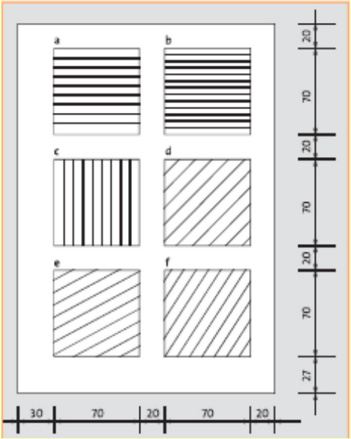
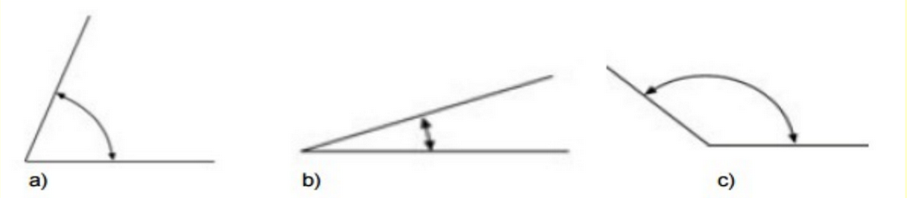
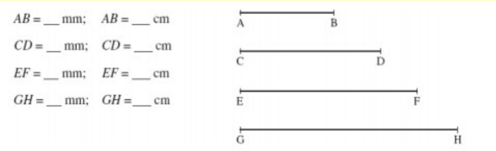

# Tasca escaire i cartabò

1.	Dibuixa dues línies paral·leles i dues línies perpendiculars separades l,5cm entre elles.
2.	Dibuixa una circumferència de radi 2,5 cm i amb l'ajuda de l'escaire i el cartabó fes un diàmetre horitzontal i un altre vertical. Després posa-hi els angles: 0°, 90°, 180°, 270° i 360°. 3.

3.	Dibuixa una escaire i posa els seus angles.
4.	Dibuixa un cartabó i posa els seus angles.

5.	Dibuixa sis quadrats iguals en un full DIN A4 i traça:

- a)	Línies horitzontals paral·leles amb una separació de lOmm.
- b)	Línies horitzontals paral·leles amb una separació de 5mm.
- c)	Línies verticals paral·leles amb una separació de lOmm.
- d)	Línies	paral·leles	amb	una inclinació	de	45°	respecte de l'horitzontal, separades lOmm.
- e)	Línies	paral·leles	amb	una inclinació	de	30°	respecte de l'horitzontal, separades lOmm.
- f)	Línies	paral·leles	amb	una inclinació	de	60°	respecte de l'horitzontal, separades lOmm.

6. Mesura els següents angles amb el transportador: a) b) c)

7. Dibuixa amb el transportador els següents angles: a) 36° b) 40° c) 154°.

8. Digues la mesura dels segments en mil·límetres i en centímetres.

9. Amb l’escaire o el cartabó traça els següents angles: 

a) 150°
b) 120°
c) 135°
d) 15°
e) 75º