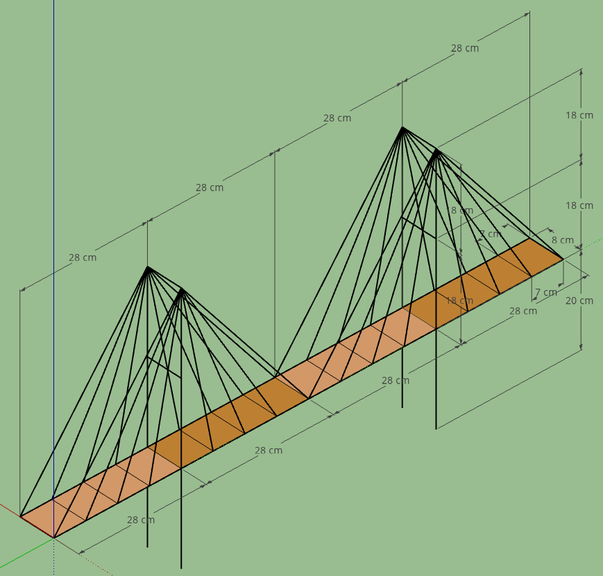
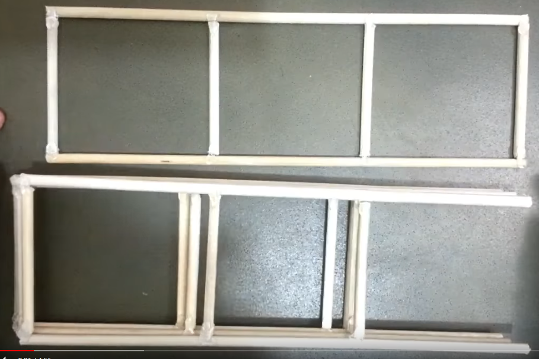
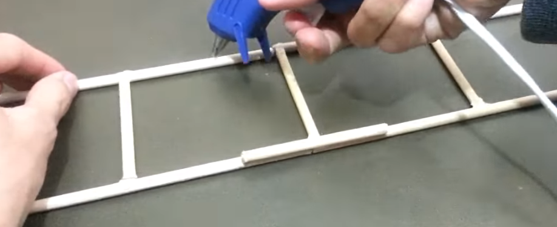
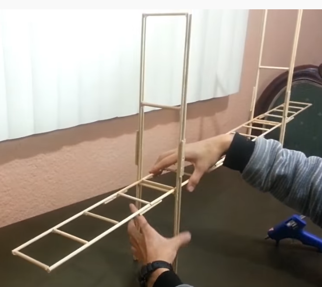
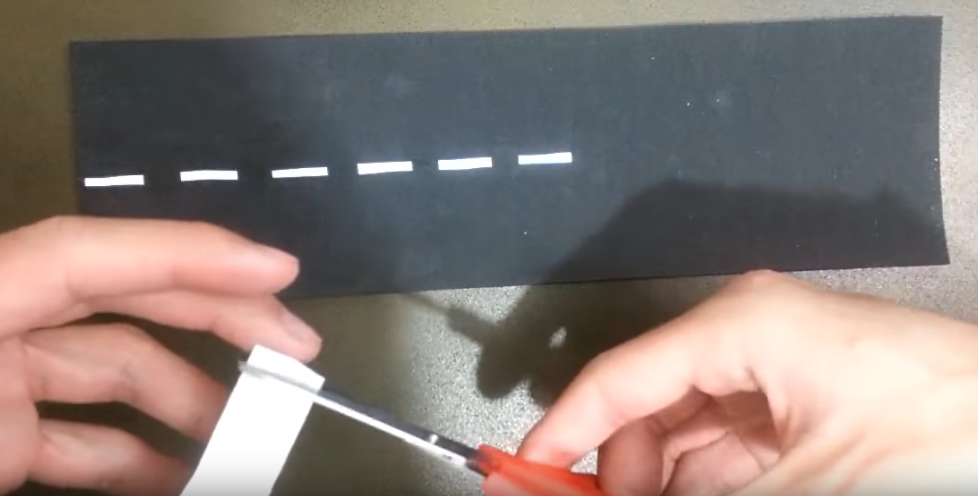
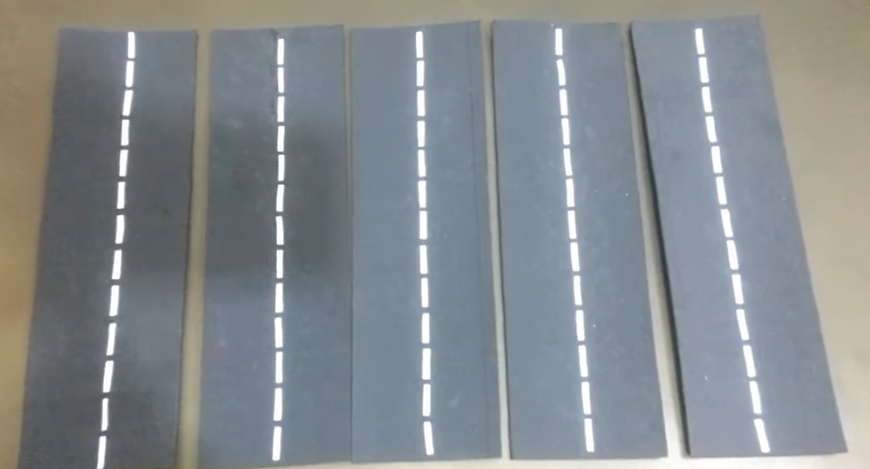
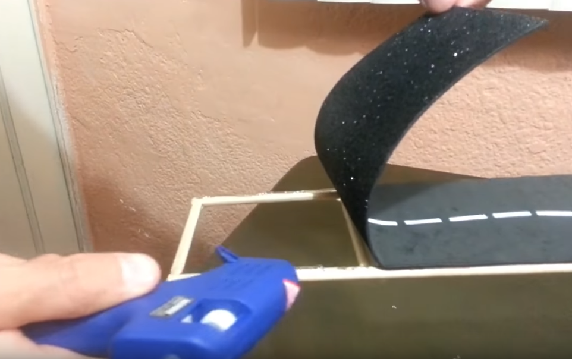
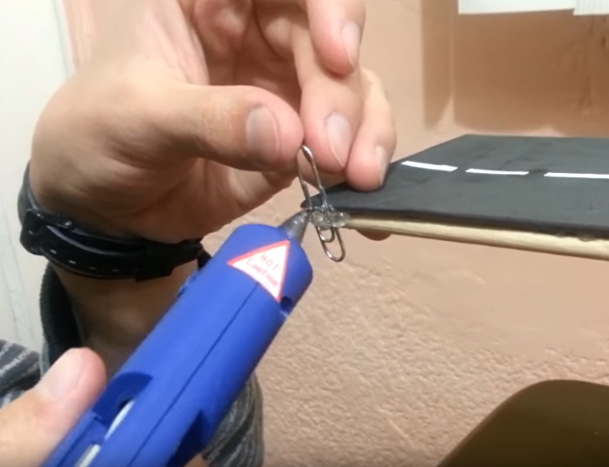
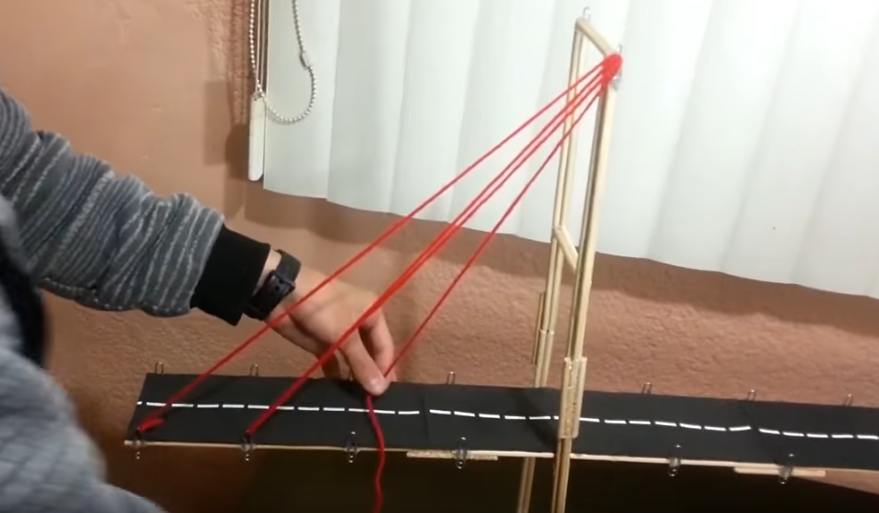

El proyecto consiste en la construcción de un puente colgante atirantado.

# Vídeo de montaje

https://www.youtube.com/watch?v=qs24mFT7fOw

# Herramientas

- Pistolas de silicona
- Barras de silicona

# Materiales

- Palos de madera
- Lana o hilo grueso
- Clips de papel
- Espuma fomix o cartulina gruesa
- Cinta aislante

# Vista tridimensional

# Pasos

## 1. Realizar las 4 estructuras del tablero (base)

## 2. Unirlas entre ellas

## 3. Realizar las 2 estructuras de los pilares

Además de los tirantes, dos pilares sujetarán y estabilizarán la estructura. Para crearlos, tenemos que crear dos figuras iguales.

## 4. Encajar y unir la base a las estructuras verticales

En este momento veremos como nos ha servido dejar los pilares un poco más anchos que el tablero, para que este pueda pasar a través y apoyarse correctamente.

## 5. Crear la carretera

La podemos crear con foam y cinta aislante, o bien cartón si no disponemos de otro material. Se puede pintar y decorar como más nos interese.

## 6. Pegar la carretera a la estructura del tablero.

7. Pegar los clips a las diferentes partes de la base y en lo alto de los pilares.

8. Unir con cuerda la base y los pilares.

Una vez colocados todos los clips, procedemos a ir pasando el hilo por todos los clips en el orden correcto para crear los tirantes que darán soporte a la estructura.

