- [1. Forces](#1-forces)
  - [1.1 Exemples de forces](#11-exemples-de-forces)
- [2. Estructures](#2-estructures)
- [2.1. Tipus d'estructures](#21-tipus-destructures)
  - [Naturals](#naturals)
  - [Artificials](#artificials)
- [Càrregues](#c%c3%a0rregues)
  - [Tipus de càrregues](#tipus-de-c%c3%a0rregues)
    - [Càrregues permanents](#c%c3%a0rregues-permanents)
    - [Càrregues variables](#c%c3%a0rregues-variables)
- [Esforços](#esfor%c3%a7os)
  - [Tipus d'esforços](#tipus-desfor%c3%a7os)
    - [Tracció](#tracci%c3%b3)
- [Condicions estructurals](#condicions-estructurals)
- [Tipus d'estructures artificials](#tipus-destructures-artificials)
  - [Massives](#massives)
  - [Vaulted](#vaulted)
  - [Entramades](#entramades)
  - [Triangulades](#triangulades)
  - [Penjants](#penjants)
  - [Pneumàtiques](#pneum%c3%a0tiques)
  - [Rolled and plate](#rolled-and-plate)
  - [Geodèsiques](#geod%c3%a8siques)
- [Elements d'una estructura](#elements-duna-estructura)
- [Perfils](#perfils)

# 1. Forces

Les forces són elements que poden:

- Deformar un cos (efecte estàtic)
- Canviar el seu estat de moviment (efecte dinàmic)

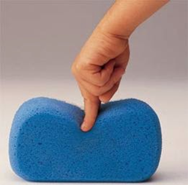

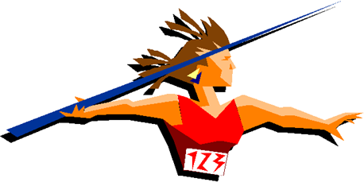

## 1.1 Exemples de forces

- Gravetat
- Vent
- Forces mecàniques
- Pressions de gasos
- Músculs
- Calor

¿Quines forces actuen sobre aquests objectes?

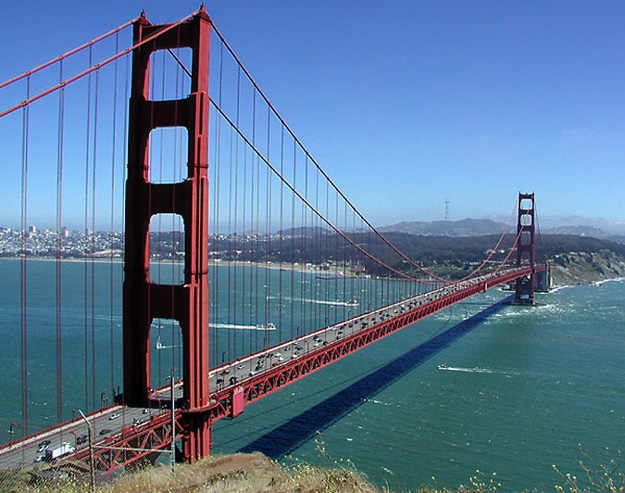
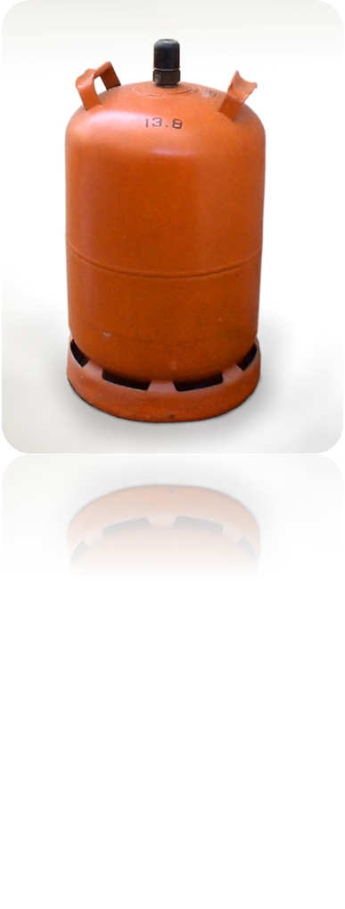
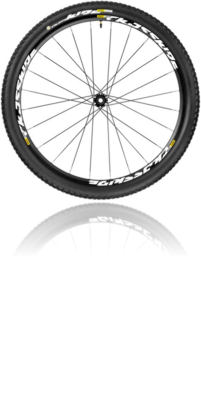

# 2. Estructures

Una estructura és un conjunt resistent i estable d’elements capaços de suportar forces i transmetre-les als punts de suport.

Tots els objectes necessiten una estructura que els permeti resistir els efectes de les forces que hi actuen.

# 2.1. Tipus d'estructures

## Naturals

- Conxes
- Nius

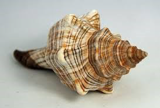
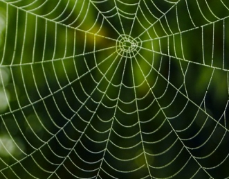
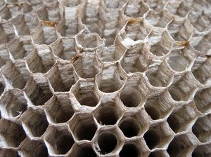
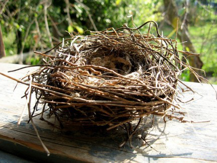
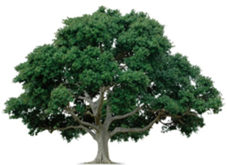

## Artificials

- Gratacels
- Torres elèctriques

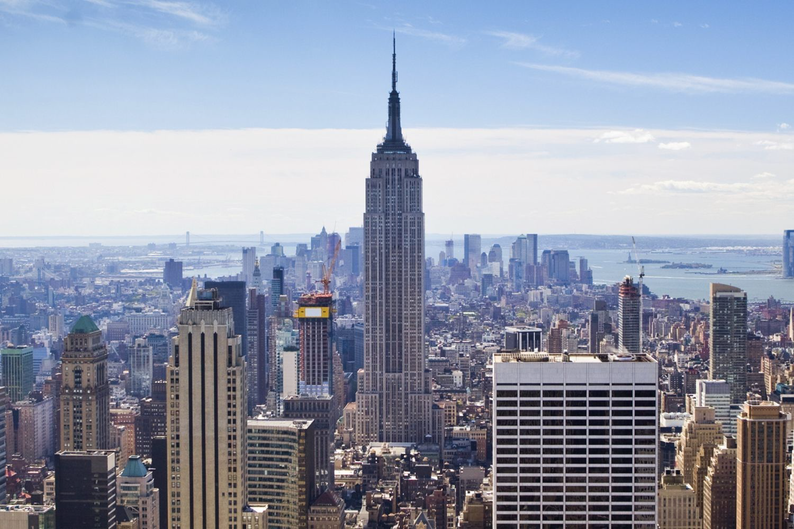
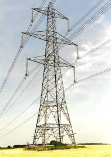
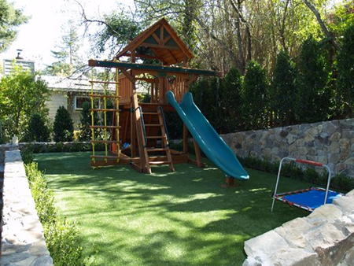
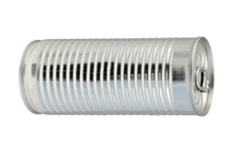

# Càrregues

Son forces que actuen sobre una estructura

## Tipus de càrregues

### Càrregues permanents

No varien amb el temps

Exemples:

- El propi pes d'un objecte

### Càrregues variables

Son ocasionals i varibles

Exemples:

- Neu sobre un terrat
- Pressió de l'aigua sobre una presa

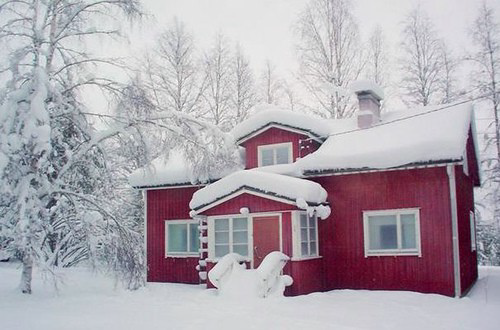
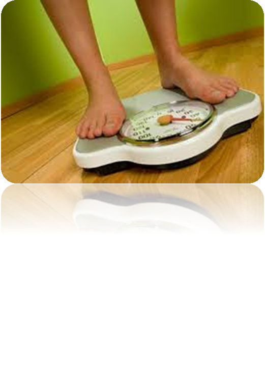

# Esforços

Es tracta de tensions internes que sofreixen els objectes que estan sotmessos a l'acció de una o més forces.

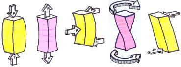

## Tipus d'esforços

### Tracció

Forces intenten estirar l'objecte.

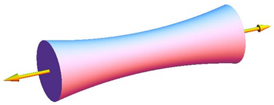

- Flexió

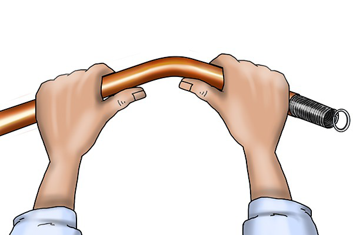
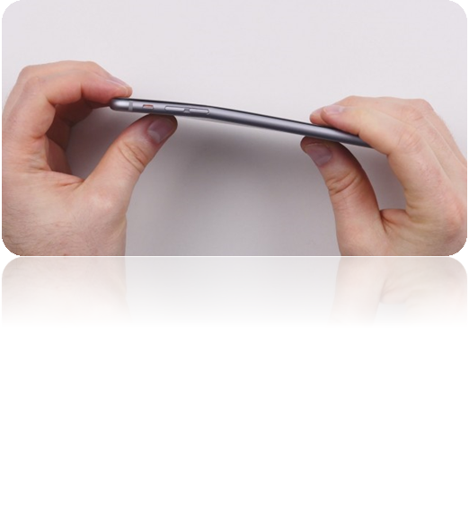

- Compressió

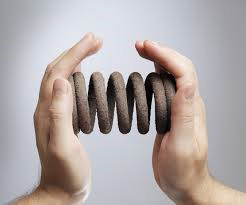
- Torsió

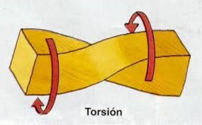

- Cizalla

Dues forces actuen com les fulles d'una tissora. Una es mou cap a dalt i l'altra cap abaix, com si tractessin de tallar un objecte.

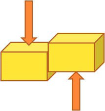

Quins esforços diries que sofreixen els següents objectes:

- Tirants d'un vestit
- Potes d'una cadira
- Candau d'una porta
- Tissores per tallar paper

# Condicions estructurals

- **Estabilitat**: La capacitat que té l'objecte per mantenir-se estable.
- **Resistència**: Capacitat de resistir un esforç sense trencar-se.
- **Rigiditat**: Capacitat de mantenir la seva forma.

# Tipus d'estructures artificials

## Massives

Materials: roca, pedres
Exemples: piràmides

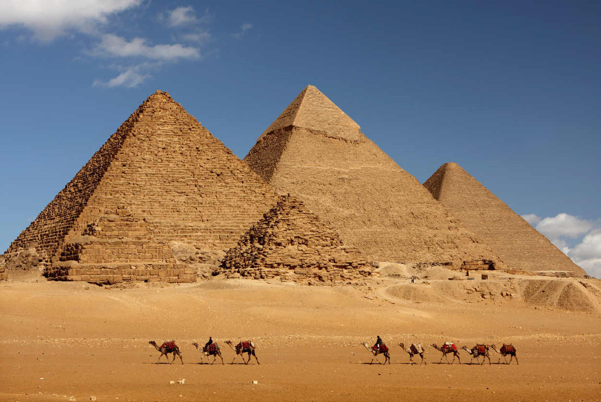

## Vaulted

Materials: pedra, roca o ciment
Exemples: basíliques, panteons i catedrals

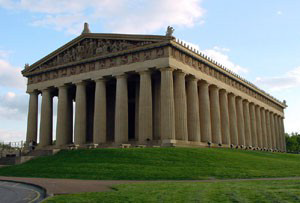

## Entramades

Materials: ciment i metall
Exemples: blocs i pisos

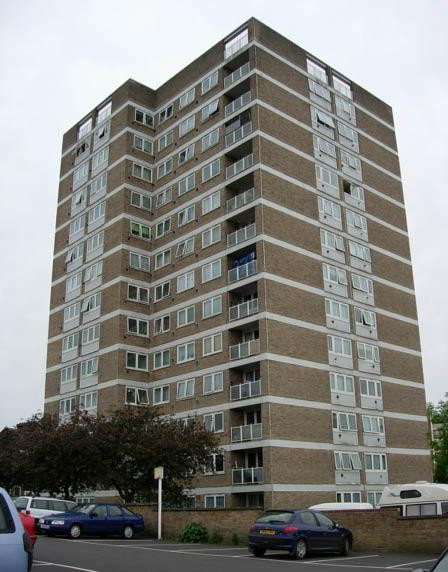

## Triangulades

Materials: metall o fusta
Exemples: sostres, ponts

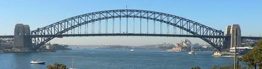

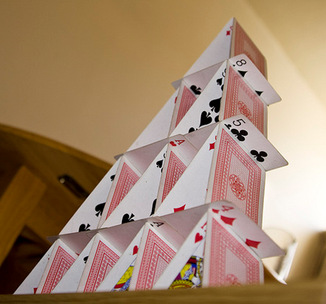

## Penjants

Materials: metall i ciment
Exemples: ponts,  antennes i torres

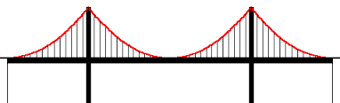

## Pneumàtiques

Materials: plàstic
Exemples: castell inflable

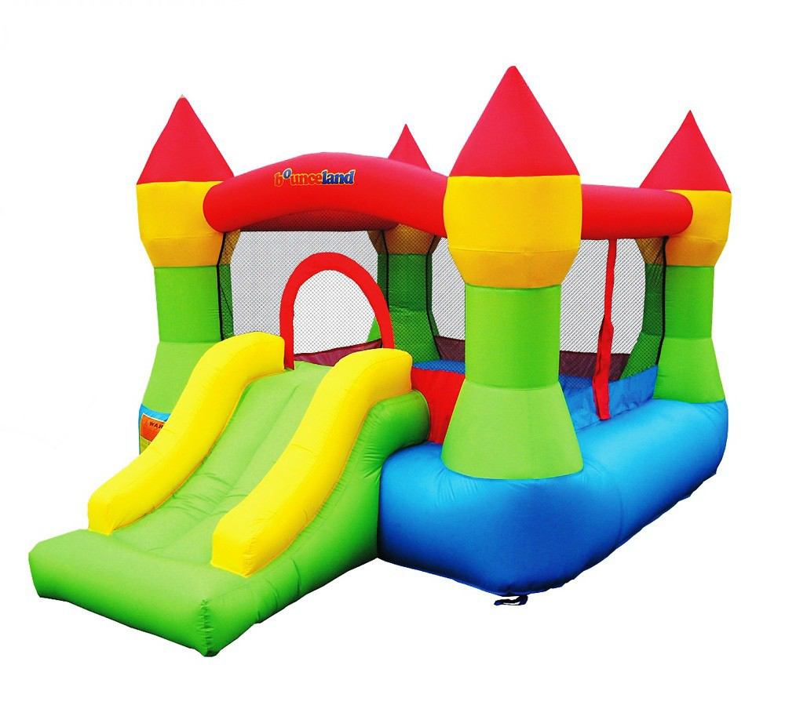

## Rolled and plate

Materials: metall, plàstic i altres materials sintètics
Exemples: cotxe

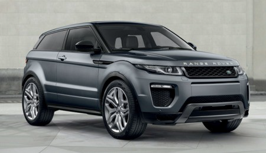

## Geodèsiques

Materials: metall i alumini
Exemples: tetrahedre

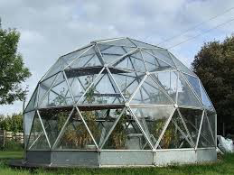

# Elements d'una estructura

fonaments
Columnes o pilars
bigues
arcs
tirants

# Perfils

Recurs molt utilitzat per construir estructures
Són barres de diferents seccions
Bigues i columnes massisses,
pesarien molt
Serien molt cares
No podríem fabricar grans estructures.